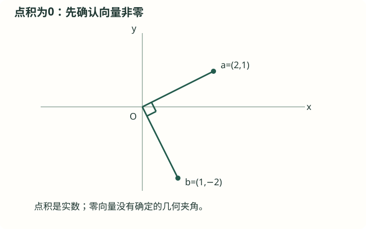
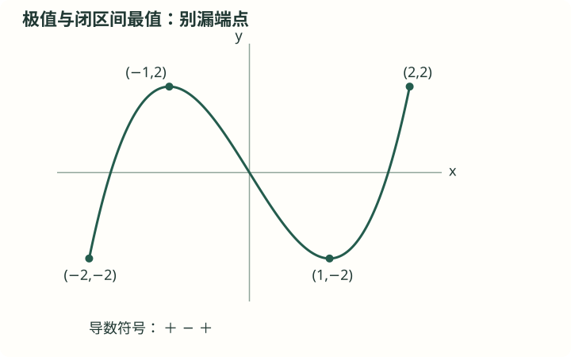
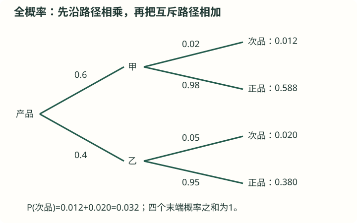

# 高中知识卡合订本

版本 1.1 · 2026-09-16。所有标为原创的练习均为本次自行编写。

# H01 集合、区间与交并补

高中 · 必修起步（建议高一） · 必修 · 预备知识

## 前置知识

[J13 一次不等式、不等式组与整数方案](初中_合订.md#j13)

## 本节目标

- 理解并应用元素与集合
- 理解并应用交并补运算
- 理解并应用区间与参数

## 基础与概念

### 元素与集合

集合的元素须确定、互不重复，排列次序不改变集合。a∈A讨论元素属于集合，A⊆B讨论集合包含关系；空集∅没有元素，而{0}有一个元素0。常用N={0,1,2,…}，正整数可写N*，使用前明确约定。

### 交并补运算

A∩B同时属于两集合，A∪B至少属于一个；补集CᵤA由全集U中不属于A的元素组成，没有指定全集就不能唯一确定补集。代数不等式用交表示同时成立，用并表示至少一个条件成立。

### 区间与参数

区间端点有等号用方括号，没有等号用圆括号，无穷端总用圆括号。比较含参数集合先检查是否可能为空集；空集是任意集合子集，忽略它会漏解参数范围。集合的元素也可为点、向量或函数，不限实数。

## 解题方法

- 先确定全集和元素类型，画数轴检查端点，再做逻辑运算。

## 易错与限制

- {1}∈{1,2}不成立；{1}⊆{1,2}成立。

## 完整例题

【原创】A={x∈R|−1<x≤3}，B={x∈R|x≥2}，求交集与并集。

1. A写为(−1,3]，B写为[2,+∞)。
2. 同时满足得到[2,3]；至少满足一个得到(−1,+∞)。
3. A∩B=[2,3]，A∪B=(−1,+∞)。

答案：A∩B=[2,3]，A∪B=(−1,+∞)。

## 自测与解析

### 1. 基础

【原创】{1,2}有几个子集？

展开答案与解析

答案：4个。

解析：∅、{1}、{2}、{1,2}。

### 2. 进阶

【原创】A=(a,1)，A⊆∅时a范围？

展开答案与解析

答案：a≥1。

解析：只有A为空才可能为∅的子集，a≥1时不存在a<x<1。

## 掌握检查

- 能说明定义、适用范围及反例
- 独立完成自测并核查取值范围

## 核查来源与对应范围

- [人教A版必修第一册](https://www.pep.com.cn/xw/zt/hd/12/zbtjc/202410/t20241022_1996035.html)：参考书目名称保留，私人原文件链接不随公开版发布。此公开出版社页面只供教学背景阅读，不表示该页面逐条证明本卡公式。知识讲解和训练为自行组织。

本卡为自行组织的讲解与训练，不是教材的逐字摘录。来源定位不代表逐页核完该教材。

---

# H02 命题、量词与充分必要条件

高中 · 必修起步（建议高一） · 必修 · 预备知识

## 前置知识

[H01 集合、区间与交并补](#h01)

## 本节目标

- 理解并应用命题与逻辑方向
- 理解并应用全称与存在及否定
- 理解并应用证明与反例

## 基础与概念

### 命题与逻辑方向

能判断真假的陈述句为命题。p⇒q表示只要p成立就能推出q，称p为q的充分条件、q为p的必要条件。若双向均成立则充要；判断时画出条件的集合包含关系，或尝试为某个方向找反例。

### 全称与存在及否定

∀表示每一个，∃表示至少一个。全称命题的否定换成存在并否定性质；存在命题的否定换成全称并否定性质。例如否定“所有x都有f(x)>0”是“存在x使f(x)≤0”，范围必须与原命题相同。

### 证明与反例

证明充分性是从条件到结论，证明必要性反向进行。一个反例能推翻全称命题，但若要证明存在，只需给出一个合格例子。逆命题并不自动成立；使用等价符号⇔要保证每一步双向可逆。

## 解题方法

- 对每个方向分别推理或给出反例，保留变量范围与量词。

## 易错与限制

- 把‘不大于’误写成‘小于’会丢掉等号。

## 完整例题

【原创】判断x>2是x²>4的什么条件（x∈R）？

1. x>2一定推出x²>4，所以充分。
2. x=−3满足x²>4却不满足x>2，所以不是必要。
3. 充分不必要条件。

答案：充分不必要条件。

## 自测与解析

### 1. 基础

【原创】否定“存在实数x，使x²<0”。

展开答案与解析

答案：对所有实数x，都有x²≥0。

解析：将∃换∀，将<0否定为≥0。

### 2. 进阶

【原创】p:ab=0，q:a=0，p是q的充分条件吗？

展开答案与解析

答案：不是；q是p的充分条件。

解析：取a=1,b=0，p真q假；但a=0总推出ab=0。

## 掌握检查

- 能说明定义、适用范围及反例
- 独立完成自测并核查取值范围

## 核查来源与对应范围

- [人教A版必修第一册](https://www.pep.com.cn/xw/zt/hd/12/zbtjc/202410/t20241022_1996035.html)：参考书目名称保留，私人原文件链接不随公开版发布。此公开出版社页面只供教学背景阅读，不表示该页面逐条证明本卡公式。知识讲解和训练为自行组织。

本卡为自行组织的讲解与训练，不是教材的逐字摘录。来源定位不代表逐页核完该教材。

---

# H03 二次不等式与分式不等式

高中 · 必修起步（建议高一） · 必修 · 预备知识

## 前置知识

[J33 二次函数：图象、顶点与最值](初中_合订.md#j33) · [H01 集合、区间与交并补](#h01)

## 本节目标

- 理解并应用符号与根
- 理解并应用分式的符号
- 理解并应用参数与边界

## 基础与概念

### 符号与根

对于a(x−r₁)(x−r₂)，r₁<r₂，a>0时两根外正、两根间负；a<0符号反转。若无实根，二次式符号与a一致。重根时表达式在根处为0，其余与a同号，因此不能不看判别式就套两根法。

### 分式的符号

A(x)/B(x)>0等价于A与B同号，且B≠0；可使用符号表，把零点和无定义点排序，逐区间判断。只有确认乘数符号，才可以在不等式两边直接乘它。弱不等号可含分子零点，但永远不能含分母零点。

### 参数与边界

含参数时需讨论最高次系数退化、根的存在性、根与端点的位置。关于所有x成立的条件与存在某个x成立不同；前者可转最小值非负，后者可能只需某处取值合适。

## 解题方法

- 整理为一边0，记录分母限制与关键点，再用符号表或图象。

## 易错与限制

- 不能直接把含x且正负不明的分母乘到另一边而保持不等号。

## 完整例题

【原创】解(x−1)/(x+2)≥0。

1. 关键点−2（分母0）、1（分子0），分三段检验符号。
2. (−∞,−2)正，(−2,1)负，(1,+∞)正；1可取，−2不可取。
3. 解集(−∞,−2)∪[1,+∞)。

答案：解集(−∞,−2)∪[1,+∞)。

## 自测与解析

### 1. 基础

【原创】解x²−5x+6<0。

展开答案与解析

答案：2<x<3。

解析：(x−2)(x−3)<0，开口向上，两根之间负。

### 2. 进阶

【原创】x²+2x+c≥0对所有实数x成立，c范围？

展开答案与解析

答案：c≥1。

解析：配方(x+1)²+c−1，最小值c−1须≥0。

### 3. 基础巩固

【原创·分层】解不等式 (x+1)(x−2)/(x−3)≤0，并说明三个关键点能否取到。

展开答案与解析

答案：(−∞,−1]∪[2,3)。−1、2可取，3不可取。

解析：先排除分母为零的x=3。分子零点是−1和2，三个点把数轴分成四段。在(−∞,−1)、(−1,2)、(2,3)、(3,+∞)上，分子与分母符号分别为(+,-)、(-,-)、(+,-)、(+,+)，分式符号依次为负、正、负、正。因此选第一和第三段。由于原式允许等号，分子零点−1、2纳入；分母零点3无论是否有等号均排除。

### 4. 条件变式

【原创·分层】求所有实数m，使 mx²−2x+1≥0 对每个实数x都成立。需检查m=0的情形。

展开答案与解析

答案：m≥1。

解析：若m<0，二次项开口向下，当|x|足够大时表达式为负，不能恒成立。若m=0，变为−2x+1≥0，取x=1便失败。若m>0，配方为m(x−1/m)²+1−1/m，最小值在x=1/m取得，为1−1/m。恒非负等价于1−1/m≥0，因为m>0可同乘m，得到m≥1。合并各类即可，m=1时表达式为(x−1)²，边界可取。

### 5. 综合应用

【原创·分层】求实数a的范围，使 x²−2ax+a+2≥0 对所有x∈[0,2]成立。说明为什么不能直接要求判别式不大于零。

展开答案与解析

答案：a∈[−2,2]。判别式条件针对全部实数，不可直接替代限定区间条件。

解析：设f(x)=(x−a)²+2+a−a²，抛物线顶点横坐标为a。①a≤0时，区间[0,2]位于顶点右侧，最小值f(0)=a+2，故−2≤a≤0。②0<a<2时，顶点在区间内，最小值2+a−a²=(2−a)(a+1)>0，全部满足。③a≥2时，区间位于顶点左侧，最小值f(2)=6−3a，故只能a=2。合并为[−2,2]。例如a=−2时全实数判别式大于零，但在[0,2]上f(x)=x²+4x≥0，说明不应添加全实数的限制。

## 掌握检查

- 能说明定义、适用范围及反例
- 独立完成自测并核查取值范围

## 核查来源与对应范围

- [人教A版必修第一册](https://www.pep.com.cn/xw/zt/hd/12/zbtjc/202410/t20241022_1996035.html)：参考书目名称保留，私人原文件链接不随公开版发布。此公开出版社页面只供教学背景阅读，不表示该页面逐条证明本卡公式。知识讲解和训练为自行组织。

本卡为自行组织的讲解与训练，不是教材的逐字摘录。来源定位不代表逐页核完该教材。

---

# H04 基本不等式与等号条件

高中 · 必修起步（建议高一） · 必修 · 预备知识

## 前置知识

[H03 二次不等式与分式不等式](#h03)

## 本节目标

- 理解并应用平方非负推出均值不等式
- 理解并应用定和求积与定积求和
- 理解并应用配凑与实际优化

## 自学加深：先查起点，再问为什么

### 入门检查（先独立回答）

设t为实数，(t−3)²能否为负？它的最小值是多少，何时取得？若只允许t>3，0还能取得吗？

检查起点

平方不能为负；在R上最小值为0，t=3时取得。若t>3，则0不能取得。

本节最重要的前置知识是平方非负，以及方程t−3=0给出的等号条件。先比较允许范围与取等点，才知道一个界能不能成为真正的最小值。会算平方却忽略定义域，是后续最值题最常见的障碍。

### 直观入口（不是证明）

对两个乘积固定的正数，一项变小会迫使另一项变大；两项相等时看起来最均衡。例如乘积为9，(1,9)、(2,4.5)、(3,3)的和依次为10、6.5、6。这些数值只帮助提出猜想，并不能证明所有正数情形，更不能代替检查题目允许哪些数。

## 基础与概念

### 平方非负推出均值不等式

非负a、b满足(√a−√b)²≥0，因此a+b≥2√(ab)，等号当且仅当a=b。常写正数x、y的算术平均≥几何平均：(x+y)/2≥√(xy)。正性是保证平方根和取等分析有效的前提。

### 定和求积与定积求和

正数和S固定时，积xy≤S²/4，x=y=S/2取等；正数积P固定时，和x+y≥2√P，x=y=√P取等。条件变化后等号可能无法达到，所以算出的界还必须检查在允许范围中是否可取。

### 配凑与实际优化

像x+c/x在x>0、c>0时，两个正项积为c，可直接得最小值2√c。复杂式子需先辨哪一部分的和或积固定；不能看到相加就无条件套均值不等式。可用配方或导数交叉验证。

## 不跳步的推理

#### 为什么要先要求非负？

要从(√a−√b)²≥0推导，需要√a、√b是实数，因此a,b≥0。展开平方得a+b−2√(ab)≥0，移项才得到a+b≥2√(ab)。若随意取负数，推导中的实平方根可能无定义，结论也未必成立。对于原例题x+9/x，条件x>0恰好保证两项都正且分母非零。

#### 为什么平方等于零给出唯一取等条件？

实数的平方等于零，当且仅当这个实数本身等于零。因此(√a−√b)²=0等价于√a=√b，再由两边非负得到a=b。这里得到了两个方向：a=b一定能使等号成立；等号成立也一定要求a=b。取等条件不是额外猜测，而是从证明原样追踪出来的。

#### 为什么乘积固定才能得到一个固定下界？

若ab=P且P是确定的正数，不等式变为a+b≥2√P，右侧不随选择变化，所以它是所有允许和的共同下界。如果ab仍依赖x，右侧也在变，虽然不等式正确，却不能直接把它的某个值当作整个表达式的最小值。原例题中x·(9/x)=9，正好消去变量。

#### 证明最小值为什么需要两件事？

说m是函数在D上的最小值，必须同时证明：对每个x∈D都有f(x)≥m；至少存在一个x₀∈D使f(x₀)=m。第一句只说明没有值低于m，第二句才说明这个值实际出现。若只有第一句成立，m可能只是很松的下界，也可能是可以无限接近但取不到的边界。

#### 为什么求完取等点还要代回原范围？

不等式证明常在一个大范围内成立，但题目可能再限制x≥4、x为正整数或x位于开区间。方程a=b求出的候选点可能被这些条件排除。应先列出候选点，再逐项检查正性、分母、区间与实际意义；只有全部通过，才能把下界升级为最小值。

#### 若等号点不允许，下一步怎样做？

可以比较表达式与某个允许端点的值，把差因式分解判断正负，也可以配方或在已学习导数后研究单调性。若区间开放，还要判断是否根本没有最小值。直接说基本不等式失效也不准确：不等式往往仍有效，只是它给出的下界未必在新范围达到。

## 解题方法

- 一正、二定、三取等逐项检查，再把等号解代入原范围。

## 易错与限制

- 不等式给出下界不一定给出可达到的最小值。

## 完整例题

【原创】x>0时求x+9/x的最小值。

1. 两项正，积为9，因此x+9/x≥2√9=6。
2. 等号要求x=9/x，即x²=9，又x>0。
3. 最小值6，在x=3取得。

答案：最小值6，在x=3取得。

### 老师怎样想到并检查每一步

#### 读懂原例题的任务和范围

原卡完整例题是：x>0时，求x+9/x的最小值。要找的是所有正实数输入中最小的输出，还要找达到这个输出的x。这里没有整数限制，也没有额外的区间端点限制。

#### 选出基本不等式中的两个量

令a=x、b=9/x。由x>0，得到a>0、b>0；同时ab=x·9/x=9。此处明确验证了正性和乘积固定，才可以把a+b≥2√(ab)变成x+9/x≥2√9=6。

#### 从证明中追踪等号

等号要求a=b，所以x=9/x。因为x>0可同乘x，得到x²=9，代数候选为x=3或x=−3。原范围排除−3，只剩x=3。不要在写出下界6后直接结束，取等检查仍未完成。

#### 确认候选点真实可取

x=3满足x>0，分母也不为0。代入原式得3+9/3=6，确实与共同下界相等。现在既证明所有输出≥6，又展示合法输入3能得到6，因此最小值结论完整。

#### 用另一条恒等式独立核对

直接计算x+9/x−6=(x²−6x+9)/x=(x−3)²/x。x>0使分母为正，分子平方非负，所以差≥0；差为0当且仅当x=3。这条分解与基本不等式给出完全相同的数值和取等条件，也解释了答案为何可靠。

#### 形成完整答句与迁移规则

完整答案为：最小值6，当且仅当x=3时取得。迁移到x+c/x时，先检查x>0、c>0，再得下界2√c及候选x=√c；如果题目另限范围，仍须重新检查该点能否进入，不能照搬最小值结论。

### 错解对照

错误说法：既然x+9/x≥6，那么把条件改成x>3后，最小值仍是6。

错在哪里：证明≥6只给出共同下界。等号要求x=3，但新范围x>3排除了这个点，所以6不是该范围内任何一次输出。更进一步，该范围也不存在一个略大于6的最小输出：对任意x>3，取y=(x+3)/2，便有3<y<x，而且f(x)−f(y)=(x−y)(1−9/(xy))>0，因此总能找到更小的合法输出。

怎样修正：在x>3时，函数没有最小值，6是能任意接近但不能取得的下界。可写x=3+ε，其中ε>0，此时f(x)−6=ε²/(3+ε)，令ε足够小即可使差任意小。原题x>0包含3，所以原题才有最小值6。

## 自测与解析

### 1. 基础

【原创】a,b>0且a+b=10，ab最大值？

展开答案与解析

答案：25。

解析：ab≤((a+b)/2)²=25，a=b=5取等。

### 2. 进阶

【原创】x≥4时，x+9/x能否取到6？

展开答案与解析

答案：不能；最小值25/4。

解析：取等x=3不允许。与x=4的值比较：x+9/x−25/4=(x−4)(4x−9)/(4x)≥0。

### 3. 基础巩固

【原创·分层】x>0时，求3x+12/x的最小值，并写出取等条件。

展开答案与解析

答案：最小值12，在x=2时取得。

解析：两项3x与12/x都为正，乘积恒为36，因此3x+12/x≥2√36=12。等号要求3x=12/x，即3x²=12。结合x>0得x=2，这个值在定义域内。代回原式得6+6=12，所以12确实能达到，是最小值而不只是一个下界。

### 4. 条件变式

【原创·分层】a,b>0，a+b=6，并且a≥4。求ab的最大值。判断基本不等式给出的9是否能够取得。

展开答案与解析

答案：最大值8，在a=4、b=2时取得；9不能取得。

解析：基本不等式给ab≤9，但等号须a=b=3，不满足a≥4，所以不能把9写成最大值。由b=6−a及b>0得4≤a<6。于是ab=a(6−a)=9−(a−3)²。由于a−3≥1，平方至少为1，故ab≤8。a=4、b=2满足全部原条件并达到8，因此最大值为8。

### 5. 综合应用

【原创·分层】用围栏围成面积48平方米的矩形菜地，其中一边沿一条足够长的直河岸，不需围栏。设垂直河岸的边长为x米，受地形限制0<x≤4。求所需围栏的最短长度，并说明为何直接取基本不等式的等号会失败。

展开答案与解析

答案：最短20米，x=4米、沿河岸边长12米。无约束取等点x=2√6>4，不可采用。

解析：设沿河岸边长y>0，由xy=48得y=48/x。围栏覆盖两条宽和一条长，总长L=2x+48/x。基本不等式给L≥2√96=8√6，等号要求2x=48/x，即x=2√6，但这超出地形限制。为了在允许区间找精确最小值，比较L与x=4时的20：L−20=(2x²−20x+48)/x=2(x−4)(x−6)/x。0<x≤4时，分母为正、两个因子均非正，所以差≥0；在允许区间等号仅x=4成立。此时y=12，故最短为20米。

## 离开本节前：独立迁移

不计算导数，判断x∈[1,2]时x+9/x的最小值是不是6；若不是，求正确最小值。

核对迁移题

不是6；最小值13/2，在x=2时取得。

等号点3不在[1,2]。比较与x=2的值：x+9/x−13/2=(2x²−13x+18)/(2x)=(x−2)(2x−9)/(2x)。在[1,2]上分母正，两因子均非正，所以差≥0，且仅x=2取等。这样同时证明了下界与可达性。

### 卡住时回哪里补

- 不会由平方非负推导基本不等式：[H03 二次不等式与分式不等式](#h03)。先练习展开(√a−√b)²并移项，逐步标明a,b≥0；再用a=1,b=9核验左右两边。
- 把下界和最小值混为一谈：[H04 基本不等式与等号条件](#h04)。为每个最值结论固定写两行：所有允许值不低于m；给出一个允许输入使输出等于m。缺少第二行时暂停宣布最小值。
- 求出取等点却忘记原题限制：[H01 集合、区间与交并补](#h01)。把取等点组成的集合与定义域求交。对x>0、x>3、1≤x≤2三个范围各做一次，体会同一不等式在不同范围有不同最值结论。

## 掌握检查

- 能说明定义、适用范围及反例
- 独立完成自测并核查取值范围

## 核查来源与对应范围

- [人教A版必修第一册](https://www.pep.com.cn/xw/zt/hd/12/zbtjc/202410/t20241022_1996035.html)：参考书目名称保留，私人原文件链接不随公开版发布。此公开出版社页面只供教学背景阅读，不表示该页面逐条证明本卡公式。知识讲解和训练为自行组织。

本卡为自行组织的讲解与训练，不是教材的逐字摘录。来源定位不代表逐页核完该教材。

---

# H05 高中函数：定义域、值域与基本性质

高中 · 必修起步（建议高一） · 必修 · 函数

## 前置知识

[J26 函数概念、表示法与变量范围](初中_合订.md#j26) · [H01 集合、区间与交并补](#h01)

## 本节目标

- 理解并应用定义域、对应与值域
- 理解并应用单调性与奇偶性
- 理解并应用值域与分段函数

## 基础与概念

### 定义域、对应与值域

函数由定义域及对应规则确定，值域是实际输出的集合。相同解析式若定义域不同，就可能是不同函数。求复合f(g(x))的定义域必须同时满足g有定义且g(x)落在f的定义域中；外层限制作用在g(x)而非直接作用在x。

### 单调性与奇偶性

单调递增要求区间内任意x₁<x₂有f(x₁)<f(x₂)，递减反向。偶函数f(−x)=f(x)，奇函数f(−x)=−f(x)，首先定义域需关于原点对称。单调性是区间性质，奇偶性关系的是整个定义域。

### 值域与分段函数

求值域可用图象、配方、单调性或换元，但换元后范围必须跟随。分段函数按输入所属区间选公式，端点归属不能重复或遗漏；复合求值有时需要先算内层输出，再重新判断外层分段。

## 解题方法

- 任何函数题先写范围，后谈性质；变形前后核查是否改变允许输入。

## 易错与限制

- f(x)=x²在[0,1]上不能直接称偶函数，定义域不对称。

## 完整例题

【原创】f(x)=√(x−1)，g(x)=3−x，求f(g(x))及定义域。

1. f(g(x))=√((3−x)−1)=√(2−x)。
2. 要求g(x)≥1，即x≤2；g自身对所有实数定义。
3. f(g(x))=√(2−x)，定义域(−∞,2]。

答案：f(g(x))=√(2−x)，定义域(−∞,2]。

## 自测与解析

### 1. 基础

【原创】f(x)=x³+x的奇偶性？

展开答案与解析

答案：奇函数。

解析：定义域R对称，f(−x)=−x³−x=−f(x)。

### 2. 进阶

【原创】y=(x−2)²，0≤x≤1，值域？

展开答案与解析

答案：[1,4]。

解析：区间在对称轴左侧，随x增大递减，端点输出4和1。

## 掌握检查

- 能说明定义、适用范围及反例
- 独立完成自测并核查取值范围

## 核查来源与对应范围

- [人教A版必修第一册](https://www.pep.com.cn/xw/zt/hd/12/zbtjc/202410/t20241022_1996035.html)：参考书目名称保留，私人原文件链接不随公开版发布。此公开出版社页面只供教学背景阅读，不表示该页面逐条证明本卡公式。知识讲解和训练为自行组织。

本卡为自行组织的讲解与训练，不是教材的逐字摘录。来源定位不代表逐页核完该教材。

---

# H06 指数、指数函数与增长模型

高中 · 必修起步（建议高一） · 必修 · 函数

## 前置知识

[J19 整数指数幂与整式乘除](初中_合订.md#j19) · [H05 高中函数：定义域、值域与基本性质](#h05)

## 本节目标

- 理解并应用有理指数到实数指数
- 理解并应用指数函数的性质
- 理解并应用增长与衰减

## 基础与概念

### 有理指数到实数指数

a>0时定义a^(m/n)=n次根号(aᵐ)，与整数指数法则保持一致，再扩展到实数指数。正底数保证这种扩展无歧义。负数底数可以有某些有理指数值，但不能直接把正底的全套实指数性质套用。

### 指数函数的性质

y=aˣ要求a>0且a≠1，定义域R、值域(0,+∞)，过(0,1)。a>1递增，0<a<1递减。底数和指数都变时不能只看一项比较，应选中间值或取对数转化。

### 增长与衰减

每周期乘相同因子a形成N(t)=N₀aᵗ（t的单位与周期一致），半衰期T对应N(t)=N₀·2^(−t/T)。离散周期模型直接适用整数t，连续延拓需要假设相同规律在非整数时间成立。

## 解题方法

- 先核对底数条件，统一底数或利用单调性，并将时间单位写进指数。

## 易错与限制

- 指数不等式在底数小于1时化比较指数，需要反转方向。

## 完整例题

【原创】某数量每两小时翻倍，初始80，写模型并求6小时后数值。

1. 两小时为一周期，t小时有t/2个周期，N(t)=80·2^(t/2)。
2. t=6时3个周期。
3. N(6)=80×8=640。

答案：N(6)=80×8=640。

## 自测与解析

### 1. 基础

【原创】解2^(x+1)=16。

展开答案与解析

答案：x=3。

解析：16=2⁴，由同底单调一一对应，x+1=4。

### 2. 进阶

【原创】比较(1/3)^−2与(1/3)^−1。

展开答案与解析

答案：前者9>后者3。

解析：底数0<a<1时函数递减，−2<−1所以函数值前者更大。

## 掌握检查

- 能说明定义、适用范围及反例
- 独立完成自测并核查取值范围

## 核查来源与对应范围

- [人教A版必修第一册](https://www.pep.com.cn/xw/zt/hd/12/zbtjc/202410/t20241022_1996035.html)：参考书目名称保留，私人原文件链接不随公开版发布。此公开出版社页面只供教学背景阅读，不表示该页面逐条证明本卡公式。知识讲解和训练为自行组织。

本卡为自行组织的讲解与训练，不是教材的逐字摘录。来源定位不代表逐页核完该教材。

---

# H07 对数、运算法则与对数函数

高中 · 必修起步（建议高一） · 必修 · 函数

## 前置知识

[H06 指数、指数函数与增长模型](#h06)

## 本节目标

- 理解并应用对数是指数的逆问题
- 理解并应用运算及换底
- 理解并应用图象与方程

## 基础与概念

### 对数是指数的逆问题

a>0、a≠1、N>0时，aˣ=N的唯一解记logₐN。于是a^(logₐN)=N、logₐ(aˣ)=x。底为10常记lg，底为e记ln；真数必须正，logₐ0与实数范围logₐ(负数)无定义。

### 运算及换底

在M,N>0时，logₐ(MN)=logₐM+logₐN，商转为差；M>0时logₐ(Mᵏ)=klogₐM。换底logₐN=ln N/ln a。一般没有log(M+N)=log M+log N；涉及x²时可用log(x²)=2log|x|（x≠0）。

### 图象与方程

y=logₐx定义域(0,+∞)、值域R、过(1,0)，a>1增、0<a<1减。解方程先写所有真数>0条件，使用法则合并后求候选值并筛选，不能让变形把无定义输入纳入。

## 解题方法

- 真数范围写在第一步；等式用乘除法则，不等式再检查底数的单调方向。

## 易错与限制

- logₐ(x²)=2logₐx只在x>0成立；x<0右式无意义。

## 完整例题

【原创】解log₂(x−1)+log₂(x+1)=3。

1. 真数条件x>1。
2. 合并得log₂(x²−1)=3，故x²−1=8，x=±3。
3. 根据x>1，唯一解x=3。

答案：根据x>1，唯一解x=3。

## 自测与解析

### 1. 基础

【原创】求log₃81−log₃3。

展开答案与解析

答案：3。

解析：4−1=3，也可合并log₃27。

### 2. 进阶

【原创】解log_(1/2)x>2。

展开答案与解析

答案：0<x<1/4。

解析：底数小于1，递减，x<(1/2)²，同时x>0。

### 3. 基础巩固

【原创·分层】求函数 f(x)=log₂(x²−5x+6) 的定义域，并判断x=2、x=3是否可以代入。

展开答案与解析

答案：定义域(−∞,2)∪(3,+∞)；2、3均不可代入。

解析：底数2已经满足正且不等于1。实对数的真数必须严格大于零，故(x−2)(x−3)>0。开口向上的二次式在两根外为正，所以x<2或x>3。两个根使真数等于0，而log₂0无定义，因此即使多项式本身在2和3有值，对数函数也不能在这两点取值。

### 4. 条件变式

【原创·分层】已知a>0且a≠1，解关于x的不等式 logₐ(2x−1)>logₐ(5−x)，结果按a的范围分类。

展开答案与解析

答案：a>1时x∈(2,5)；0<a<1时x∈(1/2,2)。

解析：两个对数同时有意义要求2x−1>0且5−x>0，先得到1/2<x<5。若a>1，对数递增，不等式等价于2x−1>5−x，即x>2，与定义域相交为(2,5)。若0<a<1，对数递减，比较真数时反向，得到2x−1<5−x，即x<2，与定义域相交为(1/2,2)。x=2使两侧相等，不属于原严格不等式。

### 5. 综合应用

【原创·分层】设f(x)=log₂x+log₂(8−x)。求f的最大值及取到时的x，再求满足f(x)≥3的全部x。

展开答案与解析

答案：最大值4，在x=4取得；f(x)≥3的解为[4−2√2,4+2√2]。

解析：定义域要求0<x<8。在这个范围可合并为f(x)=log₂[x(8−x)]，而x(8−x)=16−(x−4)²≤16，等号x=4合法。因为log₂递增，f最大值为log₂16=4。再解f≥3：在定义域内等价于x(8−x)≥8，即(x−4)²≤8，所以4−2√2≤x≤4+2√2。这两个端点均在(0,8)，无需进一步删点；代入使真数乘积为8、函数值为3。

## 掌握检查

- 能说明定义、适用范围及反例
- 独立完成自测并核查取值范围

## 核查来源与对应范围

- [人教A版必修第一册](https://www.pep.com.cn/xw/zt/hd/12/zbtjc/202410/t20241022_1996035.html)：参考书目名称保留，私人原文件链接不随公开版发布。此公开出版社页面只供教学背景阅读，不表示该页面逐条证明本卡公式。知识讲解和训练为自行组织。

本卡为自行组织的讲解与训练，不是教材的逐字摘录。来源定位不代表逐页核完该教材。

---

# H08 幂函数、图象变换与复合

高中 · 必修起步（建议高一） · 必修 · 函数

## 前置知识

[H05 高中函数：定义域、值域与基本性质](#h05) · [H07 对数、运算法则与对数函数](#h07)

## 本节目标

- 理解并应用幂函数及定义域
- 理解并应用平移、伸缩与翻折
- 理解并应用复合单调与逆关系

## 基础与概念

### 幂函数及定义域

幂函数形如y=xᵅ，指数α固定。先研究1、2、3、1/2、−1等基本模型，定义域取决于指数；√x只允许非负，1/x排除0。一般实指数幂常先限定x>0，高阶讨论需另声明拓展。

### 平移、伸缩与翻折

y=f(x−h)+k将图象右移h、上移k；y=f(ax)（a≠0）的横坐标缩为原来的1/a，a<0还含左右翻转。y=|f(x)|把x轴下方部分翻到上方，y=f(|x|)用右半图复制到左侧。

### 复合单调与逆关系

若内层单调且其值域落在外层的某个单调区间，复合函数可依两次增减判断；同向增、反向减只是相应条件下的口诀。严格单调函数在其值域上有反函数，其图象关于y=x对称，反函数存在要求一一对应。

## 解题方法

- 在变换中追踪一个点的新坐标，复合单调先检查内层值域落在哪里。

## 易错与限制

- 不能在无区间限制下直接宣称‘复合两次减一定增’。

## 完整例题

【原创】由y=x²得到y=2(x−3)²−1，描述变换并求顶点。

1. 先把基本图象右移3，得(x−3)²。
2. 纵向扩大2倍，再下移1，得到所求式。
3. 顶点(3,−1)，开口向上。

答案：顶点(3,−1)，开口向上。

## 自测与解析

### 1. 基础

【原创】y=x⁻¹的定义域和值域？

展开答案与解析

答案：都为R去掉0。

解析：分母不得0，函数值也永远不为0，任意非零y有x=1/y。

### 2. 进阶

【原创】f(x)=x²在R上有反函数吗？限制到[0,+∞)呢？

展开答案与解析

答案：R上无；限制后反函数√x。

解析：R上2与−2输出同为4，非一一对应；非负半轴严格递增且值域非负。

## 掌握检查

- 能说明定义、适用范围及反例
- 独立完成自测并核查取值范围

## 核查来源与对应范围

- [人教A版必修第一册](https://www.pep.com.cn/xw/zt/hd/12/zbtjc/202410/t20241022_1996035.html)：参考书目名称保留，私人原文件链接不随公开版发布。此公开出版社页面只供教学背景阅读，不表示该页面逐条证明本卡公式。知识讲解和训练为自行组织。

本卡为自行组织的讲解与训练，不是教材的逐字摘录。来源定位不代表逐页核完该教材。

---

# H09 零点、二分法与函数模型

高中 · 必修起步（建议高一） · 必修 · 函数

## 前置知识

[H03 二次不等式与分式不等式](#h03) · [H05 高中函数：定义域、值域与基本性质](#h05)

## 本节目标

- 理解并应用零点与连续性
- 理解并应用二分法
- 理解并应用模型的选择

## 基础与概念

### 零点与连续性

f的零点是满足f(x)=0的自变量数值，不是平面点。若f在[a,b]连续且f(a)f(b)<0，则(a,b)至少一个零点；连续性不可缺，异号只保证存在不保证唯一。严格单调加异号才可保证区间唯一零点。

### 二分法

在连续异号区间求中点m，若f(m)=0结束；否则保留异号的半区间。n次二分后区间宽度变成原宽度/2ⁿ，若用中点估计，绝对误差最多剩余宽度的一半。算法不适合直接寻找不变号的偶重零点。

### 模型的选择

线性模型描述固定增量，指数模型描述固定倍增，幂模型描述尺度比例，分段模型描述机制变化。应用时据变量关系和数据选择，并检验残差及范围；拟合得好不表示可无界外推。

## 解题方法

- 先证明连续与异号，若要唯一性再证明单调；数值结果附上误差区间。

## 易错与限制

- 零点是x值；(x,0)是对应的图象交点。

## 完整例题

【原创】用连续性和单调性证明x³+x−1=0在(0,1)有且仅有一个实根，并二分一次。

1. f(0)=−1、f(1)=1且多项式连续，因此区间有根。
2. x³与x都严格递增，和仍严格递增，所以在R上至多一个根。
3. f(0.5)=−0.375<0，新区间为(0.5,1)，唯一根位于其中。

答案：f(0.5)=−0.375<0，新区间为(0.5,1)，唯一根位于其中。

## 自测与解析

### 1. 基础

【原创】f(x)=1/x在−1、1函数值异号，能据此说中间有零点吗？

展开答案与解析

答案：不能。

解析：f在0处无定义，不满足闭区间连续，也确实无零点。

### 2. 进阶

【原创】初始区间长1，二分10次后的长度？

展开答案与解析

答案：1/1024。

解析：每次减半，长度1/2¹⁰。

## 掌握检查

- 能说明定义、适用范围及反例
- 独立完成自测并核查取值范围

## 核查来源与对应范围

- [人教A版必修第一册](https://www.pep.com.cn/xw/zt/hd/12/zbtjc/202410/t20241022_1996035.html)：参考书目名称保留，私人原文件链接不随公开版发布。此公开出版社页面只供教学背景阅读，不表示该页面逐条证明本卡公式。知识讲解和训练为自行组织。

本卡为自行组织的讲解与训练，不是教材的逐字摘录。来源定位不代表逐页核完该教材。

---

# H10 任意角、弧度制与单位圆

高中 · 必修起步（建议高一） · 必修 · 函数

## 前置知识

[J42 锐角三角函数与解直角三角形](初中_合订.md#j42) · [H05 高中函数：定义域、值域与基本性质](#h05)

## 本节目标

- 理解并应用任意角与弧度
- 理解并应用单位圆定义
- 理解并应用同角关系与象限

## 基础与概念

### 任意角与弧度

按旋转方向，逆时针通常为正、顺时针为负，可超过一周。与角θ终边相同的角为θ+2kπ（k∈Z）。弧度θ=有向弧长/r，180°=π弧度；在弧度制下弧长r|θ|，扇形面积(1/2)r²|θ|（取对应非负扇形角大小）。

### 单位圆定义

单位圆上终边点P(x,y)定义cosθ=x、sinθ=y，cosθ≠0时tanθ=y/x。它把锐角直角三角形的比推广至任意角；sin、cos总在[−1,1]，tan在π/2+kπ无定义。

### 同角关系与象限

单位圆方程给sin²θ+cos²θ=1；tanθ=sinθ/cosθ需cosθ≠0。知道一个函数值求其他值常产生正负分支，必须用象限、角范围筛选，而不能开平方后默认正号。

## 解题方法

- 先统一角度单位，再依单位圆判断符号和定义域。

## 易错与限制

- sin²θ表示(sinθ)²，不是sin(θ²)。

## 完整例题

【原创】θ在第二象限且sinθ=3/5，求cosθ、tanθ。

1. cos²θ=1−9/25=16/25。
2. 第二象限横坐标负，所以cosθ=−4/5。
3. tanθ=(3/5)/(−4/5)=−3/4。

答案：tanθ=(3/5)/(−4/5)=−3/4。

## 自测与解析

### 1. 基础

【原创】把150°化为弧度。

展开答案与解析

答案：5π/6。

解析：150×π/180=5π/6。

### 2. 进阶

【原创】半径2、圆心角π/3弧度的扇形面积？

展开答案与解析

答案：2π/3。

解析：S=(1/2)r²θ=(1/2)×4×π/3。

## 掌握检查

- 能说明定义、适用范围及反例
- 独立完成自测并核查取值范围

## 核查来源与对应范围

- [人教A版必修第一册](https://www.pep.com.cn/xw/zt/hd/12/zbtjc/202410/t20241022_1996035.html)：参考书目名称保留，私人原文件链接不随公开版发布。此公开出版社页面只供教学背景阅读，不表示该页面逐条证明本卡公式。知识讲解和训练为自行组织。

本卡为自行组织的讲解与训练，不是教材的逐字摘录。来源定位不代表逐页核完该教材。

---

# H11 诱导公式与三角恒等变换

高中 · 必修（建议高一） · 必修 · 函数

## 前置知识

[H10 任意角、弧度制与单位圆](#h10)

## 本节目标

- 说明并应用诱导公式
- 说明并应用和差角与倍角
- 说明并应用降幂与辅助角

## 基础与概念

### 诱导公式

单位圆旋转和对称给sin(−x)=−sin x、cos(−x)=cos x；sin(π−x)=sin x、cos(π−x)=−cos x。把任意角化至熟悉范围，先决定用sin还是cos，再按终边象限定符号，比死记口令更可靠。

### 和差角与倍角

sin(a±b)=sin a cos b±cos a sin b；cos(a±b)=cos a cos b∓sin a sin b。令a=b得到sin2a=2sin a cos a、cos2a=cos²a−sin²a=1−2sin²a。正切和角公式分母1−tan a tan b须非零，且涉及的正切有定义。

### 降幂与辅助角

sin²x=(1−cos2x)/2，cos²x=(1+cos2x)/2。a sin x+b cos x可写R sin(x+φ)，R=√(a²+b²)>0，选cosφ=a/R、sinφ=b/R；振幅R对任意x的范围是[−R,R]，限定x时需另查能否取端值。

## 解题方法

- 统一角、函数名或次数，每步使用可逆恒等式并保留分母限制。

## 易错与限制

- sin(a+b)通常不等于sin a+sin b。

## 完整例题

【原创】求sin75°的精确值。

1. 75°=45°+30°，应用和角公式。
2. sin75°=(√2/2)(√3/2)+(√2/2)(1/2)。
3. 结果为(√6+√2)/4。

答案：结果为(√6+√2)/4。

## 自测与解析

### 1. 基础

【原创】化简1−2sin²x。

展开答案与解析

答案：cos2x。

解析：由二倍角公式直接得到。

### 2. 进阶

【原创】求3sin x+4cos x在R上的最大值。

展开答案与解析

答案：5。

解析：写成5sin(x+φ)，取cosφ=3/5、sinφ=4/5，存在相位使sin为1。

### 3. 基础巩固

【原创·分层】θ在第二象限且sinθ=3/5，求sin2θ和cos2θ的精确值。

展开答案与解析

答案：sin2θ=−24/25，cos2θ=7/25。

解析：先由sin²θ+cos²θ=1得cos²θ=16/25。第二象限余弦为负，所以cosθ=−4/5，而不能取正根。于是sin2θ=2sinθcosθ=2×(3/5)×(−4/5)=−24/25；cos2θ=1−2sin²θ=1−18/25=7/25。两结果还满足平方和1，可用于交叉核对。

### 4. 条件变式

【原创·分层】化简 tan x/(1+tan²x)，写出原式定义域；能否因为化简后有意义，就把原式在x=π/2处定义为0？

展开答案与解析

答案：原式=sin x cos x=(1/2)sin2x，适用x≠π/2+kπ，k∈Z。原式在π/2仍无定义。

解析：原式中的tan x存在须cos x≠0，因此排除π/2+kπ。该范围内1+tan²x=1/cos²x>0，所以原式=(sin x/cos x)÷(1/cos²x)=sin x cos x=(1/2)sin2x。化简是在原定义域上建立相等关系，并不自动更改定义域。虽然新表达式在π/2值为0，但给原函数补上这个点属于另定义一个延拓函数，不是恒等变形本身的结果。

### 5. 综合应用

【原创·分层】在0≤x≤π/2上，求sin x+cos x的值域，并求sin x+cos x≥√6/2的解集。

展开答案与解析

答案：值域[1,√2]；解集[π/12,5π/12]。

解析：由和角公式，sin x+cos x=√2 sin(x+π/4)。令t=x+π/4，则t∈[π/4,3π/4]。正弦在这段中于π/2取最大1，两端均为√2/2，所以原式值域为[1,√2]。不等式化为sin t≥√3/2。在给定t区间内，这等价于π/3≤t≤2π/3。减去π/4得到π/12≤x≤5π/12。两端使等号成立，且都在原区间内。

## 掌握检查

- 能够补全公式成立的条件
- 独立完成自测并核查图形或代数范围

## 核查来源与对应范围

- [人教A必修第一册](https://www.pep.com.cn/xw/zt/hd/12/zbtjc/202410/t20241022_1996035.html)：参考书目名称保留，私人原文件链接不随公开版发布。此公开出版社页面只供教学背景阅读，不表示该页面逐条证明本卡公式。知识讲解和训练为自行组织。

本卡为自行组织的讲解与训练，不是教材的逐字摘录。来源定位不代表逐页核完该教材。

---

# H12 三角函数图象、周期与参数

高中 · 必修（建议高一） · 必修 · 函数

## 前置知识

[H10 任意角、弧度制与单位圆](#h10) · [H11 诱导公式与三角恒等变换](#h11)

## 本节目标

- 说明并应用基本图象
- 说明并应用正弦型参数
- 说明并应用解三角方程

## 基础与概念

### 基本图象

sin、cos最小正周期2π，正弦为奇函数、余弦为偶函数；tan最小正周期π，在每个(−π/2+kπ,π/2+kπ)严格递增，k为整数，不能跨间断点拼成整体单调区间。本库讨论完整周期图象：T>0为周期时，定义域D对±T平移保持不变，即x∈D时x±T也在D中，并且对每个x∈D都有f(x+T)=f(x)。不能仅挑两边恰好有定义的点比较；例如把sin x限制到[0,1]，不能因此仍称该限制函数的周期为2π。最小正周期需确实存在；实数上的常函数任意T>0都是周期，没有最小正周期。

### 正弦型参数

y=A sin(ωx+φ)+b在A≠0、ω≠0时振幅|A|、最小正周期2π/|ω|，中线y=b，值域[b−|A|,b+|A|]。相位移动量是−φ/ω，不是−φ；A或ω为0会退化为常函数。

### 解三角方程

sin x=sinα的通解是x=α+2kπ或x=π−α+2kπ；cos x=cosα为x=±α+2kπ。求区间解时把通解与区间相交，检查端点和是否重复。使用图象可帮助确认解的数量。

## 解题方法

- 把ωx+φ整体当角变量，先解其范围，再换回x。

## 易错与限制

- 把相位φ直接作为水平位移会漏除ω。

## 完整例题

【原创】求y=2sin(2x−π/3)+1的振幅、周期和一个最大值点。

1. 振幅2，周期2π/2=π，中线1，最大值3。
2. 令2x−π/3=π/2+2kπ得x=5π/12+kπ。
3. 例如x=5π/12时取最大值3。

答案：例如x=5π/12时取最大值3。

## 自测与解析

### 1. 基础

【原创】sin x=1/2，0≤x<2π的解？

展开答案与解析

答案：π/6、5π/6。

解析：单位圆第一、二象限有两个满足点。

### 2. 进阶

【原创】y=sin(3x+π)向右平移多少变成sin3x？

展开答案与解析

答案：π/3。

解析：将x换x−h，3(x−h)+π=3x要求h=π/3。

## 掌握检查

- 能够补全公式成立的条件
- 独立完成自测并核查图形或代数范围

## 核查来源与对应范围

- [人教A必修第一册](https://www.pep.com.cn/xw/zt/hd/12/zbtjc/202410/t20241022_1996035.html)：参考书目名称保留，私人原文件链接不随公开版发布。此公开出版社页面只供教学背景阅读，不表示该页面逐条证明本卡公式。知识讲解和训练为自行组织。

本卡为自行组织的讲解与训练，不是教材的逐字摘录。来源定位不代表逐页核完该教材。

---

# H13 平面向量与数量积

高中 · 必修（建议高一） · 必修 · 几何与代数

## 前置知识

[J11 平面直角坐标系与平移](初中_合订.md#j11) · [J23 勾股定理、逆定理与距离](初中_合订.md#j23) · [H10 任意角、弧度制与单位圆](#h10)

## 本节目标

- 说明并应用向量运算与坐标
- 说明并应用数量积
- 说明并应用基底与几何表示

## 自学加深：先查起点，再问为什么

### 入门检查（先独立回答）

A(1,2)、B(4,6)，从A走到B，横向和纵向分别改变多少？向量BA与AB是否相同？

检查起点

改变(3,4)；BA=(−3,−4)，与AB相反。

终点减起点：AB=(4−1,6−2)。向量包含方向，交换起终点后每个分量都变号，但模仍是5。

### 直观入口（不是证明）

数量积把两支箭头变成一个数：同向程度越强越正，相反程度越强越负，垂直时为0。它不是把两支箭头拼成第三支箭头；点积的结果类型是数。投影图只是几何解释，坐标计算与角度定义需要明确连接。

## 基础与概念

### 向量运算与坐标

向量同时有大小和方向，自由向量可平移。AB=B−A，向量相加按首尾相接或平行四边形法则；坐标逐分量相加。a=λb且b≠0时二者共线，零向量的方向不定，涉及夹角前要排除零向量。

### 数量积

非零向量a·b=|a||b|cosθ，坐标为aₓbₓ+aᵧbᵧ，结果是数。它衡量沿另一方向的投影。非零向量垂直当且仅当点积0；|a|²=a·a，因此距离、夹角可转成代数。

### 基底与几何表示

平面两个不共线向量可唯一表示任意向量。中点坐标为两端坐标平均；线段比例点可按加权和表示，权重和1保证仿射位置。坐标方法适合垂直、距离问题，但建立坐标轴时不能把并不垂直的两边当正交轴。

## 图解与读图提示

两个向量起点同在O；a=(2,1)，b=(1,−2)。坐标轴等比例，a·b=2×1+1×(−2)=0且两向量非零，因此夹角90°；长度都是√5。

## 不跳步的推理

#### 约定坐标系，不偷换基底

下面坐标公式采用互相垂直、单位长度相同的正交坐标轴。用单位基向量i=(1,0)、j=(0,1)，任何平面向量都写为a=aₓi+aᵧj。如果换成斜坐标轴，直接相乘相加不再是这个公式。

#### 先定义非零向量夹角，再处理零向量

把非零向量起点平移到一起，夹角θ取0到π，定义a·b=|a||b|cosθ。零向量没有确定方向，所以不能谈它的夹角；为保持运算一致，约定0·b=0。约定点积为0不等于定义了零向量的夹角。

#### 坐标式从什么运算性质得到

采用数量积对向量加法和数乘的分配、线性性质，并用i·i=j·j=1、i·j=j·i=0，展开(aₓi+aᵧj)·(bₓi+bᵧj)，交叉两项为0，剩aₓbₓ+aᵧbᵧ。本段依赖已说明的分配性质，不把公式展开冒充这些性质的独立证明。高阶A11给出实内积的公理化视角。

#### 为什么点积为0可以判垂直

若两个向量均非零，|a||b|>0，因此a·b=0等价于cosθ=0。θ在[0,π]内，所以θ=π/2，即90°。若任一个为零，不能做这一步除法，也不能据此报告一个夹角。

#### 不用陌生名词判断共线

例如a=(1,2)、b=(t,6)，设b=λa，得到t=λ、6=2λ，故λ=3且t=3。这个推理只用比例，不必先学行列式。一般平面坐标判据aₓbᵧ−aᵧbₓ=0要结合零向量约定理解。

## 解题方法

- 写清向量的起点终点；距离用模，角用点积，共线用比例或行列式。

## 易错与限制

- a·b不是向量，不能继续按同一种点积定义写(a·b)·c。

## 完整例题

【原创】a=(2,1)，b=(1,−2)，求a·b、两模和夹角。

1. a·b=2−2=0，两向量均非零。
2. |a|=|b|=√5，点积0判垂直。
3. 点积0，模均√5，夹角90°。

答案：点积0，模均√5，夹角90°。

### 老师怎样想到并检查每一步

#### 读题并确定三个不同目标

原例题a=(2,1)、b=(1,−2)要求点积、两个模和夹角。它们分别是一个实数、两个非负长度和一个角，答案类型不要混在一起。

#### 按坐标定义计算点积

横向分量相乘为2×1=2，纵向分量相乘为1×(−2)=−2，两者相加a·b=0。不要误算为(2,−2)，那只是两个乘积，不是点积。

#### 用平方和求模

|a|=√(2²+1²)=√5；|b|=√(1²+(−2)²)=√5。括号必须保留，因为(−2)²=4而−2²=−4；两模都大于0。

#### 检查夹角公式的分母

现在已确认非零，可除以|a||b|=5。cosθ=(a·b)/(|a||b|)=0/5=0，在[0,π]内θ=π/2，即90°。

#### 用几何再核对一次

把a=(2,1)顺时针旋转90°会得到(1,−2)，恰是b，且长度保持√5。几何核对与代数答案一致，但解题时仍应写清非零条件与点积判据。

### 错解对照

错误说法：任何两个向量，只要点积为0，夹角就是90°。

错在哪里：取a=(0,0)、b=(1,2)，点积仍为0，但零向量没有确定方向，夹角未定义，cosθ公式分母也为0。

怎样修正：先核查两个向量均非零，再用点积0判垂直。关于零向量的正交约定与平面几何的夹角概念应区分。

## 自测与解析

### 1. 基础

【原创】A(1,2)、B(4,6)，求AB。

展开答案与解析

答案：(3,4)，模5。

解析：坐标相减，再用勾股求模。

### 2. 进阶

【原创】a=(1,2)，b=(t,6)，何时共线？

展开答案与解析

答案：t=3。

解析：行列式1×6−2t=0，得t=3；此时b=3a。

### 3. 基础巩固

【原创·分层】向量u=(3,−1)，v=(1,2)。求u·v及两向量夹角的余弦值，并判断该夹角是锐角、直角还是钝角。

展开答案与解析

答案：u·v=1，cosθ=1/√50=√2/10，夹角为锐角。

解析：按正交坐标数量积公式，u·v=3×1+(−1)×2=1。两向量模分别为√10、√5，都非零，故夹角公式可用。cosθ=(u·v)/(|u||v|)=1/(√10√5)=1/√50。向量夹角θ取[0,π]，此处余弦严格介于0和1，因此0<θ<π/2，为锐角。

### 4. 条件变式

【原创·分层】a=(t,1)，b=(1,t)，t∈R。分别求a、b垂直和共线时t的值，说明两种情况是否重合。

展开答案与解析

答案：垂直时t=0；共线时t=±1；两种情况不重合。

解析：两向量都有一个固定非零分量，所以对任何t都不是零向量，垂直判据无需额外排除。a·b=t+t=2t，因此垂直等价于t=0。共线可用二维行列式为零：t·t−1·1=t²−1=0，得t=±1。t=1时两向量相同，t=−1时两向量相反；它们的夹角分别为0或π，都不是π/2，所以没有重合参数。

### 5. 综合应用

【原创·分层】A=(0,0)，B=(6,0)，C=(0,4)。P在线段BC上且BP:PC=1:2。Q在线段AB上，要求向量AP与CQ垂直。求P、Q的坐标及PQ的长度。

展开答案与解析

答案：P=(4,4/3)，Q=(4/3,0)，PQ=4√5/3。

解析：BP占BC的1/3，所以P=B+(C−B)/3=(6,0)+(−6,4)/3=(4,4/3)。设Q=(q,0)，线段约束为0≤q≤6。AP=(4,4/3)，CQ=(q,−4)，两者均非零，垂直条件是数量积4q−16/3=0，得q=4/3，确在[0,6]内。于是PQ的横、纵坐标差分别为8/3、4/3，长度√[(8/3)²+(4/3)²]=√80/3=4√5/3。

## 离开本节前：独立迁移

非零向量a=(1,2)、b=(t,−1)何时垂直？在该参数下求两模，并说明为什么不能只凭图形判断。

核对迁移题

t=2；两模均为√5。

a·b=t−2，令其为0得t=2。a显然非零，b的纵分量为−1也永远非零，故判据适用。|a|=|b|=√5。示意图可能有比例误差，垂直结论由定义和计算保证。

### 卡住时回哪里补

- 把点坐标与位移混淆：[J11 平面直角坐标系与平移](初中_合订.md#j11)。在坐标图中画A到B和B到A，分别记录两个方向的坐标变化。
- 模的平方和公式不会用：[J23 勾股定理、逆定理与距离](初中_合订.md#j23)。先用勾股定理求位移(3,4)的长度，再换成含负分量的例子。
- cosθ=0不能确定角：[H10 任意角、弧度制与单位圆](#h10)。在单位圆上查θ∈[0,π]中横坐标为0的位置。

## 掌握检查

- 能够补全公式成立的条件
- 独立完成自测并核查图形或代数范围

## 核查来源与对应范围

- [人教A必修第二册](https://www.pep.com.cn/xw/zt/hd/12/zbtjc/202410/t20241022_1996035.html)：参考书目名称保留，私人原文件链接不随公开版发布。此公开出版社页面只供教学背景阅读，不表示该页面逐条证明本卡公式。知识讲解和训练为自行组织。

本卡为自行组织的讲解与训练，不是教材的逐字摘录。来源定位不代表逐页核完该教材。

---

# H14 正弦定理、余弦定理与解三角形

高中 · 必修（建议高一） · 必修 · 几何与代数

## 前置知识

[H13 平面向量与数量积](#h13) · [J42 锐角三角函数与解直角三角形](初中_合订.md#j42)

## 本节目标

- 说明并应用正弦定理
- 说明并应用余弦定理
- 说明并应用面积与现实方位

## 基础与概念

### 正弦定理

任意非退化三角形中a/sin A=b/sin B=c/sin C=2R，a、b、c各对A、B、C。可从面积的两种表达或外接圆圆周角关系推出。已知两角一边通常易解；已知两边一对角（SSA）可能无解、一解或两解。

### 余弦定理

a²=b²+c²−2bc cos A，由向量点积展开|b向量−c向量|²得到。A=90°时退化为勾股。已知三边求角，或两边及夹角求第三边，通常优先用此式；计算反余弦前结果须在[−1,1]。

### 面积与现实方位

S=(1/2)bc sin A，也可由底乘高解释。方位角和航向问题先画方向箭头，将题目角转成三角形内角；三角形角和π和边长三角不等式都可用于检验是否合理。

## 解题方法

- 根据已知条件选择定理，SSA要检查另一补角可能，最终核验三角形条件。

## 易错与限制

- 边a必须与角A相对，不能只按图上文字顺序代入。

## 完整例题

【原创】三角形b=3、c=5、A=60°，求a和面积。

1. a²=9+25−2×3×5×1/2=19。
2. S=(1/2)×3×5×√3/2。
3. a=√19，面积15√3/4。

答案：a=√19，面积15√3/4。

## 自测与解析

### 1. 基础

【原创】A=30°、a=4，外接圆半径R？

展开答案与解析

答案：4。

解析：2R=a/sin A=8，R=4。

### 2. 进阶

【原创】已知sin B=1/2，B为三角形内角，一定B=30°吗？

展开答案与解析

答案：不一定，也可能150°。

解析：正弦在0至π有两个可能角，再用其余角边条件筛选。

## 掌握检查

- 能够补全公式成立的条件
- 独立完成自测并核查图形或代数范围

## 核查来源与对应范围

- [人教A必修第二册](https://www.pep.com.cn/xw/zt/hd/12/zbtjc/202410/t20241022_1996035.html)：参考书目名称保留，私人原文件链接不随公开版发布。此公开出版社页面只供教学背景阅读，不表示该页面逐条证明本卡公式。知识讲解和训练为自行组织。

本卡为自行组织的讲解与训练，不是教材的逐字摘录。来源定位不代表逐页核完该教材。

---

# H15 复数的四则运算与几何意义

高中 · 必修（建议高一） · 必修 · 几何与代数

## 前置知识

[J24 二次根式：化简与运算](初中_合订.md#j24) · [H13 平面向量与数量积](#h13)

## 本节目标

- 说明并应用复数及相等
- 说明并应用共轭、模与除法
- 说明并应用复平面与方程

## 基础与概念

### 复数及相等

定义i²=−1，复数z=a+bi，a、b为实数。实部a、虚部b（虚部不是bi）；两个复数相等当且仅当实部、虚部分别相等。实数嵌在复数中，b=0即实数，b≠0为虚数。

### 共轭、模与除法

共轭z̄=a−bi，模|z|=√(a²+b²)，z z̄=|z|²。除以非零复数可同乘其共轭，将分母化为正实数a²+b²。复数没有与实数同样兼容四则运算的通常大小顺序，不用z>0表达一般复数。

### 复平面与方程

a+bi对应平面点(a,b)，加法对应向量相加，模是到原点距离。x²+1=0在复数中根为±i；解一般二次方程仍可用配方，负判别式给一对共轭根（实系数时）。

## 解题方法

- 先化i的幂，除法有理化分母，最后整理成a+bi。

## 易错与限制

- |a+bi|一般不等于|a|+|b|。

## 完整例题

【原创】计算(1+2i)/(1−i)。

1. 分子分母同乘1+i，分母(1−i)(1+i)=2。
2. 分子1+3i+2i²=−1+3i。
3. 结果−1/2+(3/2)i。

答案：结果−1/2+(3/2)i。

## 自测与解析

### 1. 基础

【原创】求z=3−4i的共轭与模。

展开答案与解析

答案：3+4i；5。

解析：共轭改变虚部符号，模√(9+16)=5。

### 2. 进阶

【原创】解x²−2x+5=0（复数范围）。

展开答案与解析

答案：1±2i。

解析：配方(x−1)²=−4，故x−1=±2i。

## 掌握检查

- 能够补全公式成立的条件
- 独立完成自测并核查图形或代数范围

## 核查来源与对应范围

- [人教A必修第二册](https://www.pep.com.cn/xw/zt/hd/12/zbtjc/202410/t20241022_1996035.html)：参考书目名称保留，私人原文件链接不随公开版发布。此公开出版社页面只供教学背景阅读，不表示该页面逐条证明本卡公式。知识讲解和训练为自行组织。

本卡为自行组织的讲解与训练，不是教材的逐字摘录。来源定位不代表逐页核完该教材。

---

# H16 空间几何体、表面积与体积

高中 · 必修（建议高一） · 必修 · 几何与代数

## 前置知识

[J44 投影、三视图与展开图](初中_合订.md#j44) · [J41 弧长、扇形面积与圆锥展开](初中_合订.md#j41)

## 本节目标

- 说明并应用几何体与截面
- 说明并应用体积公式
- 说明并应用比例与组合

## 基础与概念

### 几何体与截面

棱柱、棱锥、棱台由多边形面围成，圆柱、圆锥、球等有曲面。空间点线面关系不能仅依平面示意图的视觉；截面是平面与几何体相交形成的图形，需判断截平面穿过哪些棱或曲面。

### 体积公式

棱柱和圆柱V=Sh，棱锥和圆锥V=Sh/3，h为底面到顶点或两底面的垂直距离。台体V=h(S₁+S₂+√(S₁S₂))/3用于由平行截面形成的相应棱台或圆台。球V=4πr³/3、表面积4πr²。

### 比例与组合

相似空间体线性比k、面积比k²、体积比k³。组合体体积可分割相加或扣除空洞，表面积需排除贴合后内部面。公式量纲给快速检验：体积必须是长度的三次方。

## 解题方法

- 标底面与真正的高，分割时检查是否重复计算内部面。

## 易错与限制

- 斜棱长度通常不等于锥体高。

## 完整例题

【原创】圆锥底半径3、高4，求体积与总表面积。

1. 母线L=√(9+16)=5。
2. 体积(1/3)π×9×4=12π；侧面积π×3×5=15π。
3. 体积12π，总面积15π+9π=24π。

答案：体积12π，总面积15π+9π=24π。

## 自测与解析

### 1. 基础

【原创】球半径扩大2倍，面积和体积各变几倍？

展开答案与解析

答案：4倍、8倍。

解析：分别按半径平方、立方变化。

### 2. 进阶

【原创】底面积12、高5的棱锥体积？

展开答案与解析

答案：20。

解析：V=12×5/3=20，高是垂距。

## 掌握检查

- 能够补全公式成立的条件
- 独立完成自测并核查图形或代数范围

## 核查来源与对应范围

- [人教A必修第二册](https://www.pep.com.cn/xw/zt/hd/12/zbtjc/202410/t20241022_1996035.html)：参考书目名称保留，私人原文件链接不随公开版发布。此公开出版社页面只供教学背景阅读，不表示该页面逐条证明本卡公式。知识讲解和训练为自行组织。

本卡为自行组织的讲解与训练，不是教材的逐字摘录。来源定位不代表逐页核完该教材。

---

# H17 空间平行：判定与性质

高中 · 必修（建议高一） · 必修 · 几何与代数

## 前置知识

[H16 空间几何体、表面积与体积](#h16) · [J09 相交线、平行线与推理证明](初中_合订.md#j09)

## 本节目标

- 说明并应用线线与异面
- 说明并应用线面平行
- 说明并应用面面平行

## 基础与概念

### 线线与异面

空间两直线可相交、平行或异面；异面是不在同一平面内，既不相交也不平行。图上不交并不能判平行。研究异面角可平移一条直线使之与另一条相交，并取不大于90°的夹角作为直线夹角。

### 线面平行

直线l不在平面α内，若l平行于α内一条直线m，则l∥α。外置条件不可缺，否则l可能就在平面中。若l∥α且含l的平面β与α交于m，通常可由相应性质得l∥m，要核实交线存在。

### 面面平行

一个平面内两条相交直线分别平行另一平面，可判两平面平行。只给一条或两条互相平行的线不够，因为两个平面仍可能沿平行方向的交线相交。证明常利用中位线、平行四边形和截面关系。

## 解题方法

- 每个判定写明所属平面、相交或外置条件，以平面几何等量为起点。

## 易错与限制

- 线面平行判定里的‘直线在面外’不能省。

## 完整例题

【原创】棱锥P-ABC中M、N分别为PA、PB中点，证明MN∥平面ABC。

1. 在△PAB中MN是中位线，所以MN∥AB。
2. AB在平面ABC内，MN不在该平面内。
3. 由线面平行判定，MN∥平面ABC。

答案：由线面平行判定，MN∥平面ABC。

## 自测与解析

### 1. 基础

【原创】两直线都平行同一直线，是否平行？

展开答案与解析

答案：是（若两线不同）。

解析：空间平行关系具有该传递性质，重合情形另算。

### 2. 进阶

【原创】两平面各含一条互相平行的直线，能判平面平行吗？

展开答案与解析

答案：不能。

解析：例如相交的两个平面都可以各取平行于交线的直线。

## 掌握检查

- 能够补全公式成立的条件
- 独立完成自测并核查图形或代数范围

## 核查来源与对应范围

- [人教A必修第二册](https://www.pep.com.cn/xw/zt/hd/12/zbtjc/202410/t20241022_1996035.html)：参考书目名称保留，私人原文件链接不随公开版发布。此公开出版社页面只供教学背景阅读，不表示该页面逐条证明本卡公式。知识讲解和训练为自行组织。

本卡为自行组织的讲解与训练，不是教材的逐字摘录。来源定位不代表逐页核完该教材。

---

# H18 空间垂直、距离与二面角

高中 · 必修（建议高一） · 必修 · 几何与代数

## 前置知识

[H17 空间平行：判定与性质](#h17) · [H13 平面向量与数量积](#h13)

## 本节目标

- 说明并应用线面垂直
- 说明并应用面面垂直与二面角
- 说明并应用三垂线思想与投影

## 基础与概念

### 线面垂直

一条直线若垂直于平面内两条相交直线，则垂直该平面；也就垂直平面内所有方向。两条验证线必须相交，若平行则只检验了一个方向。过点作面垂线的长度是点到平面的距离。

### 面面垂直与二面角

两平面的夹角由沿交线分别在两面内作垂直交线的射线形成，其夹角为二面角的平面角。一个平面包含另一平面的一条垂线，可判两平面垂直；两平面垂直并不说明任意跨面两线均垂直。

### 三垂线思想与投影

斜线在平面上的正投影把空间角度转成面内关系。斜线与面夹角为该线与其投影的锐角；垂直于面时投影退化为点，规定角为90°；平行于面或在面内时取0°。求距离常换底用同一体积，或建立正交坐标系。

## 解题方法

- 先证垂直关系，再量角或距离；必要时利用向量把几何前提表达成代数。

## 易错与限制

- 二面角不可直接拿空间图上两个可见斜边夹角代替。

## 完整例题

【原创】直角三棱锥O-ABC中OA、OB、OC两两垂直且都长2，求O到平面ABC距离。

1. 以△OAB为底，底面积为2，OC垂直该底面且高2，故棱锥体积V=2×2/3=4/3。
2. 勾股定理给AB=BC=CA=2√2，△ABC为等边三角形，其面积为(1/2)×8×sin60°=2√3。
3. 改以△ABC为底，设O到面距离d，则V=(1/3)×2√3×d。由体积不变得d=2/√3。

答案：d=2/√3。

## 自测与解析

### 1. 基础

【原创】直线垂直平面内两条平行线，能判垂直平面吗？

展开答案与解析

答案：不能。

解析：两平行线只提供同一方向，判定需要两条相交直线。

### 2. 进阶

【原创】单位正方体体对角线与底面夹角的正弦？

展开答案与解析

答案：1/√3。

解析：体对角线长√3，垂直底面的分量高1，sinθ=1/√3。

### 3. 基础巩固

【原创·分层】长方体ABCD−A₁B₁C₁D₁中，AB=3、AD=4、AA₁=12。求AC₁与底面ABCD所成角的正弦值，指出所用的正投影线段。

展开答案与解析

答案：正投影为AC，所成角为∠C₁AC，其正弦为12/13。

解析：长方体的侧棱CC₁垂直底面，因此C₁的正投影为C，A本来在底面内，斜线段AC₁的正投影为AC。底面直角三角形ABC给AC=√(3²+4²)=5。三角形ACC₁在C处为直角，AC₁=√(5²+12²)=13。线面角是斜线与其正投影的夹角，所以sin∠C₁AC=CC₁/AC₁=12/13。

### 4. 条件变式

【原创·分层】平面α与β垂直，交线为l。点A∈α且A不在l上，H是A到l的垂足。证明AH⊥β，并说明A到β的距离是什么。

展开答案与解析

答案：AH⊥β；A到β的距离等于线段AH的长度。

解析：由于A、l都在α内，垂足H∈l，直线AH位于α内且AH⊥l。在β内过H作直线m⊥l；AH与m分别在两个平面内且都垂直交线，它们所成角为二面角的平面角。已知α⊥β，因此AH⊥m。现在l、m是β内两条相交于H的直线，AH同时垂直这两条线，由线面垂直判定得AH⊥β。又H∈β，所以AH正是A到β的垂线段，距离为|AH|。

### 5. 综合应用

【原创·分层】四棱锥P−ABCD的底面ABCD为边长2的正方形，PA⊥平面ABCD且PA=2。求以BC为棱、分别含P和A的两个半平面形成的二面角的大小，并求A到平面PBC的距离。

展开答案与解析

答案：二面角为45°；A到平面PBC的距离为√2。

解析：因为BC⊥AB且BC⊥PA，而AB、PA在平面PAB内相交于A，所以BC⊥平面PAB，从而BC⊥PB。于是BA与BP分别位于所指定的两个半平面内并均垂直BC，∠PBA是该二面角的平面角。△PAB在A处直角且PA=AB=2，因此∠PBA=45°、PB=2√2。在△PAB内作AH⊥PB，H∈PB。由BC⊥平面PAB也有BC⊥AH；AH同时垂直PBC内相交的PB和BC，所以AH⊥平面PBC。△PAB面积为2，又等于PB·AH/2，故AH=4/(2√2)=√2。

## 掌握检查

- 能够补全公式成立的条件
- 独立完成自测并核查图形或代数范围

## 核查来源与对应范围

- [人教A必修第二册](https://www.pep.com.cn/xw/zt/hd/12/zbtjc/202410/t20241022_1996035.html)：参考书目名称保留，私人原文件链接不随公开版发布。此公开出版社页面只供教学背景阅读，不表示该页面逐条证明本卡公式。知识讲解和训练为自行组织。

本卡为自行组织的讲解与训练，不是教材的逐字摘录。来源定位不代表逐页核完该教材。

---

# H19 空间向量与点线面计算

高中 · 选择性必修（建议高二） · 选择性必修 · 几何与代数

## 前置知识

[H18 空间垂直、距离与二面角](#h18) · [H13 平面向量与数量积](#h13)

## 本节目标

- 说明并应用正交坐标与点积
- 说明并应用法向量与平面方程
- 说明并应用夹角公式与方向

## 基础与概念

### 正交坐标与点积

在互相垂直、单位一致的三轴下，a·b=a₁b₁+a₂b₂+a₃b₃，|a|²为三分量平方和。向量与平面平行时，和法向量点积为0。若轴不正交，不能直接使用此坐标点积公式。

### 法向量与平面方程

平面内两条不共线方向向量u、v确定法向量n，需n·u=n·v=0且n≠0。过P₀的平面写n·(X−P₀)=0，即Ax+By+Cz+D=0。点Q到面的距离为|Aqₓ+Bqᵧ+Cq_z+D|/√(A²+B²+C²)。

### 夹角公式与方向

取非零方向向量a、b及非零法向量n。两直线取较小夹角θ∈[0,π/2]时，cosθ=|a·b|/(|a||b|)；平行情形按夹角0处理，垂直时为π/2，不能统称锐角。线面角θ∈[0,π/2]满足sinθ=|a·n|/(|a||n|)。两平面的较小夹角同样可用其非零法向量点积的绝对值计算；若题目指定某个二面角，其值可能为钝角，须由几何朝向确定用θ还是π−θ。

## 解题方法

- 取最方便的正交坐标系；求法向量时写两个点积方程；角度结果再用图检验锐钝。

## 易错与限制

- 法向量可乘任意非零常数，不必唯一；零向量不能作法向量。

## 完整例题

【原创】平面2x−y+2z−6=0，求Q(1,0,0)到面距离。

1. 法向量n=(2,−1,2)，模为3。
2. 点代方程左端为2−6=−4，取绝对值4。
3. 距离4/3。

答案：距离4/3。

## 自测与解析

### 1. 基础

【原创】方向向量(1,1,0)与(1,−1,0)夹角？

展开答案与解析

答案：90°。

解析：点积0，两者非零。

### 2. 进阶

【原创】直线方向(1,1,1)，平面法向(0,0,1)，线面角正弦？

展开答案与解析

答案：1/√3。

解析：代sinθ=|1|/(√3×1)。

## 掌握检查

- 能够补全公式成立的条件
- 独立完成自测并核查图形或代数范围

## 核查来源与对应范围

- [人教A选择性必修第一册](https://www.pep.com.cn/xw/zt/hd/12/zbtjc/202410/t20241022_1996035.html)：参考书目名称保留，私人原文件链接不随公开版发布。此公开出版社页面只供教学背景阅读，不表示该页面逐条证明本卡公式。知识讲解和训练为自行组织。

本卡为自行组织的讲解与训练，不是教材的逐字摘录。来源定位不代表逐页核完该教材。

---

# H20 直线方程、位置关系与距离

高中 · 选择性必修（建议高二） · 选择性必修 · 几何与代数

## 前置知识

[H13 平面向量与数量积](#h13) · [H01 集合、区间与交并补](#h01)

## 本节目标

- 说明并应用方程形式
- 说明并应用平行与垂直
- 说明并应用距离与交点

## 基础与概念

### 方程形式

非竖直直线斜率k=(y₂−y₁)/(x₂−x₁)，点斜式y−y₀=k(x−x₀)。一般式Ax+By+C=0要求A、B不同时0，覆盖竖直线；x=x₀没有有限斜率，不能为套斜率公式而将它排除。

### 平行与垂直

两直线斜率都存在时平行需k₁=k₂（且不重合），垂直需k₁k₂=−1；有竖直线要单独判断。一般式下法向量为(A,B)，点积或比例关系可统一处理，仍需区分平行与重合。

### 距离与交点

点(x₀,y₀)到直线距离d=|Ax₀+By₀+C|/√(A²+B²)。它来自向法向量方向的投影。平行直线距离可在统一A、B系数后用|C₁−C₂|/√(A²+B²)，系数未统一不可直接代。

## 解题方法

- 先看是否竖直；选适合的方程，位置关系尽量用向量或一般式覆盖特殊情形。

## 易错与限制

- k₁k₂=−1的判定前提是两斜率都存在。

## 完整例题

【原创】求过P(1,2)且垂直于2x−y+3=0的直线。

1. 原直线y=2x+3斜率2，新斜率−1/2。
2. 点斜式y−2=−(x−1)/2。
3. 整理得x+2y−5=0。

答案：整理得x+2y−5=0。

## 自测与解析

### 1. 基础

【原创】点(0,0)到3x+4y−10=0距离？

展开答案与解析

答案：2。

解析：|−10|/√25=2。

### 2. 进阶

【原创】过(2,1)、(2,5)的直线方程？

展开答案与解析

答案：x=2。

解析：两点横坐标相同，直线竖直，斜率不存在。

## 掌握检查

- 能够补全公式成立的条件
- 独立完成自测并核查图形或代数范围

## 核查来源与对应范围

- [人教A选择性必修第一册](https://www.pep.com.cn/xw/zt/hd/12/zbtjc/202410/t20241022_1996035.html)：参考书目名称保留，私人原文件链接不随公开版发布。此公开出版社页面只供教学背景阅读，不表示该页面逐条证明本卡公式。知识讲解和训练为自行组织。

本卡为自行组织的讲解与训练，不是教材的逐字摘录。来源定位不代表逐页核完该教材。

---

# H21 圆的方程与直线圆综合

高中 · 选择性必修（建议高二至高三） · 选择性必修 · 几何与代数

## 前置知识

[H20 直线方程、位置关系与距离](#h20) · [J40 直线与圆的位置关系及切线](初中_合订.md#j40)

## 本节目标

- 能够解释并使用圆的标准与一般式
- 能够解释并使用直线与圆
- 能够解释并使用轨迹与限制

## 基础与概念

### 圆的标准与一般式

圆心(a,b)、半径r>0的圆为(x−a)²+(y−b)²=r²。一般式x²+y²+Dx+Ey+F=0配方后半径平方(D²+E²)/4−F须>0，等于0仅一个点，小于0没有实点，不能都称圆。

### 直线与圆

利用圆心到直线距离与r比较判断相交、相切或相离；也可联立消元用判别式。相交弦长为2√(r²−d²)，由垂径定理得。切线点已知时可用半径垂直切线，避免繁琐联立。

### 轨迹与限制

设动点(x,y)，把等距、定距条件翻译成方程后，还须检验每个方程点是否都能由原条件产生。消分母、平方可能引入额外点，轨迹方程须附上必须排除的点或区间。

## 解题方法

- 优先考虑几何距离，需要坐标时再联立，并核查退化情况。

## 易错与限制

- 平方得到的轨迹可能扩大原集合，必须回代条件。

## 完整例题

【原创】圆(x−1)²+(y+2)²=25与直线y=1相交，求弦长。

1. 圆心(1,−2)、半径5，圆心到y=1距离3。
2. 半弦长√(25−9)=4。
3. 弦长8。

答案：弦长8。

## 自测与解析

### 1. 基础

【原创】x²+y²−4x+6y+13=0是圆吗？

展开答案与解析

答案：不是，只有点(2,−3)。

解析：配方(x−2)²+(y+3)²=0，半径0。

### 2. 进阶

【原创】x²+y²=25在P(3,4)处的切线？

展开答案与解析

答案：3x+4y=25。

解析：法向量取OP=(3,4)，3(x−3)+4(y−4)=0。

### 3. 基础巩固

【原创·分层】把x²+y²+2x−6y+1=0化成圆的标准方程，求圆心、半径及直线y=3截得的弦长。

展开答案与解析

答案：(x+1)²+(y−3)²=9；圆心(−1,3)，半径3，弦长6。

解析：配方时x²+2x=(x+1)²−1，y²−6y=(y−3)²−9，代回得(x+1)²+(y−3)²=9。半径平方为正，确实表示圆。直线y=3经过圆心，所截弦为直径，长2r=6；也可代入得x=−4或2，两点横坐标差6。

### 4. 条件变式

【原创·分层】求过P=(0,3)且与圆x²+y²=4相切的全部直线。写出竖直直线的检查过程。

展开答案与解析

答案：y=(√5/2)x+3及y=−(√5/2)x+3。竖直线x=0不是切线。

解析：过P的竖直直线为x=0，它经过圆心并与圆交于(0,±2)，所以是割线而非切线。其余直线可写y=kx+3，即kx−y+3=0。圆心到直线距离为3/√(k²+1)，相切条件是该距离等于半径2，得到9=4(k²+1)，故k²=5/4、k=±√5/2。两个斜率均产生距离恰为2的直线，因此候选全部有效。

### 5. 综合应用

【原创·分层】圆的圆心为C=(0,2)，半径为1。动点P=(t,0)在x轴上，PT是从P作出的任一切线段，T为切点。求PT的最小值，并求使PT≤2的全部P。

展开答案与解析

答案：最小值√3，在P=(0,0)取得；满足PT≤2的点为P=(t,0)，−1≤t≤1。

解析：对任意实数t，PC=√(t²+4)≥2>1，因此P始终在圆外，两条实切线都存在。半径CT与切线PT垂直，故由直角三角形PCT得PT²=PC²−CT²=t²+4−1=t²+3。因t²≥0，PT≥√3，t=0时取得。条件PT≤2中两边非负，可平方等价变为t²+3≤4，即t²≤1，得−1≤t≤1。每个这样的P都在圆外，未因平方引入无效点。

## 掌握检查

- 能完整写出公式成立条件并给出不满足条件的例子
- 独立完成变式题并检验

## 核查来源与对应范围

- [人教A选择性必修第一册](https://www.pep.com.cn/xw/zt/hd/12/zbtjc/202410/t20241022_1996035.html)：参考书目名称保留，私人原文件链接不随公开版发布。此公开出版社页面只供教学背景阅读，不表示该页面逐条证明本卡公式。知识讲解和训练为自行组织。

本卡为自行组织的讲解与训练，不是教材的逐字摘录。来源定位不代表逐页核完该教材。

---

# H22 椭圆：定义、方程与几何量

高中 · 选择性必修（建议高二至高三） · 选择性必修 · 几何与代数

## 前置知识

[H21 圆的方程与直线圆综合](#h21) · [H14 正弦定理、余弦定理与解三角形](#h14)

## 本节目标

- 能够解释并使用焦点定义
- 能够解释并使用标准方程及参数
- 能够解释并使用范围与焦点三角形

## 基础与概念

### 焦点定义

平面内到两定点F₁、F₂的距离和为2a且2a>|F₁F₂|的点形成椭圆。记焦距2c，需a>c>0；焦点重合c=0时变为圆。条件若等于焦距，轨迹退化为线段而非通常椭圆。

### 标准方程及参数

焦点在x轴时x²/a²+y²/b²=1，a>b>0，c²=a²−b²；长半轴a、短半轴b，焦点(±c,0)，离心率e=c/a∈(0,1)。分母较大者对应长轴，若长轴在y方向交换角色。

### 范围与焦点三角形

椭圆上x∈[−a,a]，y∈[−b,b]。焦点三角形中PF₁+PF₂=2a可和余弦定理、面积公式联用。使用焦半径公式时须先说明方向，不如从定义求和、再求差往往更稳妥。

## 解题方法

- 先确定长轴方向再读a、b、c；定义中的2a不能误作a。

## 易错与限制

- 离心率越大通常越扁，但半轴大小与总体尺寸是两回事。

## 完整例题

【原创】椭圆x²/25+y²/9=1，求焦点、离心率及长轴长。

1. a=5，b=3，c=√(25−9)=4。
2. 焦点(−4,0)、(4,0)，e=4/5。
3. 长轴长2a=10，焦点与离心率如上。

答案：长轴长2a=10，焦点与离心率如上。

## 自测与解析

### 1. 基础

【原创】椭圆点到一焦点距离3，长半轴5，到另一焦点距离？

展开答案与解析

答案：7。

解析：两距离和2a=10，另一距离10−3。

### 2. 进阶

【原创】y²/16+x²/7=1的焦点在哪？

展开答案与解析

答案：(0,±3)。

解析：较大分母16在y项，a²=16,b²=7,c²=9。

## 掌握检查

- 能完整写出公式成立条件并给出不满足条件的例子
- 独立完成变式题并检验

## 核查来源与对应范围

- [人教A选择性必修第一册](https://www.pep.com.cn/xw/zt/hd/12/zbtjc/202410/t20241022_1996035.html)：参考书目名称保留，私人原文件链接不随公开版发布。此公开出版社页面只供教学背景阅读，不表示该页面逐条证明本卡公式。知识讲解和训练为自行组织。

本卡为自行组织的讲解与训练，不是教材的逐字摘录。来源定位不代表逐页核完该教材。

---

# H23 双曲线与抛物线

高中 · 选择性必修（建议高二至高三） · 选择性必修 · 几何与代数

## 前置知识

[H22 椭圆：定义、方程与几何量](#h22)

## 本节目标

- 能够解释并使用双曲线定义与标准式
- 能够解释并使用抛物线定义与参数
- 能够解释并使用不同曲线的几何约束

## 基础与概念

### 双曲线定义与标准式

到两焦点距离之差的绝对值等于2a且0<2a<2c的点形成双曲线。x²/a²−y²/b²=1中c²=a²+b²，焦点在x轴，e=c/a>1，渐近线y=±(b/a)x。正项所在轴决定实轴，a不一定大于b。

### 抛物线定义与参数

到焦点与准线等距的点形成抛物线，焦点不能在准线上。标准式y²=2px（p>0）开口向右，焦点(p/2,0)、准线x=−p/2；x²=2py开口向上。焦点到准线的距离是p，不是p/2。

### 不同曲线的几何约束

双曲线两个分支的距离差带符号，去绝对值要分支判断；抛物线上点到焦点距离等于到准线垂距，例如y²=2px时为x+p/2。求轨迹中仍要排除平方引入的错误区域。

## 解题方法

- 看平方项的符号和方向，统一参数定义，再用焦点性质简化。

## 易错与限制

- 椭圆用c²=a²−b²，双曲线用c²=a²+b²，不可互换。

## 完整例题

【原创】抛物线y²=8x，求焦点、准线，以及P(2,4)到焦点距离。

1. 2p=8得p=4，焦点(2,0)，准线x=−2。
2. P到准线距离2−(−2)=4，也可直接计算到(2,0)的距离。
3. 焦点(2,0)，准线x=−2，PF=4。

答案：焦点(2,0)，准线x=−2，PF=4。

## 自测与解析

### 1. 基础

【原创】双曲线x²/9−y²/16=1的离心率？

展开答案与解析

答案：5/3。

解析：a=3,b=4,c=5，e=c/a。

### 2. 进阶

【原创】双曲线y²/4−x²/9=1的渐近线？

展开答案与解析

答案：y=±(2/3)x。

解析：将右端改0，y²/4=x²/9，再取正负根。

## 掌握检查

- 能完整写出公式成立条件并给出不满足条件的例子
- 独立完成变式题并检验

## 核查来源与对应范围

- [人教A选择性必修第一册](https://www.pep.com.cn/xw/zt/hd/12/zbtjc/202410/t20241022_1996035.html)：参考书目名称保留，私人原文件链接不随公开版发布。此公开出版社页面只供教学背景阅读，不表示该页面逐条证明本卡公式。知识讲解和训练为自行组织。

本卡为自行组织的讲解与训练，不是教材的逐字摘录。来源定位不代表逐页核完该教材。

---

# H24 圆锥曲线联立、弦长与参数

高中 · 选择性必修（建议高二至高三） · 选择性必修 · 几何与代数

## 前置知识

[H23 双曲线与抛物线](#h23) · [J32 判别式、韦达定理与二次方程建模](初中_合订.md#j32)

## 本节目标

- 能够解释并使用联立与韦达
- 能够解释并使用弦长表达
- 能够解释并使用参数结论的验证

## 基础与概念

### 联立与韦达

直线代入二次曲线得到Ax²+Bx+C=0，A≠0且Δ>0时有两个不同横坐标根。根和−B/A、根积C/A可直接用于中点、弦长、面积，不必显式写复杂根式。竖直直线可直接设x=t，避免漏掉。

### 弦长表达

若直线y=kx+m与曲线交于P、Q，弦长|PQ|=√(1+k²)|x₁−x₂|；|x₁−x₂|=√[(x₁+x₂)²−4x₁x₂]。这是两点距离公式和平方恒等式的组合，不是所有曲线都自动有两个实交点。

### 参数结论的验证

参数定值、定点、最值问题常先用中点或垂直条件得到参数关系，再代回。计算中除去的量可能为0，必须单独讨论；由必要条件得到候选参数后，需验证其能产生真实图形。

## 解题方法

- 先列交点存在条件与特殊直线，再使用根和根积减少运算。

## 易错与限制

- 联立后的最高次系数若为0，就不能继续直接套二次韦达。

## 完整例题

【原创】直线y=x与椭圆x²/4+y²=1交于P、Q，求弦长。

1. 代入得(5/4)x²=1，x=±2/√5，横坐标差4/√5。
2. 斜率k=1，距离乘√2。
3. 弦长4√(2/5)，即4√10/5。

答案：弦长4√(2/5)，即4√10/5。

## 自测与解析

### 1. 基础

【原创】两点在y=2x+1上，横坐标差3，距离多少？

展开答案与解析

答案：3√5。

解析：纵坐标差6，距离√(9+36)。

### 2. 进阶

【原创】求圆x²+y²=9中直线x=1截得的弦长。

展开答案与解析

答案：4√2。

解析：y=±√8=±2√2，竖直弦长度4√2；不需要斜率。

### 3. 基础巩固

【原创·分层】直线x=1与椭圆x²/9+y²/4=1交于P、Q。求交点坐标和弦长PQ。

展开答案与解析

答案：P、Q为(1,4√2/3)、(1,−4√2/3)，弦长8√2/3。

解析：直线竖直，不设不存在的斜率。直接把x=1代入椭圆：1/9+y²/4=1，故y²=32/9、y=±4√2/3。两点横坐标相同，距离等于纵坐标差的绝对值，即8√2/3。两个不同实数纵坐标同时确认了直线确实截得非退化弦。

### 4. 条件变式

【原创·分层】直线y=x+b与抛物线y²=4x相交。求有两个不同交点的b的范围，并把对应弦长写成b的函数。另说明临界情形。

展开答案与解析

答案：b<1时有两个不同交点，弦长4√[2(1−b)]；b=1时相切，b>1时无实交点。

解析：由直线得x=y−b，代入抛物线得到y²−4y+4b=0。这里二次项系数恒为1，不存在降次。判别式Δ=16−16b，故两不同实根要求b<1。两纵坐标根之差的绝对值为√Δ=4√(1−b)。由于交点在斜率1的直线上，横坐标差等于纵坐标差，弦长是该差的√2倍，即4√[2(1−b)]。b=1时重根y=2、x=1，切线为y=x+1；b>1时判别式负，无实交点。

### 5. 综合应用

【原创·分层】椭圆x²/4+y²=1的一条弦以M=(1,0)为中点。求这条弦所在的直线方程和弦长，说明为什么仅设y=k(x−1)会漏解。

展开答案与解析

答案：直线x=1，弦长√3。所有非竖直直线均不满足中点要求。

解析：先检查竖直线x=1：椭圆给y=±√3/2，两交点的中点确为(1,0)，弦长√3。再证明没有其他直线：若非竖直直线过M，则可写y=k(x−1)。代入并乘4得(1+4k²)x²−8k²x+4k²−4=0。若有两个交点且中点横坐标为1，韦达定理要求x₁+x₂=2，即8k²/(1+4k²)=2；这推出8k²=2+8k²，矛盾。因此只可能是先前的竖直弦。斜截式不包含x=1，若只用该形式就会误判无解。

## 掌握检查

- 能完整写出公式成立条件并给出不满足条件的例子
- 独立完成变式题并检验

## 核查来源与对应范围

- [人教A选择性必修第一册](https://www.pep.com.cn/xw/zt/hd/12/zbtjc/202410/t20241022_1996035.html)：参考书目名称保留，私人原文件链接不随公开版发布。此公开出版社页面只供教学背景阅读，不表示该页面逐条证明本卡公式。知识讲解和训练为自行组织。

本卡为自行组织的讲解与训练，不是教材的逐字摘录。来源定位不代表逐页核完该教材。

---

# H25 数列、递推、等差与等比

高中 · 选择性必修（建议高二至高三） · 选择性必修 · 数列

## 前置知识

[H06 指数、指数函数与增长模型](#h06) · [H04 基本不等式与等号条件](#h04)

## 本节目标

- 能够解释并使用数列与递推
- 能够解释并使用等差数列
- 能够解释并使用等比数列

## 基础与概念

### 数列与递推

数列是定义在正整数或其有限初段上的函数，通项aₙ直接依赖n，递推式通过前项定义后项并需初值。数列求和符号Sₙ=Σₖ₌₁ⁿaₖ；a₁=S₁，而n≥2时aₙ=Sₙ−Sₙ₋₁，不能把n=1套进未定义的S₀。

### 等差数列

若aₙ₊₁−aₙ=d恒定，则aₙ=a₁+(n−1)d；Sₙ=n(a₁+aₙ)/2，由首尾配对得到。等差中项2b=a+c，等距下标项和相同。项数n必须为正整数，解方程算出的非整数下标没有意义。

### 等比数列

通常各项非零且aₙ₊₁/aₙ=q恒定，aₙ=a₁q^(n−1)。q≠1时Sₙ=a₁(1−qⁿ)/(1−q)，q=1时Sₙ=na₁。q<0时项交替变号，不能因|q|>1就称数列整体递增。

## 解题方法

- 先判断数列类型与下标范围，求和式涉及q−1时保留q=1分支。

## 易错与限制

- 把aₙ与Sₙ混用，会把单项大小错当累计和。

## 完整例题

【原创】等差数列a₁=3、d=2，求a₁₀、S₁₀。

1. 通项a₁₀=3+9×2=21。
2. S₁₀=10(3+21)/2。
3. a₁₀=21，S₁₀=120。

答案：a₁₀=21，S₁₀=120。

## 自测与解析

### 1. 基础

【原创】等比数列首项2、公比3，前4项和？

展开答案与解析

答案：80。

解析：2+6+18+54=80，或2(3⁴−1)/(3−1)。

### 2. 进阶

【原创】Sₙ=n²+2n，求通项。

展开答案与解析

答案：aₙ=2n+1。

解析：n≥2做差得2n+1；n=1时S₁=3亦符合，统一成立。

## 掌握检查

- 能完整写出公式成立条件并给出不满足条件的例子
- 独立完成变式题并检验

## 核查来源与对应范围

- [人教A选择性必修第二册](https://www.pep.com.cn/xw/zt/hd/12/zbtjc/202410/t20241022_1996035.html)：参考书目名称保留，私人原文件链接不随公开版发布。此公开出版社页面只供教学背景阅读，不表示该页面逐条证明本卡公式。知识讲解和训练为自行组织。

本卡为自行组织的讲解与训练，不是教材的逐字摘录。来源定位不代表逐页核完该教材。

---

# H26 数列求和与递推转化

高中 · 选择性必修（建议高二至高三） · 选择性必修 · 数列

## 前置知识

[H25 数列、递推、等差与等比](#h25)

## 本节目标

- 能够解释并使用裂项相消
- 能够解释并使用错位相减
- 能够解释并使用构造等比与累加累乘

## 基础与概念

### 裂项相消

将一项拆成相邻差，如1/[n(n+1)]=1/n−1/(n+1)，求和时中间项抵消。核心是先找到可验证的恒等分解，再写首尾几项看边界，而不是只记得‘最后剩两项’。分母和下标范围需合法。

### 错位相减

当aₙ为多项式因子乘等比因子时，设S=Σnqⁿ，乘q后错位相减，把次数降下来。q=1必须另用普通整数和。相减时下标首末端最易漏项，建议对齐写出。

### 构造等比与累加累乘

递推aₙ₊₁=qaₙ+b可找固定点L=b/(1−q)，q≠1时aₙ₊₁−L=q(aₙ−L)，于是平移后等比。差分递推适合累加，比值递推可累乘但不得除以0。每一步转化都要携带初值。

## 解题方法

- 看相邻差、相邻比或乘一个常数后是否简化，并用n=1、2验证结果。

## 易错与限制

- 错位相减公式若分母含q−1，q=1时不能代入。

## 完整例题

【原创】求Σₖ₌₁ⁿ 1/[k(k+1)]。

1. 每项1/[k(k+1)]=1/k−1/(k+1)。
2. 相加：(1−1/2)+(1/2−1/3)+…+(1/n−1/(n+1))。
3. 和为1−1/(n+1)=n/(n+1)。

答案：和为1−1/(n+1)=n/(n+1)。

## 自测与解析

### 1. 基础

【原创】a₁=1，aₙ₊₁=2aₙ+3，求aₙ。

展开答案与解析

答案：aₙ=4·2^(n−1)−3。

解析：固定点−3，令bₙ=aₙ+3，则b₁=4，bₙ₊₁=2bₙ。

### 2. 进阶

【原创】求1+2+…+n。

展开答案与解析

答案：n(n+1)/2。

解析：首尾配对每对和n+1，将正反两个求和式相加得2S=n(n+1)。

### 3. 基础巩固

【原创·分层】n为正整数，求Sₙ=Σₖ₌₁ⁿ 1/[(2k−1)(2k+1)]，写出裂项后的首尾。

展开答案与解析

答案：Sₙ=n/(2n+1)。

解析：验证裂项：1/(2k−1)−1/(2k+1)=2/[(2k−1)(2k+1)]，所以原项是该差的1/2。求和得Sₙ=(1/2)[(1−1/3)+(1/3−1/5)+…+(1/(2n−1)−1/(2n+1))]。中间项抵消，剩(1/2)(1−1/(2n+1))=n/(2n+1)。n=1时原式1/3与公式一致。

### 4. 条件变式

【原创·分层】a₁=2，aₙ₊₁=q aₙ+1，其中q>0为常数、n为正整数。分别求q=1与q≠1时的通项。

展开答案与解析

答案：q=1时aₙ=n+1；q≠1时aₙ=L+(2−L)q^(n−1)，其中L=1/(1−q)。

解析：q=1时递推成为aₙ₊₁−aₙ=1，为首项2、公差1的等差数列，所以aₙ=2+n−1=n+1。q≠1时寻找L使L=qL+1，解得L=1/(1−q)。两边减L得到aₙ₊₁−L=q(aₙ−L)。令bₙ=aₙ−L，则b₁=2−L，递推相乘给bₙ=(2−L)q^(n−1)，从而得到通项。即使b₁=0，等式递推仍成立，此时bₙ恒为0，无需称其为各项非零的等比数列。最后代n=1得到2，检查初值正确。

### 5. 综合应用

【原创·分层】设Sₙ=Σₖ₌₁ⁿ k/2ᵏ，n为正整数。用错位相减求Sₙ，再求使Sₙ>1.9的最小n。

展开答案与解析

答案：Sₙ=2−(n+2)/2ⁿ；最小n为7。

解析：写Sₙ=1/2+2/2²+…+n/2ⁿ，再写Sₙ/2=1/2²+2/2³+…+n/2ⁿ⁺¹。两式按相同分母对齐相减，得Sₙ/2=1/2+1/2²+…+1/2ⁿ−n/2ⁿ⁺¹。前面的等比和为1−1/2ⁿ，因此Sₙ/2=1−(n+2)/2ⁿ⁺¹，即Sₙ=2−(n+2)/2ⁿ。因Sₙ₊₁−Sₙ=(n+1)/2ⁿ⁺¹>0，Sₙ严格递增。算S₆=2−8/64=1.875<1.9，S₇=2−9/128=1.9296875>1.9，所以最小n为7；单凭找到n=7还不足以证明它最小，单调性补齐了这一点。

## 掌握检查

- 能完整写出公式成立条件并给出不满足条件的例子
- 独立完成变式题并检验

## 核查来源与对应范围

- [人教A选择性必修第二册](https://www.pep.com.cn/xw/zt/hd/12/zbtjc/202410/t20241022_1996035.html)：参考书目名称保留，私人原文件链接不随公开版发布。此公开出版社页面只供教学背景阅读，不表示该页面逐条证明本卡公式。知识讲解和训练为自行组织。

本卡为自行组织的讲解与训练，不是教材的逐字摘录。来源定位不代表逐页核完该教材。

---

# H27 导数定义、求导法则与切线

高中 · 选择性必修（建议高二至高三） · 选择性必修 · 函数与导数

## 前置知识

[H05 高中函数：定义域、值域与基本性质](#h05) · [H11 诱导公式与三角恒等变换](#h11) · [H07 对数、运算法则与对数函数](#h07)

## 本节目标

- 能够解释并使用导数的定义
- 能够解释并使用基本导数与条件
- 能够解释并使用运算法则与切线

## 基础与概念

### 导数的定义

f在x₀的导数是差商[f(x₀+h)−f(x₀)]/h当h→0的有限极限。h≠0，极限若存在说明瞬时变化率确定；几何上为非竖直切线斜率。可导必连续，连续未必可导，如|x|在0有尖角。极限严格基础见A02起。

### 基本导数与条件

(xⁿ)′=nxⁿ⁻¹，(eˣ)′=eˣ，(ln x)′=1/x（x>0），(sin x)′=cos x，(cos x)′=−sin x（三角自变量为弧度）。一般幂xᵅ在x>0可用幂规则，其他允许区间需按具体幂讨论。

### 运算法则与切线

(uv)′=u′v+uv′，(u/v)′=(u′v−uv′)/v²（v≠0），复合函数[f(g(x))]′=f′(g(x))g′(x)。在切点x₀，切线y=f(x₀)+f′(x₀)(x−x₀)；过某点的切线不一定切于该点。

## 解题方法

- 先写定义域，再判运算结构与复合层次；切线计算切点值和斜率两项。

## 易错与限制

- (uv)′不是u′v′；(f(g))′不能漏内层导数。

## 完整例题

【原创】求f(x)=x²ln x在x=1处的切线。

1. 定义域x>0，乘积法则得f′=2xln x+x。
2. f(1)=0，f′(1)=1。
3. 切线y=x−1。

答案：切线y=x−1。

## 自测与解析

### 1. 基础

【原创】求(3x+1)⁴的导数。

展开答案与解析

答案：12(3x+1)³。

解析：外层四次幂求导，再乘内层导数3。

### 2. 进阶

【原创】y=x³在x=0处导数0，能说该点是极值吗？

展开答案与解析

答案：不能。

解析：f′=3x²，0两侧均非负，函数持续递增；导数0只是可能的极值候选。

## 掌握检查

- 能完整写出公式成立条件并给出不满足条件的例子
- 独立完成变式题并检验

## 核查来源与对应范围

- [人教A选择性必修第二册](https://www.pep.com.cn/xw/zt/hd/12/zbtjc/202410/t20241022_1996035.html)：参考书目名称保留，私人原文件链接不随公开版发布。此公开出版社页面只供教学背景阅读，不表示该页面逐条证明本卡公式。知识讲解和训练为自行组织。

本卡为自行组织的讲解与训练，不是教材的逐字摘录。来源定位不代表逐页核完该教材。

---

# H28 导数与单调、极值、最值

高中 · 选择性必修（建议高二至高三） · 选择性必修 · 函数与导数

## 前置知识

[H27 导数定义、求导法则与切线](#h27) · [H03 二次不等式与分式不等式](#h03)

## 本节目标

- 能够解释并使用导数符号与单调
- 能够解释并使用极值与候选点
- 能够解释并使用闭区间最值

## 自学加深：先查起点，再问为什么

### 入门检查（先独立回答）

f(x)=x²在[−1,2]上，求f′(x)，并列出寻找最大、最小值时需要检查的输入。

检查起点

f′(x)=2x；需要检查−1、0、2。最小值0，最大值4。

导数为零给内部候选0，但闭区间的两个端点−1、2同样不能遗漏。将三点代入得到1、0、4，比较后才得到全区间最值。若只检查0，会直接漏掉最大值。

### 直观入口（不是证明）

把函数图像想成一条起伏的路径，导数描述行进处的坡度，函数值描述高度。坡度为零只意味着局部很平，可能是山顶、谷底，也可能是继续上升时短暂变平。这个图像帮助区别导数与函数值；严谨判断仍必须依据整个邻域的符号或比较关系。

## 基础与概念

### 导数符号与单调

在一个区间内可导且f′>0则严格递增，f′<0则严格递减；f′≥0给不减，若要严格递增还需排除非退化区间上恒为0等情况。单调性依据中值定理，不能把离散样本的导数符号代替整个区间。

### 极值与候选点

内点若可导且取得局部极值则f′=0，这是必要非充分条件。符号从+变−得极大，从−变+得极小；导数不存在点也可能有极值，如|x|的0。端点在闭区间最值中也必须检查。

### 闭区间最值

函数在[a,b]连续时有最大最小值；可用端点、区间内导数0及不可导点的函数值比较。若区间开放或无界，需分析边界极限，上下界可能不取到；将下确界误当最小值是常见错误。

## 图解与读图提示

f(x)=x³−3x，范围[−2,2]。导数在(−2,−1)、(1,2)为正，在(−1,1)为负。两个驻点与两个端点的函数值都要比较；本例最大值、最小值各在两处取得。

## 不跳步的推理

#### 为什么首先检查函数在哪些点有意义？

求导和最值都依赖原定义域。分母为零、对数真数非正等点不能纳入候选。区间是否包含端点也会改变最大最小值是否存在。原例题是多项式，给定闭区间[−2,2]内处处有定义且连续，因此不存在断点，端点可以代入。

#### 连续性为什么能保证有最值，却不能直接告诉我们在哪里？

闭区间上的连续实函数一定能达到最大值和最小值。这只保证答案存在，没有定位能力。函数在开区间或无界区间上即使连续，也可能只有能接近但取不到的界。原例题符合存在定理后，仍需要导数定位内部候选、再与端点比较。

#### 导数为零到底是什么条件？

在区间内点，若函数可导并取得局部极值，则导数必须为零；这是必要条件而非充分条件。反例f(x)=x³在0处导数为零，但0左右仍持续上升，没有极大或极小。不可导点也可能有极值，例如|x|在0，所以一般题还要单独检查不可导点。

#### 为什么要把定义域按导数零点分段？

导数符号决定函数在对应区间增加还是减少。若导数可连续变化，它的正负变化往往发生在零点或无定义点附近。把这些点排序后，在每个区间判断符号，可以确定由增转减的极大值点、由减转增的极小值点，也能识别导数为零却不变号的普通点。

#### 怎样从局部极值过渡到全区间最值？

局部极值只和附近的函数值比较，全区间最值要和所有允许输入比较。对连续且仅有有限个导数零点或不可导点的常见题，列出这些内点以及所有包含的端点，计算其函数值后统一比较。用单调区间说明每一段不会另藏更高或更低值，才使候选比较完整。

#### 为什么必须列出所有取到最值的位置？

不同输入可能对应相同的最大或最小函数值。求值和求取值点是两个相关但不同的任务，比较表中出现并列时要全部保留。原例题恰好让一个内点与一个端点共享最大值，另外两个点共享最小值，是检验是否真正检查端点的好例子。

## 解题方法

- 列定义域断点与导数零点，画符号表，再比较所有允许候选值。

## 易错与限制

- f′(a)=0不能直接推出极值。

## 完整例题

【原创】f(x)=x³−3x在[−2,2]上求最大最小值。

1. f′=3(x−1)(x+1)，候选内点−1、1。
2. f(−2)=−2，f(−1)=2，f(1)=−2，f(2)=2。
3. 最大值2（x=−1或2），最小值−2（x=−2或1）。

答案：最大值2（x=−1或2），最小值−2（x=−2或1）。

### 老师怎样想到并检查每一步

#### 固定原例题与输出目标

原卡例题为f(x)=x³−3x在[−2,2]上求最大、最小值。本题要报告两个数值，并列出所有达到它们的x。多项式连续，因此闭区间最值存在。

#### 正确求导并分解

逐项求导：(x³)′=3x²，(−3x)′=−3，所以f′(x)=3x²−3=3(x−1)(x+1)。令导数等于0得到x=−1或x=1；两点都位于(−2,2)，均为合法内部候选。

#### 在三个区间逐项判号

在(−2,−1)，x−1和x+1均负，因此f′>0；在(−1,1)，两因子一负一正，因此f′<0；在(1,2)，两因子均正，因此f′>0。于是函数先增、再减、再增，不能把三段合并成一个单调区间。

#### 用变号识别局部极值

经过x=−1时，导数从正变负，函数从上升变下降，因此−1是局部极大值点。经过x=1时，导数从负变正，函数由下降变上升，因此1是局部极小值点。到这一步只确定局部情形，还未比较区间端点。

#### 把端点和内部候选一起代回原函数

计算时应代入f而非f′：f(−2)=−8+6=−2；f(−1)=−1+3=2；f(1)=1−3=−2；f(2)=8−6=2。这样有四个候选输出−2、2、−2、2。由于每个分段上函数单调，其余点不会超过相邻边界给出的范围。

#### 保留并列位置，形成完整答案

最大值为2，取到位置是x=−1和x=2；最小值为−2，取到位置是x=−2和x=1。内点±1给出局部极值，端点±2在全区间比较中也取得相同最值。若只报导数零点，就会漏掉一半的取到位置。

#### 作不依赖绘图的复核

由符号表可读出：f在[−2,−1]从−2升到2，在[−1,1]从2降到−2，在[1,2]再从−2升到2。三段覆盖整个给定区间，全部输出都在[−2,2]，并且两端输出值实际出现。这个核对把计算表与全区间结论连接起来。

### 错解对照

错误说法：解出f′(x)=0得x=±1，所以最大值2只在x=−1取得，最小值−2只在x=1取得。

错在哪里：导数为零只筛选可导内点的极值候选，不会自动列出闭区间端点。原题中f(2)=2、f(−2)=−2，恰好与内点的最大、最小值相同。这个错误得到的两个最值数值碰巧正确，但把取到位置写得不完整，方法在其他函数上还会连最值数值也求错。

怎样修正：候选表固定包含左端点、右端点、内部导数零点、内部不可导点，并删除不在定义域内的点。本题检查−2、−1、1、2后，将所有并列最大或最小的位置一并报告。

## 自测与解析

### 1. 基础

【原创】f(x)=x²在(0,1)有最小值吗？

展开答案与解析

答案：没有，下确界为0。

解析：x可任意接近0但不等于0，因此最小输出0无法取到。

### 2. 进阶

【原创】f′在x=a左正右负，a为内点且f连续，什么极值？

展开答案与解析

答案：局部极大。

解析：左侧增向a，右侧从a递减，附近值不超过f(a)。

### 3. 基础巩固

【原创·分层】求f(x)=x+4/x在闭区间[1,5]上的最大值和最小值。

展开答案与解析

答案：最小值4，在x=2取得；最大值29/5，在x=5取得。

解析：函数在[1,5]连续、内部可导。f′(x)=1−4/x²=(x−2)(x+2)/x²，在(1,2)为负、(2,5)为正，所以x=2是极小值候选。还必须比较端点：f(1)=5、f(2)=4、f(5)=29/5。三者比较得到最小4、最大29/5。仅解f′=0只能找内点候选，不能漏掉给出最大值的右端点。

### 4. 条件变式

【原创·分层】求实数a的范围，使f(x)=x³−3ax在R上严格递增。特别讨论导数在某点等于0的情况。

展开答案与解析

答案：a≤0。a=0时导数在0为0，但函数仍严格递增。

解析：f′(x)=3(x²−a)。若a<0，所有x处导数均正，因此严格递增。若a=0，f=x³；任取x₁<x₂，有f(x₂)−f(x₁)=(x₂−x₁)(x₂²+x₁x₂+x₁²)。第二因子=(x₂+x₁/2)²+3x₁²/4，除两数同为0外为正；x₁<x₂排除了两数同为0，因此差严格为正。若a>0，则在(−√a,√a)上导数为负，存在递减区间，不可能在R严格递增。综上a≤0，不能把处处f′>0误当严格递增的必要条件。

### 5. 综合应用

【原创·分层】从边长12厘米的正方形纸板四角各剪去边长x厘米的小正方形，将四边折起做无盖盒子，不计纸厚。求体积最大时x及最大体积，并解释求导得到x=6为什么不能当作有效盒子。

展开答案与解析

答案：x=2厘米，最大体积128立方厘米；x=6导致底边为0，超出有效定义域。

解析：盒高为x，底边为12−2x，必须两者都正，故0<x<6。体积V=x(12−2x)²=144x−48x²+4x³。求导V′=144−96x+12x²=12(x−2)(x−6)。在(0,2)两因子都负，导数正；在(2,6)一正一负，导数负。因此体积先增后减，在允许内点x=2取全局最大值，V(2)=2×8²=128。x=6虽使导数表达式为0，却不在定义域且底边为0；当x趋近0或6时体积趋近0，也与最大值判断一致。

## 离开本节前：独立迁移

g(x)=x³在[−1,1]上求最大、最小值。g′(0)=0是否说明0为极值点？

核对迁移题

最大值1在x=1取得，最小值−1在x=−1取得；0不是局部极值点。

g′(x)=3x²，在0两侧均为正，未发生由增到减或由减到增的变化。函数在整个区间严格递增，故全区间最值在两端。也可直接看0附近左边x³<0、右边x³>0，0既不高于两侧也不低于两侧。

### 卡住时回哪里补

- 不清楚导数计算规则，误把函数值和导数值混用：[H27 导数定义、求导法则与切线](#h27)。在纸上分两列记录f(x)与f′(x)，先对x³−3x逐项求导，再分别计算f(1)和f′(1)，说清二者表示高度与斜率。
- 因式分解后不会写符号表：[H03 二次不等式与分式不等式](#h03)。把−1、1标到数轴，逐段分别记录x−1、x+1的符号，最后才相乘。检查x=−3/2、0、3/2三个代表点。
- 混淆局部极值、全区间最值和取不到的界：[H28 导数与单调、极值、最值](#h28)。分别研究x²在R、[1,2]、(1,2)上的最小值，明确回答输入范围、候选点、是否达到三个问题，再回到原例题。

## 掌握检查

- 能完整写出公式成立条件并给出不满足条件的例子
- 独立完成变式题并检验

## 核查来源与对应范围

- [人教A选择性必修第二册](https://www.pep.com.cn/xw/zt/hd/12/zbtjc/202410/t20241022_1996035.html)：参考书目名称保留，私人原文件链接不随公开版发布。此公开出版社页面只供教学背景阅读，不表示该页面逐条证明本卡公式。知识讲解和训练为自行组织。

本卡为自行组织的讲解与训练，不是教材的逐字摘录。来源定位不代表逐页核完该教材。

---

# H29 含参导数、恒成立与不等式证明

高中 · 选择性必修（建议高二至高三） · 选择性必修 · 函数与导数

## 前置知识

[H28 导数与单调、极值、最值](#h28) · [H04 基本不等式与等号条件](#h04)

## 本节目标

- 能够解释并使用参数分类的来源
- 能够解释并使用恒成立与分离参数
- 能够解释并使用构造差函数

## 基础与概念

### 参数分类的来源

参数会改变导数零点个数、位置与符号。分类应围绕这些会改变结论的临界值，特别是最高次系数为0、零点重合或跨过区间端点。没有数学依据地列很多参数区间会增加漏解风险。

### 恒成立与分离参数

若对所有x∈D有a≤g(x)，可转为a≤inf g；若最小值存在则用min。分离参数时除以含x的量，必须先判断其正负。存在性条件则对应某处达到，不等号严格性与极值是否取得有关。

### 构造差函数

证明f(x)≥g(x)可研究F=f−g的最小值，求导找单调和取等点。例如ln x≤x−1（x>0）由F=x−1−ln x的导数1−1/x在1左右变号得到；结论反映曲线与切线的相对位置。

## 解题方法

- 先确定量词，再把恒成立转最值；分类只围绕真正改变符号或可行性的临界点。

## 易错与限制

- 把‘存在x’与‘对所有x’误换会得到相反范围。

## 完整例题

【原创】求实数a，使x²−2x+a≥0对全部x≥0成立。

1. 配方(x−1)²+a−1，区间包含x=1。
2. 该式最小值a−1，要求其非负。
3. a≥1。

答案：a≥1。

## 自测与解析

### 1. 基础

【原创】证明eˣ≥1+x（x∈R）。

展开答案与解析

答案：对所有实数成立，等号x=0。

解析：F=eˣ−1−x，F′=eˣ−1在0左负右正，最小值F(0)=0。

### 2. 进阶

【原创】对全部x>0有a≤x+1/x，a范围？

展开答案与解析

答案：a≤2。

解析：均值不等式给最小值2并在x=1取到，所以必要且充分。

## 掌握检查

- 能完整写出公式成立条件并给出不满足条件的例子
- 独立完成变式题并检验

## 核查来源与对应范围

- [人教A选择性必修第二册](https://www.pep.com.cn/xw/zt/hd/12/zbtjc/202410/t20241022_1996035.html)：参考书目名称保留，私人原文件链接不随公开版发布。此公开出版社页面只供教学背景阅读，不表示该页面逐条证明本卡公式。知识讲解和训练为自行组织。

本卡为自行组织的讲解与训练，不是教材的逐字摘录。来源定位不代表逐页核完该教材。

---

# H30 计数原理、排列与组合

高中 · 选择性必修（建议高二至高三） · 选择性必修 · 统计与概率

## 前置知识

[H01 集合、区间与交并补](#h01)

## 本节目标

- 能够解释并使用分类与分步
- 能够解释并使用排列与组合
- 能够解释并使用限制条件

## 基础与概念

### 分类与分步

完成任务可以选择若干互斥方案时，将各方案数相加；需依次完成多个步骤且每步可选数已明确时相乘。若后续选法数随前步不同，应按情况分别乘再加，不能盲乘一个统一数字。

### 排列与组合

从n个不同对象中取r个排顺序，A(n,r)=n!/(n−r)!；只取不排序，C(n,r)=n!/[r!(n−r)!]，0≤r≤n为整数且0!=1。除以r!的原因是同一选中集合在排列中被重复计数r!次。

### 限制条件

相邻对象可捆绑，再考虑内部顺序；不相邻可排其他对象后插空；至少一个可用总数减没有。要辨对象是否不同、是否允许重复、位置是否有标号；这决定模型而非套公式本身。

## 解题方法

- 用一句话定义什么算一种不同结果，再判断加法、乘法、排列或组合。

## 易错与限制

- 相同对象换位置未必产生新结果，不能无条件按全排列。

## 完整例题

【原创】从5人选队长和副队长各1人，与只选2名代表，方法数各是多少？

1. 有不同职务时顺序重要，5×4=20。
2. 无职务时每对被排列计数2次，20/2=10。
3. 队长副队长20种，2名代表10种。

答案：队长副队长20种，2名代表10种。

## 自测与解析

### 1. 基础

【原创】6本不同书排成一排有多少方法？

展开答案与解析

答案：720。

解析：6!=720。

### 2. 进阶

【原创】5人中甲乙必须相邻排队，方法数？

展开答案与解析

答案：48。

解析：甲乙捆为一个单位，共4个单位排4!，内部2种，合48。

## 掌握检查

- 能完整写出公式成立条件并给出不满足条件的例子
- 独立完成变式题并检验

## 核查来源与对应范围

- [人教A选择性必修第三册](https://www.pep.com.cn/xw/zt/hd/12/zbtjc/202410/t20241022_1996035.html)：参考书目名称保留，私人原文件链接不随公开版发布。此公开出版社页面只供教学背景阅读，不表示该页面逐条证明本卡公式。知识讲解和训练为自行组织。

本卡为自行组织的讲解与训练，不是教材的逐字摘录。来源定位不代表逐页核完该教材。

---

# H31 二项式定理与系数提取

高中 · 高中统计与综合（建议高二至高三） · 选择性必修 · 统计与概率

## 前置知识

[H30 计数原理、排列与组合](#h30) · [J19 整数指数幂与整式乘除](初中_合订.md#j19)

## 本节目标

- 理解并应用二项式定理
- 理解并应用项、系数与符号
- 理解并应用赋值与组合恒等式

## 基础与概念

### 二项式定理

非负整数n时，(a+b)ⁿ=Σₖ₌₀ⁿ C(n,k)aⁿ⁻ᵏbᵏ。从n个(a+b)因子中选k个b，其余选a，选法数C(n,k)即系数来源。该有限和公式不直接适用于任意实数n；广义二项式需无穷级数及收敛条件。

### 项、系数与符号

第k+1项Tₖ₊₁=C(n,k)aⁿ⁻ᵏbᵏ，k从0到n。二项式系数C(n,k)不同于展开后的实际系数，若b含负号或常数，须连同bᵏ计算。含x和1/x时，合并指数后根据目标次数解k。

### 赋值与组合恒等式

令a=b=1得到ΣC(n,k)=2ⁿ；a=1,b=−1得到n≥1时偶数k项和等于奇数k项和。组合恒等式既可用代数比较系数，也可从两种计数方式证明，明确计数对象能避免纯公式记忆。

## 解题方法

- 先写通项且保留符号，再解指数条件，最后检查k是否为允许整数。

## 易错与限制

- 第k项与指数k相差1，常数项不意味着二项式系数为0。

## 完整例题

【原创】(2x−1)⁴中x²的系数是多少？

1. 通项C(4,k)(2x)⁴⁻ᵏ(−1)ᵏ，x指数4−k。
2. 令4−k=2得k=2，系数C(4,2)·2²·1。
3. 系数24。

答案：系数24。

## 自测与解析

### 1. 基础

【原创】(1+x)⁵所有系数之和？

展开答案与解析

答案：32。

解析：令x=1得2⁵。

### 2. 进阶

【原创】(x+1/x)⁶常数项？

展开答案与解析

答案：20。

解析：通项x^(6−2k)，指数0得k=3，常数C(6,3)=20。

## 掌握检查

- 能说明随机模型或定理的假设
- 独立完成概率与统计计算并检验结果范围

## 核查来源与对应范围

- [人教A选择性必修第三册](https://www.pep.com.cn/xw/zt/hd/12/zbtjc/202410/t20241022_1996035.html)：参考书目名称保留，私人原文件链接不随公开版发布。此公开出版社页面只供教学背景阅读，不表示该页面逐条证明本卡公式。知识讲解和训练为自行组织。

本卡为自行组织的讲解与训练，不是教材的逐字摘录。来源定位不代表逐页核完该教材。

---

# H32 事件运算、互斥与独立

高中 · 高中统计与综合（建议高二至高三） · 必修 · 统计与概率

## 前置知识

[J43 随机事件、列举法与频率估计](初中_合订.md#j43) · [H30 计数原理、排列与组合](#h30)

## 本节目标

- 理解并应用概率公理与事件运算
- 理解并应用互斥与独立
- 理解并应用多次试验

## 基础与概念

### 概率公理与事件运算

事件视为样本空间的子集。P(Ω)=1，概率非负，互不重叠事件的并可相加。一般P(A∪B)=P(A)+P(B)−P(A∩B)，对立事件Aᶜ与A互斥且并为Ω，故P(Aᶜ)=1−P(A)。

### 互斥与独立

互斥表示A∩B=∅，不能同时发生；独立表示P(A∩B)=P(A)P(B)，一个事件的信息不改变另一个概率。两个概率都正的互斥事件不独立。抛不同硬币可能独立，掷一次骰子的‘1点’和‘2点’互斥。

### 多次试验

多事件独立比两两独立更强。计算全部发生或都不发生的概率，需相应的联合独立假设；至少一次发生常用1减一次都不发生。不放回抽样通常相关，不能直接将边际概率相乘。

## 解题方法

- 先用集合语言说清同时、至少、恰好、都不，再核查独立是否由题设保证。

## 易错与限制

- 看到事件不同就当作独立，是错误的。

## 完整例题

【原创】A、B独立，P(A)=0.3、P(B)=0.4，求至少一个发生概率。

1. P(A∩B)=0.3×0.4=0.12。
2. P(A∪B)=0.3+0.4−0.12。
3. 概率0.58，也等于1−0.7×0.6。

答案：概率0.58，也等于1−0.7×0.6。

## 自测与解析

### 1. 基础

【原创】P(A)=0.2，求P(Aᶜ)。

展开答案与解析

答案：0.8。

解析：对立事件概率和1。

### 2. 进阶

【原创】A与B互斥且概率各1/3，是否独立？

展开答案与解析

答案：不独立。

解析：交概率0而概率积1/9不为0。

## 掌握检查

- 能说明随机模型或定理的假设
- 独立完成概率与统计计算并检验结果范围

## 核查来源与对应范围

- [人教A必修第二册](https://www.pep.com.cn/xw/zt/hd/12/zbtjc/202410/t20241022_1996035.html)：参考书目名称保留，私人原文件链接不随公开版发布。此公开出版社页面只供教学背景阅读，不表示该页面逐条证明本卡公式。知识讲解和训练为自行组织。

本卡为自行组织的讲解与训练，不是教材的逐字摘录。来源定位不代表逐页核完该教材。

---

# H33 条件概率、乘法公式与全概率

高中 · 高中统计与综合（建议高二至高三） · 选择性必修 · 统计与概率

## 前置知识

[H32 事件运算、互斥与独立](#h32)

## 本节目标

- 理解并应用条件概率
- 理解并应用乘法公式
- 理解并应用全概率

## 自学加深：先查起点，再问为什么

### 入门检查（先独立回答）

A表示产品来自甲机，D表示产品为次品。已知P(A)=0.6、P(D|A)=0.02。总体中既来自甲机又是次品的概率是多少？0.02是哪一范围内的比例？

检查起点

P(A∩D)=0.012。0.02是仅在甲机产品内部计算的次品比例。

由条件概率定义P(D|A)=P(A∩D)/P(A)，同乘P(A)=0.6得到联合概率0.6×0.02。竖线后的A说明分母所属范围；它与全部产品范围不同，不能把条件比例直接当总体比例。

### 直观入口（不是证明）

可以想象按模型从一万件产品中做期望计数：约六千件来自甲、四千件来自乙，再在各自来源中计算次品。这是帮助理解权重的模型示意或期望数量，并不保证一批真实的一万件产品恰好有这些数目。严谨计算依靠事件划分和条件概率公式，不依靠想象样本恰好吻合。

## 基础与概念

### 条件概率

当P(B)>0，P(A|B)=P(A∩B)/P(B)。它把已知B发生后的样本范围缩到B；条件写在竖线后面。P(A|B)通常不等于P(B|A)，求反向概率需要结合基准比例。

### 乘法公式

由定义得P(A∩B)=P(B)P(A|B)。此式不要求独立；独立时条件概率等于原概率，才简化为P(A)P(B)。多步树图按路径相乘、互斥路径相加，适合不放回抽样。

### 全概率

B₁,…,Bₙ互斥且并为全部可能，P(Bᵢ)>0时，P(A)=ΣP(Bᵢ)P(A|Bᵢ)。它先分来源或情形，再加权汇总；遗漏一种来源或让分类重叠都会错误。贝叶斯反向更新在高阶部分详细推导。

## 图解与读图提示

产品来源甲、乙互斥且穷尽。P(甲)=0.6，P(次品|甲)=0.02；P(乙)=0.4，P(次品|乙)=0.05。甲且次品概率0.012，乙且次品概率0.020，总次品概率0.032。其余分支为正品，不能把0.02与0.05直接相加。

## 不跳步的推理

#### 为什么首先要说清随机抽取什么？

原题随机抽的是整个产品总体中的一件产品，并按题目给定的来源比例得到来自甲的概率0.6、来自乙的概率0.4。若改成先以相同概率选机器再在该机器选产品，来源权重会变成0.5与0.5，问题已改变。样本空间与抽取方式决定权重，不能自行替换。

#### 怎样用事件区分三种概率？

设A为来自甲机，B为来自乙机，D为次品。P(D|A)是在甲来源内部观察到次品的比例；P(A∩D)是全体产品中甲来源次品的比例；P(A|D)是在已知次品后观察到甲来源的比例。三个量的分母不同，通常不能交换或混用。

#### 乘法公式为什么不需要独立？

只要P(A)>0，条件概率定义为P(D|A)=P(A∩D)/P(A)。两边同乘P(A)，立即得到P(A∩D)=P(A)P(D|A)。这是定义的代数变形，对独立与非独立事件都适用。只有进一步知道独立，才能把P(D|A)替换成P(D)。

#### 为什么可以按机器来源分开计算？

题目假设每件产品都恰好来自甲或乙中的一个，所以A∩B为空，A∪B为整个样本空间。任意次品必属于甲次品或乙次品，故D=(D∩A)∪(D∩B)，且两部分互斥。这一步同时保证没有遗漏来源，也没有重复计数。

#### 全概率公式怎样从以上两步得到？

先用互斥事件概率可相加，P(D)=P(D∩A)+P(D∩B)；再分别套乘法公式，得到P(D)=P(A)P(D|A)+P(B)P(D|B)。所谓全概率，就是把各来源内的条件概率乘以来源权重，再汇总全部来源。

#### 怎样检查结果数量级是否合理？

本题权重非负且和为1，所以总体次品率必须位于2%和5%之间；甲权重较大，总体值应更接近2%。若结果超出这一区间，或写成3.2而非0.032，通常意味着权重、乘法或百分数换算出了错。合理范围是复核手段，不能替代完整推导。

## 解题方法

- 把条件画成树，每条分支写的是在之前条件下的概率，再汇总路径。

## 易错与限制

- 无放回时第二次的分母和有利数均可能变化。

## 完整例题

【原创】甲机产量占60%、次品率2%，乙机占40%、次品率5%。随机产品为次品概率？

1. 按来源划分B甲、B乙，互斥且穷尽。
2. P(次品)=0.6×0.02+0.4×0.05。
3. 概率0.032，即3.2%。

答案：概率0.032，即3.2%。

### 老师怎样想到并检查每一步

#### 保留原例题的所有数据

原卡例题是：甲机产量占60%、次品率2%，乙机产量占40%、次品率5%，求随机产品为次品的概率。把百分数换为小数，P(A)=0.6，P(B)=0.4，P(D|A)=0.02，P(D|B)=0.05。

#### 把甲来源次品折算到总体范围

先沿甲来源这一条路径：P(A∩D)=P(A)P(D|A)=0.6×0.02=0.012。它表示全体产品中有1.2%的概率同时满足来自甲和次品两个条件。这里不能直接写2%，因为2%只以甲的产品作为分母。

#### 单独计算乙来源路径

同理，P(B∩D)=P(B)P(D|B)=0.4×0.05=0.020，即全体产品中乙来源次品的概率为2.0%。两条路径的权重不同，不能先对机器内部的2%与5%做普通平均。

#### 用互斥性说明为什么可以相加

一件产品不会同时来自甲和乙，所以A∩D与B∩D互斥；题目也没有第三种来源。因此P(D)=0.012+0.020=0.032。这不是任何两个事件概率都能直接相加，而是来源划分保证了加法的条件。

#### 换回百分数并作范围检查

0.032乘100%等于3.2%。它位于2%和5%之间，到2%的距离为1.2个百分点，到5%的距离为1.8个百分点，确实更接近占比60%的甲机次品率。原题答案为3.2%，不是0.032%或3.2。

#### 用期望计数图景复核且保留随机性

按模型用一万件作为便于计算的期望规模，甲约占6000件、其中次品期望120件；乙约占4000件、其中次品期望200件。合计次品期望320件，比例320/10000=0.032。该图景解释加权过程，但一批实际样本仍会有随机波动，不能把320说成必然的实际次品件数。

### 错解对照

错误说法：两台机器的次品率是2%和5%，总体次品率应为(2%+5%)/2=3.5%。

错在哪里：普通平均相当于为两个来源各赋50%的权重，但题目规定随机产品来自甲、乙的概率是60%和40%。较大的甲来源不能和较小的乙来源按同样贡献计算。只有两来源在抽样机制中的权重相等，普通平均才与加权平均一致。

怎样修正：先核对随机试验是从所有产品中抽一件，再按来源权重计算0.6×2%+0.4×5%=3.2%。如果题目真的改为等概率先选机器，且再从所选机器随机抽产品，才应重新采用各1/2的来源权重。

## 自测与解析

### 1. 基础

【原创】P(B)=0.4、P(A∩B)=0.1，求P(A|B)。

展开答案与解析

答案：0.25。

解析：按定义0.1/0.4。

### 2. 进阶

【原创】袋中3红2蓝，不放回取2球，两球都红概率？

展开答案与解析

答案：3/10。

解析：第一红3/5，在已红条件下第二红2/4，乘积6/20。

### 3. 基础巩固

【原创·分层】独立掷两枚公平六面骰子，已知点数和为8，求第一枚骰子的点数至少为4的条件概率。

展开答案与解析

答案：3/5。

解析：用有序数对记录第一、第二枚点数。原来的36个结果等可能。条件点数和为8后，只剩(2,6)、(3,5)、(4,4)、(5,3)、(6,2)五个等可能结果。第一枚至少4对应后三个结果，因此条件概率为3/5。也可用定义：联合事件概率3/36，条件事件概率5/36，二者相除仍为3/5。

### 4. 条件变式

【原创·分层】袋中4个红球、2个蓝球，球除颜色外相同，随机不放回抽出2个。已知抽出的球中至少有1个红球，求两球都红的概率。

展开答案与解析

答案：3/7。

解析：设A为两球都红，B为至少一个红球。A⊆B，所以P(A∩B)=P(A)。等可能无序抽法共有C(6,2)=15种；两红有C(4,2)=6种，故P(A)=6/15。B的对立事件是两蓝，只有C(2,2)=1种，所以P(B)=14/15。条件概率P(A|B)=(6/15)/(14/15)=6/14=3/7。原无条件概率2/5并非题目所求，已知信息改变了比较范围。

### 5. 综合应用

【原创·分层】甲盒有2红1蓝，乙盒有1红3蓝；以1/3的概率选甲盒、2/3的概率选乙盒。从选中的盒中随机不放回抽出2球，已知这2球颜色不同，再从同一盒剩余球中随机抽1球。求第3球为红色的条件概率。

展开答案与解析

答案：2/5。

解析：记D为前两球颜色不同。甲盒条件下P(D|甲)=(2/3)(1/2)+(1/3)(2/2)=2/3；乙盒条件下P(D|乙)=(1/4)(3/3)+(3/4)(1/3)=1/2。全概率给P(D)=(1/3)(2/3)+(2/3)(1/2)=5/9。条件概率定义给P(甲|D)=P(甲∩D)/P(D)=[(1/3)(2/3)]/(5/9)=2/5。若来自甲且前两球异色，剩余唯一一球必红；若来自乙，已抽走唯一红球，剩余全蓝。因此第3球为红的条件概率就是2/5。不能继续用选盒前的1/3，因为观察到异色已更新了盒子来源的相对可能性。

## 离开本节前：独立迁移

沿用原例题，已经知道抽到的产品为次品，求它来自乙机的条件概率。为什么不能直接回答5%或40%？

核对迁移题

P(B|D)=0.020/0.032=5/8=62.5%。

已知为次品后，分母缩为所有次品的概率0.032；其中来自乙的联合概率为0.4×0.05=0.020，因此条件概率为62.5%。5%是乙机内部的次品率P(D|B)，40%是看到次品信息之前的来源概率P(B)，都不是所问的P(B|D)。乙的次品率较高，所以观察到次品后，乙来源的相对可能性由40%升为62.5%，方向也合理。

### 卡住时回哪里补

- 混淆条件概率和联合概率的分母：[H33 条件概率、乘法公式与全概率](#h33)。对每个概率用一句话写出只在谁的范围内统计。把P(D|A)、P(A∩D)、P(A|D)分别翻译，再使用定义计算。
- 不明白事件为何可以相加：[H32 事件运算、互斥与独立](#h32)。用两个互不重叠的来源区域表示A、B，将次品部分分别标入，检查两部分既不交叠也穷尽D，再写概率加法。
- 把模型概率当成一次样本中必然出现的比例：[H32 事件运算、互斥与独立](#h32)。回顾一次随机结果与概率规律的区别。把一万件计数始终标记为期望或模型示意，重新表述总体概率与实际样本频率。

## 掌握检查

- 能说明随机模型或定理的假设
- 独立完成概率与统计计算并检验结果范围

## 核查来源与对应范围

- [人教A选择性必修第三册](https://www.pep.com.cn/xw/zt/hd/12/zbtjc/202410/t20241022_1996035.html)：参考书目名称保留，私人原文件链接不随公开版发布。此公开出版社页面只供教学背景阅读，不表示该页面逐条证明本卡公式。知识讲解和训练为自行组织。

本卡为自行组织的讲解与训练，不是教材的逐字摘录。来源定位不代表逐页核完该教材。

---

# H34 离散随机变量、期望与方差

高中 · 高中统计与综合（建议高二至高三） · 选择性必修 · 统计与概率

## 前置知识

[H33 条件概率、乘法公式与全概率](#h33) · [J28 平均数、中位数、众数与离散程度](初中_合订.md#j28)

## 本节目标

- 理解并应用随机变量与分布列
- 理解并应用数学期望
- 理解并应用方差与标准差

## 基础与概念

### 随机变量与分布列

随机变量将每个试验结果对应为一个实数。离散变量用可能值xᵢ与概率pᵢ描述，须pᵢ≥0且Σpᵢ=1。一个随机变量的同一数值可来自多个基本结果，应先合并对应概率。

### 数学期望

E(X)=Σxᵢpᵢ，是长期平均意义的加权中心，不保证单次能取得该值。E(aX+b)=aE(X)+b；期望相加具有线性性，不要求独立（各期望存在时）。收益题要明确毛收入还是扣成本后的净收益。

### 方差与标准差

Var(X)=E[(X−E X)²]=E(X²)−(E X)²，反映波动；Var(aX+b)=a²Var(X)。一般Var(X+Y)不能直接相加；独立且二阶矩有限是可相加的充分条件，更一般地，协方差为0也足够。不独立时应核查协方差。

## 解题方法

- 先列全取值与概率，再算一阶二阶矩，最后检查方差非负与单位。

## 易错与限制

- E(X²)不是(E X)²，差正是方差。

## 完整例题

【原创】X以概率1/2取0、以1/3取3、以1/6取6，求期望和方差。

1. 概率和1。E X=0+1+1=2。
2. E X²=9/3+36/6=9。
3. Var X=9−4=5，期望2。

答案：Var X=9−4=5，期望2。

## 自测与解析

### 1. 基础

【原创】E X=4，Var X=9，Y=2X−1，求E Y、Var Y。

展开答案与解析

答案：7和36。

解析：期望2×4−1=7；方差4×9=36。

### 2. 进阶

【原创】某游戏每次付3元，奖品价值以概率1/4为8元、其余0，期望净收益？

展开答案与解析

答案：−1元。

解析：期望奖品价值8/4=2，扣固定成本3得−1。

## 掌握检查

- 能说明随机模型或定理的假设
- 独立完成概率与统计计算并检验结果范围

## 核查来源与对应范围

- [人教A选择性必修第三册](https://www.pep.com.cn/xw/zt/hd/12/zbtjc/202410/t20241022_1996035.html)：参考书目名称保留，私人原文件链接不随公开版发布。此公开出版社页面只供教学背景阅读，不表示该页面逐条证明本卡公式。知识讲解和训练为自行组织。

本卡为自行组织的讲解与训练，不是教材的逐字摘录。来源定位不代表逐页核完该教材。

---

# H35 二项分布与超几何分布

高中 · 高中统计与综合（建议高二至高三） · 选择性必修 · 统计与概率

## 前置知识

[H34 离散随机变量、期望与方差](#h34) · [H31 二项式定理与系数提取](#h31)

## 本节目标

- 理解并应用二项分布条件
- 理解并应用二项均值方差
- 理解并应用超几何分布

## 基础与概念

### 二项分布条件

n次独立重复试验，每次成功概率同为p，成功总次数X~B(n,p)。P(X=k)=C(n,k)pᵏ(1−p)ⁿ⁻ᵏ，k=0,…,n。组合数来自成功位置的选择；独立、相同概率、固定次数是模型条件。

### 二项均值方差

将X写成n个取0/1的指标变量之和，各期望p、方差p(1−p)。利用期望线性和独立方差相加，E X=np、Var X=np(1−p)。这也解释为什么只知道平均成功率不一定足以套二项模型。

### 超几何分布

从N个对象（M个目标）中不放回等可能取n个，目标个数X服从超几何分布，P(X=k)=C(M,k)C(N−M,n−k)/C(N,n)。k上下界须满足两类抽取数合法；E X=nM/N，抽取相互依赖。

## 解题方法

- 先问抽样是否放回或独立，再问次数与概率是否固定，选模型后核验k范围。

## 易错与限制

- 从小总体不放回抽样不能不加说明地当二项。

## 完整例题

【原创】独立抛公平硬币4次，恰有3次正面概率及正面次数期望？

1. X~B(4,1/2)，P(X=3)=C(4,3)(1/2)⁴。
2. 4/16=1/4，期望np=4×1/2。
3. 概率1/4，期望2。

答案：概率1/4，期望2。

## 自测与解析

### 1. 基础

【原创】B(10,0.2)的方差？

展开答案与解析

答案：1.6。

解析：np(1−p)=10×0.2×0.8。

### 2. 进阶

【原创】10件中4件目标，随机不放回取3件，恰有2件目标的概率？

展开答案与解析

答案：3/10。

解析：C(4,2)C(6,1)/C(10,3)=36/120。

## 掌握检查

- 能说明随机模型或定理的假设
- 独立完成概率与统计计算并检验结果范围

## 核查来源与对应范围

- [人教A选择性必修第三册](https://www.pep.com.cn/xw/zt/hd/12/zbtjc/202410/t20241022_1996035.html)：参考书目名称保留，私人原文件链接不随公开版发布。此公开出版社页面只供教学背景阅读，不表示该页面逐条证明本卡公式。知识讲解和训练为自行组织。

本卡为自行组织的讲解与训练，不是教材的逐字摘录。来源定位不代表逐页核完该教材。

---

# H36 正态分布与标准化

高中 · 高中统计与综合（建议高二至高三） · 选择性必修 · 统计与概率

## 前置知识

[H34 离散随机变量、期望与方差](#h34) · [H06 指数、指数函数与增长模型](#h06)

## 本节目标

- 理解并应用正态模型
- 理解并应用标准化
- 理解并应用经验区间与尾部

## 基础与概念

### 正态模型

X~N(μ,σ²)（σ>0）为以μ对称的钟形连续分布，均值μ、方差σ²。概率对应密度曲线下的面积，不是曲线高度；连续变量在单个点的概率为0。正态是模型假设，现实数据近似钟形不等于严格正态。

### 标准化

令Z=(X−μ)/σ，则Z~N(0,1)。任何区间概率转成标准正态累计分布Φ的差：P(a≤X≤b)=Φ((b−μ)/σ)−Φ((a−μ)/σ)。题目需给概率表、软件或常用近似值才能数值计算。

### 经验区间与尾部

正态模型下约68.27%、95.45%、99.73%落在均值±1、2、3个标准差范围。超过3σ仍有非零概率；正态变量可取全部实数，若建模本应非负的量，需说明近似是否合适。

## 解题方法

- 分清方差与标准差，按统一σ标准化，借给定表或已标近似常数求概率。

## 易错与限制

- 68-95-99.7近似只适用于正态模型，不是所有数据必然遵守。

## 完整例题

【原创】X~N(100,15²)，将85≤X≤115标准化并给近似概率。

1. 下界(85−100)/15=−1，上界为1。
2. 因此概率=P(−1≤Z≤1)。
3. 约0.6827，即68.27%。

答案：约0.6827，即68.27%。

## 自测与解析

### 1. 基础

【原创】N(50,4)的标准差是多少？

展开答案与解析

答案：2。

解析：第二个参数是方差4，不是标准差。

### 2. 进阶

【原创】正态变量恰好等于均值的概率是多少？

展开答案与解析

答案：0。

解析：连续分布单点没有面积，尽管均值处密度最大。

## 掌握检查

- 能说明随机模型或定理的假设
- 独立完成概率与统计计算并检验结果范围

## 核查来源与对应范围

- [人教A选择性必修第三册](https://www.pep.com.cn/xw/zt/hd/12/zbtjc/202410/t20241022_1996035.html)：参考书目名称保留，私人原文件链接不随公开版发布。此公开出版社页面只供教学背景阅读，不表示该页面逐条证明本卡公式。知识讲解和训练为自行组织。

本卡为自行组织的讲解与训练，不是教材的逐字摘录。来源定位不代表逐页核完该教材。

---

# H37 抽样、估计与样本偏差

高中 · 高中统计与综合（建议高二至高三） · 必修 · 统计与概率

## 前置知识

[J29 四分位数、百分位数与箱线图](初中_合订.md#j29) · [H34 离散随机变量、期望与方差](#h34)

## 本节目标

- 理解并应用总体与抽样
- 理解并应用用样本估计总体
- 理解并应用方差分母的口径

## 基础与概念

### 总体与抽样

总体是目标对象全体，样本是实际观察部分。固定样本量n的简单随机不放回抽样，要求总体中每个含n个不同个体的子集被选中的概率相同，因此每个个体入样概率为n/N（N为总体大小）。仅个体入样概率相同还不充分：从1、2、3、4中只等可能抽取{1,2}或{3,4}，人人入样概率1/2，但其他二人组合永远抽不到，不是简单随机抽样。分层抽样先按有关属性划层再抽样，汇总均值时应用总体层权重。便利样本容易偏，样本量大也不能自动消除选择偏差。

### 用样本估计总体

样本均值、比例、分布图可估计总体相应特征。估计存在随机误差，应说明样本来源、抽样方法、样本量和时间。若问卷只有愿意回复者，非回复偏差可能改变结论，不能直接概括全体。

### 方差分母的口径

描述一组已给数据常用1/n的平方偏差均值；推断总体方差的无偏样本方差常用1/(n−1)，n>1。二者服务不同目的，符号s²可能被不同书使用，必须跟随题目定义而非只看符号。

## 解题方法

- 明确研究对象与抽样单位，报告估计值时附上样本设计和适用人群。

## 易错与限制

- 大样本并不能修复一开始就选错人群的问题。

## 完整例题

【原创】总体分甲乙两层占30%、70%，两层样本均值分别60、80，按比例估计总体均值。

1. 总体层权重为0.3与0.7。
2. 加权估计0.3×60+0.7×80。
3. 总体均值估计74。

答案：总体均值估计74。

## 自测与解析

### 1. 基础

【原创】只在跑步俱乐部问体能水平，能代表全市居民吗？

展开答案与解析

答案：通常不能。

解析：抽样范围有系统选择偏差，运动参与者与全体居民可能不同。

### 2. 进阶

【原创】数据1、2、3的描述方差与无偏样本方差分别是多少？

展开答案与解析

答案：2/3和1。

解析：均值2，平方偏差和2，分别除以3和3−1。

## 掌握检查

- 能说明随机模型或定理的假设
- 独立完成概率与统计计算并检验结果范围

## 核查来源与对应范围

- [人教A必修第二册](https://www.pep.com.cn/xw/zt/hd/12/zbtjc/202410/t20241022_1996035.html)：参考书目名称保留，私人原文件链接不随公开版发布。此公开出版社页面只供教学背景阅读，不表示该页面逐条证明本卡公式。知识讲解和训练为自行组织。

本卡为自行组织的讲解与训练，不是教材的逐字摘录。来源定位不代表逐页核完该教材。

---

# H38 相关系数、最小二乘与回归

高中 · 高中统计与综合（建议高二至高三） · 选择性必修 · 统计与概率

## 前置知识

[H37 抽样、估计与样本偏差](#h37) · [H28 导数与单调、极值、最值](#h28)

## 本节目标

- 理解并应用相关与因果
- 理解并应用最小二乘直线
- 理解并应用残差与预测

## 基础与概念

### 相关与因果

成对数据(xᵢ,yᵢ)可用散点图观察线性趋势，相关系数r衡量线性关系方向与强弱，−1≤r≤1，变量样本方差均正才有定义。r接近0不排除强非线性关系；相关也不证明因果，可能存在共同因素。

### 最小二乘直线

拟合ŷ=a+bx，使残差平方和Σ(yᵢ−a−bxᵢ)²最小。当Σ(xᵢ−x̄)²>0时，b=Σ(xᵢ−x̄)(yᵢ−ȳ)/Σ(xᵢ−x̄)²，a=ȳ−bx̄。对a、b求极值可推导，基础版把公式理解为中心化变化的比。

### 残差与预测

残差eᵢ=yᵢ−ŷᵢ是实际值减预测值，带截距最小二乘直线过(x̄,ȳ)。回归可插值预测，但远离数据范围外推风险增加；残差呈弯曲或扇形分布提示线性、等波动假设可能不适合。

## 解题方法

- 先画散点看模型是否合理，再算中心化的乘积和，最后检查残差与预测范围。

## 易错与限制

- 把回归预测值当作必然值，忽略了随机波动。

## 完整例题

【原创】数据(1,2)、(2,3)、(3,5)，求最小二乘直线。

1. x̄=2，ȳ=10/3，分母1+0+1=2。
2. 分子(−1)(−4/3)+0+(1)(5/3)=3，故b=3/2。
3. a=10/3−3=1/3，ŷ=1/3+(3/2)x。

答案：a=10/3−3=1/3，ŷ=1/3+(3/2)x。

## 自测与解析

### 1. 基础

【原创】回归直线ŷ=2+3x，x=4实际y=15，残差？

展开答案与解析

答案：1。

解析：预测14，实际15减预测14为1。

### 2. 进阶

【原创】r=0是否意味着x、y独立？

展开答案与解析

答案：一般不意味着。

解析：例如对称取值的X与Y=X²可无线性相关，但Y完全由X确定。

## 掌握检查

- 能说明随机模型或定理的假设
- 独立完成概率与统计计算并检验结果范围

## 核查来源与对应范围

- [人教A选择性必修第三册](https://www.pep.com.cn/xw/zt/hd/12/zbtjc/202410/t20241022_1996035.html)：参考书目名称保留，私人原文件链接不随公开版发布。此公开出版社页面只供教学背景阅读，不表示该页面逐条证明本卡公式。知识讲解和训练为自行组织。

本卡为自行组织的讲解与训练，不是教材的逐字摘录。来源定位不代表逐页核完该教材。

---

# H39 列联表与独立性检验

高中 · 高中统计与综合（建议高二至高三） · 选择性必修 · 统计与概率

## 前置知识

[H38 相关系数、最小二乘与回归](#h38) · [H33 条件概率、乘法公式与全概率](#h33)

## 本节目标

- 理解并应用列联表与原假设
- 理解并应用检验统计量
- 理解并应用结论措辞

## 基础与概念

### 列联表与原假设

2×2列联表把两个二分类变量组合成四格，记观测数a,b,c,d，总数n。原假设H₀认为两变量独立；在H₀下某格期望数=所在行总数×所在列总数/n。统计检验比较观测与独立模型差别，样本来自合适设计才有解释价值。

### 检验统计量

Pearson统计量χ²=Σ(O−E)²/E；2×2表也可写n(ad−bc)²/[(a+b)(c+d)(a+c)(b+d)]，各边际须正。常用近似要求样本足够且期望频数不太小；稀疏数据不能无条件用同一近似阈值。

### 结论措辞

在预先选定显著性水平α下，统计量超过相应阈值就拒绝独立假设。未拒绝不等于证明独立；拒绝不等于发现因果。α是若H₀成立时程序误拒概率的控制水平，不是‘H₀为真概率’。

## 解题方法

- 先写H₀和α，算期望数检查近似条件，再算统计量并按给定阈值解释。

## 易错与限制

- 不能把显著性水平说成‘本结论有95%概率正确’。

## 完整例题

【原创】2×2表第一行为30、20，第二行为20、30，按题给临界值3.841判断是否在5%水平拒绝独立。

1. 行列总数均50，总数100，每格期望25。
2. χ²=4×(5²/25)=4；各期望数足够大。
3. 4>3.841，按该近似检验拒绝独立假设；有统计关联证据，不据此认定因果。

答案：4>3.841，按该近似检验拒绝独立假设；有统计关联证据，不据此认定因果。

## 自测与解析

### 1. 基础

【原创】未拒绝独立假设能说已证明独立吗？

展开答案与解析

答案：不能。

解析：可能样本不足或效应较小，只能说当前证据不足以拒绝。

### 2. 进阶

【原创】总数200，某行50、某列80，该格独立模型期望数？

展开答案与解析

答案：20。

解析：E=50×80/200=20。

### 3. 基础巩固

【原创·分层】一份可近似视为独立随机观测的2×2列联表，两行依次为(24,16)和(36,24)。以两变量独立为原假设，求四格期望频数与Pearson χ²。给定5%水平临界值3.841，说明结论。

展开答案与解析

答案：期望数依次为24、16、36、24，χ²=0；不拒绝独立假设，但不能声称已证明独立。

解析：行总数为40、60，列总数为60、40，总数100。在独立假设下，四格期望数分别为40×60/100=24、40×40/100=16、60×60/100=36、60×40/100=24，均不小于5。每个观测数恰等于期望数，所以χ²=Σ(O−E)²/E=0。0<3.841，没有足够证据在5%水平拒绝独立假设。样本与独立模型一致不等于逻辑证明总体独立，抽样波动与样本量仍影响检验能力。

### 4. 条件变式

【原创·分层】2×2表两行依次为(2,0)和(0,2)。本题约定只有四格期望频数均不小于5时才使用Pearson χ²的近似临界值3.841。计算χ²，并判断能否因χ²>3.841就在5%水平宣布拒绝独立假设。

展开答案与解析

答案：四格期望均为1，χ²=4；按题设不能据此使用3.841阈值作拒绝结论。

解析：行、列总数均为2，总数4，因此每格独立模型期望E=2×2/4=1。四格偏差依次为1、−1、−1、1，所以χ²=4×1²/1=4，算术上确实大于3.841。但所有期望数只有1，违反本题使用近似阈值的条件；统计量能算出来不表示其近似参考分布适用。应采用与抽样设计相符的精确方法，或取得更充分的数据后按适当方法检验；当前不能机械宣布5%水平显著，也不能反过来声称两变量已被证明独立。

### 5. 综合应用

【原创·分层】某样本含100名学生，可近似视为独立随机观测。自愿参加学习小组的学生中40人达标、10人未达标；未参加者中30人达标、20人未达标。预先选择5%显著性水平，给定临界值3.841。计算χ²并解释能否断言参加小组导致达标率提高。若另一份真正独立收集的200人样本四格人数恰均为原表两倍，χ²和两组达标率之差各如何变化？

展开答案与解析

答案：原表χ²=100/21≈4.762，在5%水平拒绝独立假设，有关联证据但不能据此断言因果。加倍样本χ²=200/21≈9.524；两组达标率仍为80%与60%，差仍为20个百分点。

解析：原表行总数50、50，列总数70、30，总数100，四格期望为35、15、35、15，均不少于5。χ²=2×(25/35+25/15)=100/21≈4.762>3.841，因此在预设水平拒绝独立假设。由于是否参加由学生自选而非随机分配，原有基础、动机等变量可能同时影响参加和达标，关联本身不能确立因果。若另一个真实样本的观测数、总数与期望数都加倍，每格(O−E)²/E变为原来的2倍，故χ²加倍为200/21；两组比例40/50与30/50在人数同比加倍后不变，差仍20个百分点。这说明样本量会影响统计证据强度，不能把更大的χ²直接解释为更大的比例差；简单复制原始数据也不算新的独立样本。

## 掌握检查

- 能说明随机模型或定理的假设
- 独立完成概率与统计计算并检验结果范围

## 核查来源与对应范围

- [人教A选择性必修第三册](https://www.pep.com.cn/xw/zt/hd/12/zbtjc/202410/t20241022_1996035.html)：参考书目名称保留，私人原文件链接不随公开版发布。此公开出版社页面只供教学背景阅读，不表示该页面逐条证明本卡公式。知识讲解和训练为自行组织。

本卡为自行组织的讲解与训练，不是教材的逐字摘录。来源定位不代表逐页核完该教材。

---

# H40 高中综合建模与证明方法

高中 · 高中统计与综合（建议高二至高三） · 选择性必修 · 综合与实践

## 前置知识

[H29 含参导数、恒成立与不等式证明](#h29) · [H39 列联表与独立性检验](#h39) · [H24 圆锥曲线联立、弦长与参数](#h24) · [H26 数列求和与递推转化](#h26)

## 本节目标

- 理解并应用跨主题解决问题
- 理解并应用必要、充分与反证
- 理解并应用模型验证与学习闭环

## 基础与概念

### 跨主题解决问题

同一问题可联系函数与方程、几何与向量、数列与导数、概率与计数。先辨目标是证明存在、求参数、求最值还是预测，再选择合适工具；每次切换表示法，都检查变量意义和范围仍一致。

### 必要、充分与反证

求参数常先从结论推出必要范围，再代回证明范围内确实可行。反证法假设结论不成立并推到已知条件或逻辑矛盾；构造反例则用于否定错误全称命题。数学归纳法用于自然数指标结论，详细基础在高阶A01。

### 模型验证与学习闭环

输出应包括假设、推导、答案、误差或适用范围。考试训练要先核验原卷与年份地区，原创练习不能标成真题。学习时先完成当前模块自测，再做跨模块题，错因归类后回到具体前置知识。

## 解题方法

- 把结论拆成可检验小目标，选择公式时先核对条件，最后以另一视角验算。

## 易错与限制

- 跨主题方法更强不代表可以跳过原题的定义域和几何限制。

## 完整例题

【原创】矩形长宽为正且周长40，求最大面积，分别用配方和基本不等式说明。

1. 设宽x，长20−x，0<x<20。面积S=x(20−x)=100−(x−10)²≤100，x=10取等。
2. 也可由x+(20−x)=20固定，正数乘积≤(20/2)²=100。
3. 正方形边长10时面积最大100，两种方法取等条件一致。

答案：正方形边长10时面积最大100，两种方法取等条件一致。

## 自测与解析

### 1. 基础

【原创】某不等式对所有正整数n成立，可以只验证前10项吗？

展开答案与解析

答案：不可以。

解析：有限验证仅给例证；需一般证明或数学归纳法等。

### 2. 进阶

【原创】求参数时推得a≥2后，能直接宣布所有a≥2都可行吗？

展开答案与解析

答案：不能总是如此。

解析：推导若只保证必要性，仍需验证a≥2时原条件全部成立，排除变形增解。

## 掌握检查

- 能说明随机模型或定理的假设
- 独立完成概率与统计计算并检验结果范围

## 核查来源与对应范围

- [人教A选择性必修第三册](https://www.pep.com.cn/xw/zt/hd/12/zbtjc/202410/t20241022_1996035.html)：参考书目名称保留，私人原文件链接不随公开版发布。此公开出版社页面只供教学背景阅读，不表示该页面逐条证明本卡公式。知识讲解和训练为自行组织。

本卡为自行组织的讲解与训练，不是教材的逐字摘录。来源定位不代表逐页核完该教材。
