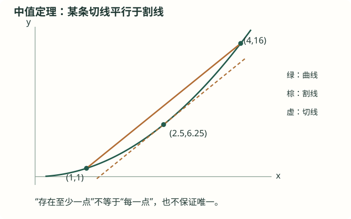

# 高阶拓展知识卡合订本

版本 1.1 · 2026-09-16。所有标为原创的练习均为本次自行编写。

# A01 数学归纳法：从递推走向证明

高阶拓展 · 学有余力选学（非统一高考必修） · 拓展 · 证明基础

## 前置知识

[H02 命题、量词与充分必要条件](高中_合订.md#h02) · [H25 数列、递推、等差与等比](高中_合订.md#h25)

## 本节目标

- 说清基础定义与定理前提
- 复述推导并核查反例
- 独立完成例题后的两道自测

## 基础与概念

### 自然数命题

命题P(n)可以随整数n变化。“试了很多项都对”仅是证据，不是对无限多个n的证明。归纳法针对从某个整数n₀起连续的全部整数。

### 归纳假设与强归纳

普通归纳是假设P(k)成立推出P(k+1)；强归纳可同时使用P(n₀),…,P(k)。两种形式建立在自然数的良序性质上：非空自然数集合有最小元。

### 适用边界

参数范围、起点和递推步都要覆盖。偶数步推偶数步不能证明奇数；证明存在一种分解时，可以归纳分解规模，但须确保子问题规模下降。

## 定理：数学归纳原理

### 成立条件

- P(n₀)成立。
- 每个整数k≥n₀都有P(k)⇒P(k+1)。

### 结论

对所有整数n≥n₀，P(n)成立。

### 证明

证明范围：完整证明（以自然数良序性质为基础）

1. 反设存在失败的整数，取其中最小的m。
2. 起点已成立，故m>n₀；最小性保证P(m−1)成立。
3. 归纳步推出P(m)成立，矛盾。因此失败集合为空。

## 公式如何衍生

1. 猜想1+3+…+(2n−1)=n²。n=1时两边都是1。
2. 假设前k个奇数和为k²；第k+1项是2k+1。
3. 新和=k²+2k+1=(k+1)²，因此对n≥1成立。

## 解题方法

- 先核对前置知识和成立条件，再应用结论；回到原定义检查边界。

## 易错与限制

- 不能把待证的P(k+1)当成归纳假设。

## 完整例题

【原创】证明1+2+…+n=n(n+1)/2。

1. n=1成立。
2. 若前k项和为k(k+1)/2，加k+1得(k+1)(k+2)/2。
3. 归纳成立，n为正整数。

答案：n(n+1)/2，n≥1。

## 自测与解析

### 1. 基础

【原创】证明2ⁿ≥n+1（整数n≥0）。

展开答案与解析

答案：成立。

解析：n=0取等；由2ᵏ≥k+1得2ᵏ⁺¹≥2k+2≥k+2（k≥0）。

### 2. 进阶

【原创】仅验证n=1和P(k)⇒P(k+2)能否证明所有n≥1？

展开答案与解析

答案：不能。

解析：只连通奇数链；还需n=2起点或其他连接偶数的方法。

## 掌握检查

- 不看正文写出定理条件与结论
- 给出一种条件缺失时的反例或限制
- 完成自测并解释关键步骤

## 核查来源与对应范围

- [核查与延伸阅读](https://ocw.mit.edu/courses/6-042j-mathematics-for-computer-science-spring-2015/mit6_042js15_textbook.pdf)：MIT课程教材：归纳法与良序原理；本库证明和训练独立编排。

本卡为自行组织的讲解与训练，不是教材的逐字摘录。来源定位不代表逐页核完该教材。

---

# A02 数列极限、上确界与单调有界

高阶拓展 · 学有余力选学（非统一高考必修） · 拓展 · 分析基础

## 前置知识

[H25 数列、递推、等差与等比](高中_合订.md#h25) · [H03 二次不等式与分式不等式](高中_合订.md#h03) · [A01 数学归纳法：从递推走向证明](#a01)

## 本节目标

- 说清基础定义与定理前提
- 复述推导并核查反例
- 独立完成例题后的两道自测

## 基础与概念

### ε—N定义

aₙ→L指对每个ε>0，存在整数N，使所有n≥N都有|aₙ−L|<ε。先给任意精度，再找统一阈值；N可依赖ε，但不能依赖随后挑选的n。

### 有界与上确界

上界M满足全部aₙ≤M；最小上界叫上确界sup。实数完备性保证每个非空且有上界的实数集合都有上确界。这是基础性质，本库不从有理数构造实数重新证明它。

### 必要条件与反例

收敛数列必有界：充分靠后的项落在L±1中，其绝对值不超过|L|+1；有限个前项的绝对值再与|L|+1一起取最大值，即得到控制全部项绝对值的界。但(−1)ⁿ有界不收敛；单调但无界的n也不收敛于有限实数。

## 定理：单调有界收敛定理

### 成立条件

- aₙ单调不减。
- 存在实数M，使每项aₙ≤M。

### 结论

aₙ收敛，极限为L=sup{aₙ}。单调不增且有下界的情形相应成立。

### 证明

证明范围：完整证明（使用实数完备性）

1. 完备性给出L。任取ε>0，L−ε不是上界，故存在N使a_N>L−ε。
2. 对n≥N，单调性给L−ε<a_N≤aₙ≤L。
3. 故|aₙ−L|<ε，正是收敛定义。

## 公式如何衍生

1. 令a₁=1，aₙ₊₁=√(2+aₙ)。归纳可证1≤aₙ<2。
2. 函数√(2+x)递增且a₂>a₁，归纳得aₙ₊₁≥aₙ。
3. 由单调有界先得到aₙ→L且1≤L≤2，移去首项不影响趋近性质，因此aₙ₊₁也趋L。不必提前借用A04：根式差有理化给|√(2+aₙ)−√(2+L)|=|aₙ−L|/[√(2+aₙ)+√(2+L)]≤|aₙ−L|/(2√3)→0。所以递推式两边极限给L=√(2+L)。平方得(L−2)(L+1)=0，结合L≥1排除−1，得到L=2。不能先解固定点方程就宣称收敛。

## 解题方法

- 先核对前置知识和成立条件，再应用结论；回到原定义检查边界。

## 易错与限制

- 递推式的固定点只是极限候选值，必须先证明收敛。

## 完整例题

【原创】用定义证明3/n→0。

1. 给定ε>0。
2. 取整数N>3/ε。
3. n≥N时|3/n|≤3/N<ε。

答案：极限为0。

## 自测与解析

### 1. 基础

【原创】数列1−2/n是否收敛？

展开答案与解析

答案：收敛到1。

解析：误差2/n；选N>2/ε即可，且数列递增有上界1。

### 2. 进阶

【原创】aₙ=(−1)ⁿ为何不能使用单调有界定理？

展开答案与解析

答案：不单调且不收敛。

解析：奇数子列恒−1，偶数子列恒1，不能具有相同极限。

## 掌握检查

- 不看正文写出定理条件与结论
- 给出一种条件缺失时的反例或限制
- 完成自测并解释关键步骤

## 核查来源与对应范围

- [核查与延伸阅读](https://openstax.org/books/calculus-volume-2/pages/5-1-sequences)：极限、单调与有界；本库另给上确界证明和原创递推例。

本卡为自行组织的讲解与训练，不是教材的逐字摘录。来源定位不代表逐页核完该教材。

---

# A03 函数极限：ε—δ、运算法则与夹逼

高阶拓展 · 学有余力选学（非统一高考必修） · 拓展 · 分析基础

## 前置知识

[H05 高中函数：定义域、值域与基本性质](高中_合订.md#h05) · [A02 数列极限、上确界与单调有界](#a02)

## 本节目标

- 说清基础定义与定理前提
- 复述推导并核查反例
- 独立完成例题后的两道自测

## 基础与概念

### 去心邻域

lim(x→a)f(x)=L表示：∀ε>0，∃δ>0，当0<|x−a|<δ且x在定义域内时，有|f(x)−L|<ε；a须为定义域聚点。去掉x=a，所以f(a)可以不存在或不同于L。

### 左右极限与运算

实轴内点的双侧极限存在当且仅当左右极限存在且相等。有限极限的和、积可逐项取极限；商还要求分母极限不为0。0/0不是数值结论，需变形或其他定理。

### 夹逼与局部有界

若近a时g≤f≤h且g、h都趋L，则f趋L；由两侧误差限制直接推出。极限有限的函数在充分小的去心邻域内有界，是乘积极限证明的重要前置。

## 定理：有限极限的加法法则

### 成立条件

- f(x)→A、g(x)→B，x→a。
- 在同一适当去心邻域中定义。

### 结论

f(x)+g(x)→A+B。

### 证明

证明范围：完整ε—δ证明

1. 给定ε>0，分别用精度ε/2找到δ₁、δ₂。
2. 取δ=min(δ₁,δ₂)。
3. 在该去心邻域中，|(f+g)−(A+B)|≤|f−A|+|g−B|<ε。

## 公式如何衍生

1. 求lim(x→3)(x²−9)/(x−3)。原式在x=3没有定义。
2. x≠3时因式分解约为x+3，故极限是6。
3. 严格核对：|x+3−6|=|x−3|，取δ=ε即可；约分只在去心邻域用，不改变极限。

## 解题方法

- 先核对前置知识和成立条件，再应用结论；回到原定义检查边界。

## 易错与限制

- 极限的0/0形式不能约成0，也不代表极限不存在。

## 完整例题

【原创】用定义证明lim(x→2)(5x−2)=8。

1. 误差|(5x−2)−8|=5|x−2|。
2. 给ε>0，取δ=ε/5。
3. 0<|x−2|<δ时误差<ε。

答案：极限为8。

## 自测与解析

### 1. 基础

【原创】求lim(x→0)x²sin(1/x)。

展开答案与解析

答案：0。

解析：sin有界，−x²≤x²sin(1/x)≤x²，两端都趋0。

### 2. 进阶

【原创】lim(x→0)1/x存在有限实数值吗？

展开答案与解析

答案：不存在。

解析：右侧无界为正，左侧无界为负，不存在共同有限极限。

## 掌握检查

- 不看正文写出定理条件与结论
- 给出一种条件缺失时的反例或限制
- 完成自测并解释关键步骤

## 核查来源与对应范围

- [核查与延伸阅读](https://openstax.org/books/calculus-volume-1/pages/2-5-the-precise-definition-of-a-limit)：严格极限定义；法则证明与例题为原创组织。

本卡为自行组织的讲解与训练，不是教材的逐字摘录。来源定位不代表逐页核完该教材。

---

# A04 连续性、介值与闭区间最值

高阶拓展 · 学有余力选学（非统一高考必修） · 拓展 · 分析基础

## 前置知识

[A03 函数极限：ε—δ、运算法则与夹逼](#a03) · [H09 零点、二分法与函数模型](高中_合订.md#h09)

## 本节目标

- 说清基础定义与定理前提
- 复述推导并核查反例
- 独立完成例题后的两道自测

## 基础与概念

### 点连续与区间连续

f在a连续指f(a)有定义且lim(x→a)f(x)=f(a)。区间端点取区间内的单侧极限。跳跃、无界、缺点均须具体分析，不能只凭一张不精确的图。

### 介值与存在性

在闭区间[a,b]连续，f会取到介于f(a)、f(b)之间的每个数。异号端值因而给出零点；这只保证至少一个，不保证唯一，唯一性可另由严格单调等证明。

### 最值与完备性

闭有界区间上的连续函数一定有最大值和最小值。证明依赖实数完备性／紧致性；本卡以该定理为已声明的基础结果，不把它伪装成显然结论。开区间函数f(x)=x（0<x<1）没有最大、最小值。

## 定理：介值定理的零点形式

### 成立条件

- a<b，f在[a,b]连续。
- f(a)<0<f(b)。

### 结论

存在c∈(a,b)，使f(c)=0。

### 证明

证明范围：完整证明（使用实数上确界性质）

1. 令S={x∈[a,b]:f(x)≤0}，它非空有上界，取c=sup S。
2. 由端点连续性，a附近存在负值且b附近为正，故a<c<b。
3. 若f(c)<0，连续性使c右边近处仍负，出现S中大于c的点，矛盾。
4. 若f(c)>0，连续性使c附近皆正；但上确界性质保证S中有任意靠近c的左侧点，矛盾。因此f(c)=0。

## 公式如何衍生

1. 方程x³+x−4=0在[1,2]端值分别−2、6，故有根。
2. 若x₂>x₁，则f(x₂)−f(x₁)=(x₂−x₁)(x₂²+x₁x₂+x₁²+1)>0，故严格递增，根唯一。
3. 二分n次后区间长1/2ⁿ，取中点的绝对误差至多1/2ⁿ⁺¹。

## 解题方法

- 先核对前置知识和成立条件，再应用结论；回到原定义检查边界。

## 易错与限制

- 最值定理的闭、有界、连续条件不能随意删除。

## 完整例题

【原创】g(x)=1/x能否因g(−1)<0<g(1)判定[−1,1]有零点？

1. 0处未定义，因此不满足区间连续条件。
2. 任意定义域中的x都有1/x≠0。
3. 异号只是必要检查的一部分，不能跳过连续性。

答案：不能；本例没有零点。

## 自测与解析

### 1. 基础

【原创】连续函数在[2,5]上端值为1和9，是否一定取到4？

展开答案与解析

答案：一定。

解析：4介于两个端值之间，由介值定理。

### 2. 进阶

【原创】f(x)=x²在R上有最大值吗？

展开答案与解析

答案：没有；最小值为0。

解析：定义域不有界，闭区间最值定理不能直接用于整个R；函数向上无界。

## 掌握检查

- 不看正文写出定理条件与结论
- 给出一种条件缺失时的反例或限制
- 完成自测并解释关键步骤

## 核查来源与对应范围

- [核查与延伸阅读](https://openstax.org/books/calculus-volume-1/pages/2-4-continuity)：连续与介值；最值定理另见同书4.3，证明范围已明确。

本卡为自行组织的讲解与训练，不是教材的逐字摘录。来源定位不代表逐页核完该教材。

---

# A05 可微与线性近似：求导法则为什么成立

高阶拓展 · 学有余力选学（非统一高考必修） · 拓展 · 微积分

## 前置知识

[A03 函数极限：ε—δ、运算法则与夹逼](#a03) · [H27 导数定义、求导法则与切线](高中_合订.md#h27)

## 本节目标

- 说清基础定义与定理前提
- 复述推导并核查反例
- 独立完成例题后的两道自测

## 基础与概念

### 可微的误差表示

f在a可微等价于f(a+h)=f(a)+f′(a)h+r(h)，其中r(h)/h→0。记r(h)=o(h)，不是误差恒等于0，而是相对h消失得更快。

### 可微必连续

增量f(a+h)−f(a)=h[f′(a)+r(h)/h]→0，因此连续。反向不成立，例如|x|在0的左右导数不同。

### 链式法则的前提

f在a可微，g在f(a)可微，则(g∘f)′(a)=g′(f(a))f′(a)。把外层的局部线性变化应用于内层增量，余项可控；不要求内层导数非零。

## 定理：乘积求导法则

### 成立条件

- f、g在a都可微。

### 结论

(fg)′(a)=f′(a)g(a)+f(a)g′(a)。

### 证明

证明范围：完整证明

1. 增减一项，把f(a+h)g(a+h)−f(a)g(a)拆成[f(a+h)−f(a)]g(a+h)+f(a)[g(a+h)−g(a)]。
2. 除以h并令h→0；可微保证g(a+h)→g(a)。
3. 两部分分别趋f′(a)g(a)和f(a)g′(a)，得到结论。

## 公式如何衍生

1. 为严谨说明链式法则，写g(b+k)−g(b)=g′(b)k+η(k)k，η(k)→0并补定义η(0)=0。
2. 令b=f(a)、k=f(a+h)−f(a)。可微给k/h→f′(a)，且k→0。
3. 复合增量除h为[g′(b)+η(k)]k/h，极限得到链式公式，也覆盖k=0的情况。

## 解题方法

- 先核对前置知识和成立条件，再应用结论；回到原定义检查边界。

## 易错与限制

- 微分近似需要误差控制；不能把≈改为=。

## 完整例题

【原创】用线性近似估计√4.04，并说明是否为精确值。

1. f(x)=√x，取a=4，f(4)=2、f′(4)=1/4。
2. h=0.04，线性估计2+(1/4)×0.04=2.01。
3. 这是近似，真正值略小于2.01；可用下一步的泰勒余项量化误差。

答案：约2.01，不是恒等值。

## 自测与解析

### 1. 基础

【原创】求d/dx [x²eˣ]。

展开答案与解析

答案：eˣ(x²+2x)。

解析：乘积法则给2xeˣ+x²eˣ。

### 2. 进阶

【原创】求d/dx sin(x²)，并解释2x的来源。

展开答案与解析

答案：2x cos(x²)。

解析：外层sin导数cos，内层x²导数2x，应用链式法则。

## 掌握检查

- 不看正文写出定理条件与结论
- 给出一种条件缺失时的反例或限制
- 完成自测并解释关键步骤

## 核查来源与对应范围

- [核查与延伸阅读](https://openstax.org/books/calculus-volume-1/pages/3-6-the-chain-rule)：链式法则核查；本卡增量证明与数值例原创。

本卡为自行组织的讲解与训练，不是教材的逐字摘录。来源定位不代表逐页核完该教材。

---

# A06 罗尔与拉格朗日中值定理

高阶拓展 · 学有余力选学（非统一高考必修） · 拓展 · 微积分

## 前置知识

[A04 连续性、介值与闭区间最值](#a04) · [A05 可微与线性近似：求导法则为什么成立](#a05) · [H28 导数与单调、极值、最值](高中_合订.md#h28)

## 本节目标

- 说清基础定义与定理前提
- 复述推导并核查反例
- 独立完成例题后的两道自测

## 自学加深：先查起点，再问为什么

### 入门检查（先独立回答）

f(t)=|t−1|在[0,2]连续，且f(0)=f(2)=1。能否直接用罗尔定理断言存在f′(c)=0？指出必须检查的条件。

检查起点

不能直接使用；f在内点1不可微，其他内点导数分别为−1或1，没有导数为0的点。

相同端值和连续只满足两项条件，还必须在整个开区间可微。一个满足前提的定理只能保证其结论；缺少前提时，需要单独分析，本例结论确实不成立。

### 直观入口（不是证明）

平均变化率是连接图象两端的割线斜率，瞬时变化率是切线斜率。中值定理说明，在连续连接且内部处处可微的路段上，某一处切线与割线平行。这是寻找证明的直观动机，不代替证明，也没有指定该点在区间正中间。

## 基础与概念

### 费马引理

若可微函数在内点c取得局部极值，则f′(c)=0。以极大值为例，右侧差商≤0、左侧差商≥0，导数若存在只能为0；端点与不可微点不适用。

### 罗尔定理

f在[a,b]连续、(a,b)可微，且f(a)=f(b)，则某c∈(a,b)满足f′(c)=0。由闭区间最值定理：非常值时至少一个不同于端值的极值在内部，再用费马引理；常值时处处导数0。

### 导数控制全局变化

中值定理把区间平均变化率等同于某内点导数。若区间上|f′|≤M，就有|f(y)−f(x)|≤M|y−x|；导数恒零则该区间上常值，不能跨定义域断点直接使用。

## 不跳步的推理

#### 1．先读清定理承诺的对象

给定a<b，假设f在[a,b]连续、在(a,b)可微。要找到的是某个c∈(a,b)，满足f′(c)=[f(b)−f(a)]/(b−a)。定理不要求端点导数存在，也不要求导函数连续，更不承诺c唯一。

#### 2．把一般斜率问题变成水平问题

记割线斜率m=[f(b)−f(a)]/(b−a)，割线函数为L(t)=f(a)+m(t−a)。设F(t)=f(t)−L(t)，是在每个位置扣掉割线高度；于是F(a)=F(b)=0，所需f′(c)=m正好变成F′(c)=0。辅助函数因此由目标反推而来。

#### 3．说明罗尔定理为何能产生零导数

连续F在闭区间有最大、最小值，此处使用A04明确陈述的最值定理。若F恒为0，任意内点导数为0；若F不恒为0，它在某处为正或负，而端点皆为0，因此相应的正最大值或负最小值只能在内部取得。

#### 4．把内部极值转换成零导数

以内部极大点c为例：h>0足够小时，[F(c+h)−F(c)]/h≤0；h<0时差商≥0。左右差商若收敛到同一导数，只能取0。这就是费马引理。极小点同理；不可微点不能跳过“同一个导数存在”的条件。

#### 5．还原中值定理结论

由F继承连续、可微条件，罗尔给出F′(c)=0。又F′(t)=f′(t)−m，故f′(c)=m。乘以非零的b−a，就得到f(b)−f(a)=f′(c)(b−a)。这里的c由存在性证明得到，不是预先随意挑选。

#### 6．从中值定理得到可用的变化界

对同一区间内的x<y，若f在[x,y]连续、内部可微且|f′(t)|≤M，则|f(y)−f(x)|=|f′(c)||y−x|≤M|y−x|。x=y时直接为0。不能跨越函数未定义的断点；也不能把只在一个点成立的导数界当作整个区间的界。

## 定理：拉格朗日中值定理

### 成立条件

- a<b，f在[a,b]连续。
- f在(a,b)处处可微。

### 结论

存在c∈(a,b)，使f(b)−f(a)=f′(c)(b−a)。

### 证明

证明范围：完整证明（罗尔及闭区间最值定理为前置）

1. 设m=[f(b)−f(a)]/(b−a)，令F(x)=f(x)−f(a)−m(x−a)。
2. F连续、内部可微，且F(a)=F(b)=0。
3. 罗尔定理给F′(c)=0；于是f′(c)=m，乘b−a得到结论。

## 公式如何衍生

1. 对x>−1且x≠0，把ln(1+t)用于端点0、x间的区间，得到ln(1+x)=x/(1+c)，c在0和x之间。
2. 更统一的比较：令h(x)=x−ln(1+x)，有h′(x)=x/(1+x)。
3. h在(−1,0)递减、(0,∞)递增，最小值h(0)=0，因此ln(1+x)≤x，等号仅x=0。

## 图解与读图提示

原例f(x)=x²在[1,4]连续、在(1,4)可导。割线斜率(16−1)/(4−1)=5；f′(2.5)=5，因此内部点ξ=2.5处切线平行于割线。图示不能证明对所有函数的存在性；一般证明在正文。

## 解题方法

- 先核对前置知识和成立条件，再应用结论；回到原定义检查边界。

## 易错与限制

- 定理说存在，不是c必为区间中点，也不保证唯一。

## 完整例题

【原创】f(x)=x²在[1,4]的中值定理点c是多少？

1. 平均变化率=(16−1)/(4−1)=5。
2. f′(c)=2c=5得c=5/2。
3. c在(1,4)中且各条件成立。

答案：c=5/2。

### 老师怎样想到并检查每一步

#### 1．复述原卡例题并检查前提

原例：求f(t)=t²在[1,4]中的中值定理点c。多项式在整个实轴连续且可微，因此闭区间连续和开区间可微两项都满足，定理保证至少有一个所求点。

#### 2．算区间平均变化率

f(1)=1，f(4)=16。纵向变化量为16−1=15，横向变化量为4−1=3，所以割线斜率m=15/3=5。此步不是求导，而是比较两个不同输入的函数值。

#### 3．把存在性结论写成方程

f′(t)=2t。中值定理要求f′(c)=m，因此需要解2c=5，得到c=5/2。不要把f(c)=5当作所求条件；5是斜率，不是图象高度。

#### 4．验证位置和等式

1<5/2<4，候选点确在开区间内。再代回：f′(5/2)(4−1)=5×3=15=f(4)−f(1)。候选值满足原定理的完整等式。

#### 5．用辅助函数独立核对

割线为L(t)=1+5(t−1)=5t−4。扣除后F(t)=t²−5t+4=(t−1)(t−4)，两端均为0；F′(t)=2t−5在t=5/2为0，与前面的直接计算一致。

#### 6．解释本例为什么不能代表所有函数

本例f′(t)=2t严格递增，所以斜率方程只给一个解，而且恰好是中点。对f(t)=t³在[−1,1]，平均斜率为1，3c²=1给c=±1/√3；中点0反而不是中值点。因此“本例是中点”和“定理规定中点”是不同命题。

### 错解对照

错误说法：中值定理中的“中值”就是区间中点，所以总取c=(a+b)/2。

错在哪里：定理只说某个内部点。f(t)=t³在[−1,1]的平均斜率是1，但中点处f′(0)=0，不能满足等式；真正的两个点是±1/√3。

怎样修正：先核查定理条件，再求平均斜率m，解f′(c)=m并筛选a<c<b。即使无法显式解出c，定理仍可用于证明存在性或估计变化量。

## 自测与解析

### 1. 基础

【原创】证明|sin u−sin v|≤|u−v|。

展开答案与解析

答案：对所有实数u,v成立。

解析：u=v显然；否则中值定理给差值cos c×(u−v)，由|cos c|≤1。

### 2. 进阶

【原创】f(x)=|x−2|在[1,3]满足罗尔定理吗？

展开答案与解析

答案：不满足可微条件。

解析：端值相同且连续，但2处不可微，其他内点导数±1，无导数为0的点。

### 3. 基础巩固

【原创·分层】f(t)=t²−2t，在[0,3]应用拉格朗日中值定理，求所有符合条件的c，并代回等式验证。

展开答案与解析

答案：c=3/2，且f(3)−f(0)=3=f′(3/2)·3。

解析：多项式在[0,3]连续、在(0,3)可微。端值f(0)=0、f(3)=3，平均变化率为1。由f′(t)=2t−2，解2c−2=1得c=3/2，确在开区间内。f′(3/2)=1，乘区间长度3得3，与端值差一致；因导数严格递增，只此一解。

### 4. 条件变式

【原创·分层】在[0,1]定义f(t)=t（0≤t<1），f(1)=2。它在(0,1)处处可微，能否使用中值定理？是否存在满足定理等式的c？

展开答案与解析

答案：不能使用；没有满足等式的c。缺少在右端点1的连续性。

解析：左极限lim(t→1−)f(t)=1，但f(1)=2，所以在闭区间上不连续。端值给平均斜率(2−0)/(1−0)=2；而每个c∈(0,1)都有f′(c)=1，不可能等于2。本例说明端点连续不能只由内部可微替代。

### 5. 综合应用

【原创·分层】证明对每个x>0都有x/(1+x)<ln(1+x)<x；并说明x=0时应如何改写。

展开答案与解析

答案：x>0时两边严格成立；x=0时三者均为0。

解析：固定x>0，对f(t)=ln(1+t)在[0,x]应用中值定理：它在该闭区间连续、内部可微，导数为1/(1+t)，所以ln(1+x)=x/(1+c)，其中0<c<x。于是1/(1+x)<1/(1+c)<1；乘正数x后得到所求严格不等式。x=0时不使用长度为0的中值定理，直接代值得三者同为0。

## 离开本节前：独立迁移

f(t)=t³在[0,2]的中值定理点是多少？c=1是否可行？

核对迁移题

c=2/√3；c=1不可行。

多项式满足前提。平均斜率(8−0)/2=4，3c²=4得到±2/√3，只有正值落在(0,2)；而f′(1)=3≠4。

### 卡住时回哪里补

- 把函数值、割线斜率和导数混为一谈：[H27 导数定义、求导法则与切线](高中_合订.md#h27)。分别计算t²在t=1的值、[1,4]割线斜率和t=1的导数，并用一句话解释三个数对应什么。
- 不知道为何极值一定能取到：[A04 连续性、介值与闭区间最值](#a04)。回看闭、有界、连续三项条件，并比较[0,1]上的x与(0,1)上的x；记清本库此处接受最值定理而未从紧致性证明。
- 不理解不可微点为何不能用费马引理：[A05 可微与线性近似：求导法则为什么成立](#a05)。对|t−1|在1处分别计算左右差商，观察两个极限为何不能合成一个导数。

## 掌握检查

- 不看正文写出定理条件与结论
- 给出一种条件缺失时的反例或限制
- 完成自测并解释关键步骤

## 核查来源与对应范围

- [核查与延伸阅读](https://openstax.org/books/calculus-volume-1/pages/4-4-the-mean-value-theorem)：定理条件核查；推导、不等式和训练为本库原创重组。

本卡为自行组织的讲解与训练，不是教材的逐字摘录。来源定位不代表逐页核完该教材。

---

# A07 泰勒公式：高阶近似与余项控制

高阶拓展 · 学有余力选学（非统一高考必修） · 拓展 · 微积分

## 前置知识

[A06 罗尔与拉格朗日中值定理](#a06) · [H31 二项式定理与系数提取](高中_合订.md#h31)

## 本节目标

- 明确基础对象及定理假设
- 复述公式推导与误差或等号条件
- 完成例题与自测

## 自学加深：先查起点，再问为什么

### 入门检查（先独立回答）

设f(t)=cos t，列出f、f′、f″、f‴、f⁽⁴⁾，以及前四项在t=0的值。

检查起点

依次为cos t、−sin t、−cos t、sin t、cos t；f(0)、f′(0)、f″(0)、f‴(0)依次为1、0、−1、0。

三角求导以弧度为单位。三次项系数为0，不表示四阶导数为0，也不表示余项消失；先掌握逐次求导再进入余项估计。

### 直观入口（不是证明）

泰勒多项式让一个容易计算的多项式，在展开中心与原函数的函数值、斜率和更高阶变化逐项匹配。匹配越多，只说明局部信息更多；真正保证近似精度的是余项。这是直观动机，不代替余项公式的证明，更不能把多次接触图象理解成处处相等。

## 基础与概念

### 高阶导数与阶乘

f⁽ᵏ⁾表示连续求k次导数，f⁽⁰⁾=f；k!=1·2·…·k，0!=1。以a为中心的n阶多项式Pₙ(x)=Σ(k=0…n) f⁽ᵏ⁾(a)(x−a)ᵏ/k!，在a处与f的前n阶导数匹配。

### 余项才决定精度

Rₙ(x)=f(x)−Pₙ(x)是精确差值。写f≈Pₙ时须给x的区间及误差界；无穷可导也不自动等于其泰勒级数，后者还要求Rₙ→0。

### 基础假设的层次

本卡采用容易核查的充分条件f∈Cⁿ⁺¹(I)，即直到n+1阶导数都在包含a、x的区间连续。定理可以在更弱条件下成立，但不能不加区分地省略条件。

## 不跳步的推理

#### 1．分清中心、阶数与变化量

中心是固定的a，目标输入是x，变化量为h=x−a。n是采用公式的阶数。Pₙ(x)=Σ(k=0…n)f⁽ᵏ⁾(a)hᵏ/k!；“n阶泰勒多项式”的实际次数可能小于n，因为某些系数可以为0。

#### 2．解释系数中为何有阶乘

若多项式含cₖ(t−a)ᵏ，连续求k次导数后在a处得到k!cₖ；次数更高的项仍含t−a，取t=a后为0，次数更低的项已被求成0。因此选cₖ=f⁽ᵏ⁾(a)/k!，就能逐阶匹配导数。

#### 3．先满足可用版本的条件

本卡采用f∈Cⁿ⁺¹(I)的充分条件：相关区间内直到n+1阶导数存在并连续；要估计的整段必须包含于I。仅在中心可导，或只知道一阶导数，都不够直接套这个版本。条件未满足只代表此版本不能保证结论，并不自动说明某个具体公式必错。

#### 4．固定目标点后设计零点

当x≠a，先固定这个目标点x，再令K=[f(x)−Pₙ(x)]/(x−a)ⁿ⁺¹。此时K是常数，证明中真正变化的变量另记t。令F(t)=f(t)−Pₙ(t)−K(t−a)ⁿ⁺¹，就同时得到F(x)=0以及F(a)=F′(a)=…=F⁽ⁿ⁾(a)=0。

#### 5．展开反复罗尔的连接

F在a、x为0，第一次罗尔在两者之间找到F′的零点c₁。若n≥1，F′在a也为0，于a与c₁之间再找F″的零点c₂。依次进行，利用F⁽ʲ⁾(a)=0（j≤n），最终得到F⁽ⁿ⁺¹⁾(ξ)=0。n=0只需第一次罗尔，无需假定F′(a)=0。

#### 6．由零导数还原精确余项

Pₙ的n+1阶导数为0，而K(t−a)ⁿ⁺¹的n+1阶导数为K(n+1)!。所以0=F⁽ⁿ⁺¹⁾(ξ)=f⁽ⁿ⁺¹⁾(ξ)−K(n+1)!，得到Rₙ(x)=f⁽ⁿ⁺¹⁾(ξ)(x−a)ⁿ⁺¹/(n+1)!。ξ存在于a与x之间，但通常不知道其值，且可能随x、n变化。

#### 7．把未知ξ换成已知保证界

如果整段上|f⁽ⁿ⁺¹⁾(t)|≤M，那么无论定理给哪个ξ，都有|Rₙ(x)|≤M|x−a|ⁿ⁺¹/(n+1)!。右边是保证上界，不是实际误差。必须取控制整段的M，不能只用中心处的导数值代替。

#### 8．区分有限公式和无穷展开

固定n的泰勒公式带着余项，是精确等式。若要令n无限增加并去掉余项，还必须证明Rₙ(x)→0。无穷可导本身不足以保证等于泰勒级数；有限阶近似无需提前作这种额外承诺。

## 定理：带拉格朗日余项的泰勒公式

### 成立条件

- n≥0为整数，f∈Cⁿ⁺¹(I)。
- a、x∈I，x≠a；I为区间。

### 结论

存在ξ严格介于a与x之间，使f(x)=Pₙ(x)+f⁽ⁿ⁺¹⁾(ξ)(x−a)ⁿ⁺¹/(n+1)!。x=a时余项为0。

### 证明

证明范围：完整证明（反复罗尔定理）

1. 固定x，令K=[f(x)−Pₙ(x)]/(x−a)ⁿ⁺¹；设F(t)=f(t)−Pₙ(t)−K(t−a)ⁿ⁺¹。
2. 有F(x)=0，且F(a)=F′(a)=…=F⁽ⁿ⁾(a)=0。
3. 先对a、x间用罗尔得F′的一处零点；再把该零点与a处F′=0配对。重复n+1次，得到区间内ξ使F⁽ⁿ⁺¹⁾(ξ)=0。
4. Pₙ的n+1阶导数为0，所以K=f⁽ⁿ⁺¹⁾(ξ)/(n+1)!，代回定义即得。

## 公式如何衍生

1. 若区间内|f⁽ⁿ⁺¹⁾|≤M，则直接取绝对值得|Rₙ(x)|≤M|x−a|ⁿ⁺¹/(n+1)!。
2. 对cos x在a=0取n=3，P₃=1−x²/2，因为奇数阶系数为0。
3. 四阶导数cos x的绝对值≤1，因此|cos x−(1−x²/2)|≤|x|⁴/24；不是凭感觉判断“小量可忽略”。

## 解题方法

- 对照定理逐项检查假设，区分精确等式、近似及单向不等式。

## 易错与限制

- ξ是存在但通常未知的中间点，不能直接替成a或x当成精确等式。

## 完整例题

【原创】用1−x²/2估算cos0.2（弧度），给误差上界。

1. 近似值1−0.2²/2=0.98。
2. 用三阶泰勒公式，四阶导数绝对值≤1。
3. 误差≤0.2⁴/24=1/15000，约0.00006667。

答案：约0.98，绝对误差不超过1/15000。

### 老师怎样想到并检查每一步

#### 1．明确原例输入和目标

原例：用1−x²/2估算cos0.2，并给误差上界。0.2表示弧度，展开中心选a=0；因为0.2接近0且cos在0的导数容易计算，这个中心合适。

#### 2．列出会用到的导数

f=cos，f′=−sin，f″=−cos，f‴=sin，f⁽⁴⁾=cos。前三阶在0的值为1、0、−1、0，且各阶导数在[0,0.2]连续，满足n=3版本的充分条件。

#### 3．解释为何可选三阶

P₃(x)=1+0·x−x²/2!+0·x³/3!=1−x²/2。虽然这个表达式只有二次项，仍是合法的三阶泰勒多项式。选择n=3便能得到四次幂量级的余项，而不是把零三次项当作余项。

#### 4．计算近似值

代x=0.2=1/5，P₃(0.2)=1−(1/5)²/2=1−1/50=49/50=0.98。到这一步只获得近似数，还没有获得精度保证。

#### 5．计算绝对误差上界

四阶导数为cos t，其绝对值在整段上≤1，故可取M=1。|R₃(0.2)|≤(1/5)⁴/4!=1/(625×24)=1/15000，约0.00006667。近似值0.98与保证误差界应一同报告。

#### 6．进一步判断误差方向

ξ∈(0,0.2)，这里cosξ>0，所以R₃(0.2)=cosξ/15000>0。又cosξ<1，因此0.98<cos0.2<0.98+1/15000。原卡的双向绝对误差保证正确，这里进一步说明0.98略低估实际值。

#### 7．检查这次计算到底证明了什么

已证明的是某个确定近似的误差不超过1/15000；没有证明实际误差恰为1/15000，也没有求出ξ。可以用计算器作合理性核对，但计算器显示的若干小数不能替代整段导数界给出的证明。

### 错解对照

错误说法：三次项系数为0，所以三阶展开后就没有误差，cos x=1−x²/2。

错在哪里：系数为0只意味着对应的一项不出现。最简单的反例是f(x)=x⁴在0的三阶泰勒多项式为0，但原函数在x≠0时不是0；误差全在四阶及更高变化中。

怎样修正：无论某个系数是否为0，都保留Rₙ。选定n后核查第n+1阶导数，在目标区间内找到M，再报告绝对误差保证。

## 自测与解析

### 1. 基础

【原创】写sin x在0处三阶泰勒多项式。

展开答案与解析

答案：x−x³/6。

解析：各阶导数在0处依次0、1、0、−1，除以对应阶乘。

### 2. 进阶

【原创】仅有f可微，能否直接使用三阶泰勒的四阶导数余项？

展开答案与解析

答案：不能。

解析：现有前提不能保证二至四阶导数存在；需补充光滑性条件。

### 3. 基础巩固

【原创·分层】对f(t)=t³，在a=1处写二阶泰勒多项式P₂(t)，并求精确余项R₂(t)。

展开答案与解析

答案：P₂(t)=1+3(t−1)+3(t−1)²，R₂(t)=(t−1)³。

解析：f(1)=1，f′(1)=3，f″(1)=6，除以2!得到二次项系数3。因为f‴(ξ)=6在任何点都相同，拉格朗日余项为6(t−1)³/3!=(t−1)³。也可把t写成1+h，直接展开(1+h)³核对；这次余项可精确计算，不只是误差上界。

### 4. 条件变式

【原创·分层】f(t)=|t|³在0附近具有连续的二阶导数。能否直接使用本卡n=2、要求f∈C³的泰勒版本？不能使用是否就说明任何二阶余项表达都一定错误？

展开答案与解析

答案：不能直接套本卡C³版本；也不能据此断言所有具体余项表达都错误。

解析：t>0时f=t³，t<0时f=−t³，f′(t)=3t|t|，f″(t)=6|t|，并且两式在0连续。但f″在0的左右导数分别为−6和6，f‴(0)不存在，故不满足本卡的充分条件。此时P₂(t)=0、实际误差为|t|³；我们仍能直接描述误差。缺少充分条件与结论必假是两件事。

### 5. 综合应用

【原创·分层】估算cos0.3，目标绝对误差不超过10⁻⁵。使用1−x²/2及原卡四阶余项上界能否保证目标？若不能，增加一个非零项并给出足够小的误差保证。

展开答案与解析

答案：原保证界0.0003375不能保证目标。改用1−x²/2+x⁴/24，在0.3处为0.9553375，绝对误差≤0.0000010125<10⁻⁵。

解析：仅用1−x²/2，对n=3公式的保证界为0.3⁴/24=0.0003375，大于目标；这里只说该界不能保证，不把“上界大”当作实际误差一定大。加入x⁴/24后，可取n=5，因为五次项系数为0。cos的六阶导数为−cos，绝对值≤1，所以误差≤0.3⁶/6!=0.000729/720=0.0000010125。近似值为1−0.045+0.0003375=0.9553375，达到保证要求。

## 离开本节前：独立迁移

用x−x³/6估算sin0.1。说明为什么可取n=4，并给保证误差上界。

核对迁移题

近似值599/6000≈0.0998333333；绝对误差≤1/12000000≈8.3333×10⁻⁸。

sin的四阶导数在0为0，故P₄仍为x−x³/6；五阶导数为cos，整段绝对值≤1。余项界为0.1⁵/5!=1/12000000。

### 卡住时回哪里补

- 不熟悉反复求导和复合求导：[H27 导数定义、求导法则与切线](高中_合订.md#h27)。写出sin、cos连续五次求导的循环，再计算在0的值；将求导顺序与代入顺序分开。
- 不理解为什么必有未知ξ：[A06 罗尔与拉格朗日中值定理](#a06)。用两次罗尔画出F的两个零点、F′的两个零点与F″的一个零点，再推广到n+1次。
- 把近似号当等号或不知道误差如何缩小：[A05 可微与线性近似：求导法则为什么成立](#a05)。回看线性近似中的余项r(h)，区别“h小时误差趋0”和“误差恒为0”。
- 把有限泰勒公式直接当无穷级数：[A10 无穷级数、幂级数与展开的边界](#a10)。在学完本卡后阅读部分和与余项趋0的要求，并尝试指出指数展开为何能去掉余项。

## 掌握检查

- 能说明公式为何成立及何时不能用
- 能独立完成练习并检查结果

## 核查来源与对应范围

- [核查与延伸阅读](https://openstax.org/books/calculus-volume-2/pages/6-3-taylor-and-maclaurin-series)：泰勒与余项条件核查；证明结构和数值训练独立编写。

本卡为自行组织的讲解与训练，不是教材的逐字摘录。来源定位不代表逐页核完该教材。

---

# A08 定积分与微积分基本定理

高阶拓展 · 学有余力选学（非统一高考必修） · 拓展 · 微积分

## 前置知识

[A02 数列极限、上确界与单调有界](#a02) · [A04 连续性、介值与闭区间最值](#a04) · [A06 罗尔与拉格朗日中值定理](#a06)

## 本节目标

- 明确基础对象及定理假设
- 复述公式推导与误差或等号条件
- 完成例题与自测

## 基础与概念

### 黎曼和与可积

把[a,b]分割为小区间，取样点ξᵢ，求Σ f(ξᵢ)Δxᵢ。若当最大段长趋0时，无论怎样分割和选点均趋同一个数，就称黎曼可积，该数记∫ₐᵇ f(x)dx；并规定反向积分变号。

### 连续为何足够

连续函数在闭区间上一致连续：一个δ可控制所有点的变化。于是分割足够细时，上和与下和之差≤ε(b−a)，故黎曼可积。这里采用“一致连续与上下和判别”基础结果；不展开其紧致性证明。

### 有向面积和原函数

积分累积带符号的量，函数为负的区域贡献负值。几何总面积是∫|f|。F′=f的F叫原函数，同一区间内任意两个原函数只差常数，这来自中值定理。

## 定理：微积分基本定理（连续函数版本）

### 成立条件

- f在[a,b]连续，a<b。
- A(x)=∫ₐˣf(t)dt。

### 结论

内部点有A′(x)=f(x)。若F在[a,b]连续、在(a,b)满足F′=f，则∫ₐᵇf=F(b)−F(a)。

### 证明

证明范围：完整核心证明（已接受黎曼积分性质及连续函数可积）

1. [A(x+h)−A(x)]/h是f在x与x+h之间的平均值。
2. 其与f(x)的差的绝对值≤该小区间上|f(t)−f(x)|的上界。连续性使此界随h→0趋0，两侧h均适用。故A′=f。
3. 若F′=f，则(F−A)′=0，中值定理给F−A在内部常值。为说明端点延伸：连续f在[a,b]有界，取|f|≤M，则|A(x)−A(y)|=|∫ᵧˣf(t)dt|≤M|x−y|，所以A在整个闭区间连续；再结合F的连续性将常数关系延至端点。
4. A(a)=0，从而F(b)−F(a)=A(b)=∫ₐᵇf。

## 公式如何衍生

1. 幂函数xᵐ（m非负整数）的原函数是xᵐ⁺¹/(m+1)。
2. 由基本定理得∫ₐᵇxᵐdx=(bᵐ⁺¹−aᵐ⁺¹)/(m+1)。
3. 更一般的实幂必须考虑定义域；m=−1时不能除以0，应使用ln|x|且区间不能穿过0。

## 解题方法

- 对照定理逐项检查假设，区分精确等式、近似及单向不等式。

## 易错与限制

- 不是所有函数都黎曼可积；不能把端点发散的广义积分当普通定积分直接代入。

## 完整例题

【原创】比较∫₋₁² x dx与图象在该区间和x轴围成的面积。

1. 有向积分=[x²/2]₋₁²=3/2。
2. 总面积分成[−1,0]与[0,2]，分别积分−x与x。
3. 得到1/2+2=5/2。

答案：有向积分3/2；总面积5/2。

## 自测与解析

### 1. 基础

【原创】求∫₀²(3x²+1)dx。

展开答案与解析

答案：10。

解析：原函数x³+x，上下限差为8+2=10。

### 2. 进阶

【原创】求d/dx ∫₀ˣ² cos t dt。

展开答案与解析

答案：2x cos(x²)。

解析：先由基本定理对上限求导，再乘上限x²的导数2x。

## 掌握检查

- 能说明公式为何成立及何时不能用
- 能独立完成练习并检查结果

## 核查来源与对应范围

- [核查与延伸阅读](https://openstax.org/books/calculus-volume-1/pages/5-3-the-fundamental-theorem-of-calculus)：基本定理核查；证明采用局部振幅估计，原创面积比较例。

本卡为自行组织的讲解与训练，不是教材的逐字摘录。来源定位不代表逐页核完该教材。

---

# A09 换元积分与分部积分的推导

高阶拓展 · 学有余力选学（非统一高考必修） · 拓展 · 微积分

## 前置知识

[A05 可微与线性近似：求导法则为什么成立](#a05) · [A08 定积分与微积分基本定理](#a08)

## 本节目标

- 明确基础对象及定理假设
- 复述公式推导与误差或等号条件
- 完成例题与自测

## 基础与概念

### 不定积分的含义

∫f(x)dx表示一个区间上全部原函数F(x)+C；定积分是确定的数。算完不定积分可通过求导核对，算定积分还要核对新旧上下限。

### 换元条件

若f连续、φ∈C¹([α,β])且φ的值落在f的定义区间内，则∫α^β f(φ(t))φ′(t)dt=∫φ(α)^φ(β) f(u)du。该复合型公式不要求φ单调；但若需反解变量并选择分支，就要另核对可逆区间。

### 分部积分的思路

乘积求导(uv)′=u′v+uv′，积分后把一项移到另一边。选择u通常希望求导后变简单；选择dv则必须能找到相应v。记号du=u′dx是微分形式，不是任意删除dx。

## 定理：分部积分公式

### 成立条件

- u、v在[a,b]上连续可微。

### 结论

∫ₐᵇu(x)v′(x)dx=[u(x)v(x)]ₐᵇ−∫ₐᵇu′(x)v(x)dx。

### 证明

证明范围：完整证明

1. 由乘积法则(uv)′=u′v+uv′。
2. 两边在[a,b]积分，基本定理给[uv]ₐᵇ=∫u′v+∫uv′。
3. 移项得到公式；所有积分因连续性而存在。

## 公式如何衍生

1. 换元公式的推导：取f的原函数F，则链式法则给(F∘φ)′=f(φ)φ′。
2. 左边积分=F(φ(β))−F(φ(α))，也是右边积分，故相等。
3. 例如∫₀¹2x cos(x²)dx，令u=x²，上下限变0与1，结果sin1。角度为弧度。

## 解题方法

- 对照定理逐项检查假设，区分精确等式、近似及单向不等式。

## 易错与限制

- 换元以后不能还用旧上下限却把变量当新变量计算。

## 完整例题

【原创】计算∫₀¹ x eˣ dx。

1. 选u=x，v′=eˣ，因此u′=1，v=eˣ。
2. 分部积分得[xeˣ]₀¹−∫₀¹eˣdx。
3. 结果e−(e−1)=1。

答案：1。

## 自测与解析

### 1. 基础

【原创】求∫2x/(1+x²)dx。

展开答案与解析

答案：ln(1+x²)+C。

解析：令u=1+x²>0，du=2x dx；积分1/u得ln u。

### 2. 进阶

【原创】计算∫₁ᵉ ln x dx。

展开答案与解析

答案：1。

解析：取u=ln x、v′=1，原函数x ln x−x；上下限差0−(−1)=1。

## 掌握检查

- 能说明公式为何成立及何时不能用
- 能独立完成练习并检查结果

## 核查来源与对应范围

- [核查与延伸阅读](https://openstax.org/books/calculus-volume-2/pages/3-1-integration-by-parts)：分部积分；换元另见Calculus Volume 1 §5.5。

本卡为自行组织的讲解与训练，不是教材的逐字摘录。来源定位不代表逐页核完该教材。

---

# A10 无穷级数、幂级数与展开的边界

高阶拓展 · 学有余力选学（非统一高考必修） · 拓展 · 分析基础

## 前置知识

[A02 数列极限、上确界与单调有界](#a02) · [A07 泰勒公式：高阶近似与余项控制](#a07) · [H26 数列求和与递推转化](高中_合订.md#h26)

## 本节目标

- 明确基础对象及定理假设
- 复述公式推导与误差或等号条件
- 完成例题与自测

## 基础与概念

### 级数是部分和的极限

Σ(n=0…∞)aₙ收敛指S_N=Σ(n=0…N)aₙ有有限极限。若收敛必有aₙ→0，因为aₙ=Sₙ−Sₙ₋₁；反向不成立，调和级数Σ1/n发散：每个倍增分组的和至少1/2。

### 绝对收敛

若Σ|aₙ|收敛，称绝对收敛。绝对收敛允许重排和有限组拆分；一般条件收敛级数不允许任意重排而保持原和。本卡所用指数、正弦、余弦幂级数均绝对收敛。

### 幂级数与收敛半径

幂级数收敛半径定理保证：对Σcₙ(x−a)ⁿ，存在R∈[0,∞]，在|x−a|<R绝对收敛、|x−a|>R发散；若0<R<∞，两个实端点需分别检查。此结构定理与区间内部逐项求导在本卡作为陈述未证的延伸基础结果，不展开一致收敛证明。

## 定理：无穷等比级数及尾项

### 成立条件

- 实数或复数q满足|q|<1。
- 从n=0起求和。

### 结论

Σ(n=0…∞)qⁿ=1/(1−q)；部分和S_N=1+q+…+qᴺ共N+1项，余项为qᴺ⁺¹/(1−q)。

### 证明

证明范围：完整证明

1. 有限等比和S_N=(1−qᴺ⁺¹)/(1−q)。
2. |q|<1保证qᴺ⁺¹→0，所以S_N→1/(1−q)。
3. 总和减部分和得到qᴺ⁺¹/(1−q)；绝对值≤|q|ᴺ⁺¹/(1−|q|)。

## 公式如何衍生

1. 由泰勒公式，eˣ的系数为1/n!，sin x为Σ(−1)ᵏx²ᵏ⁺¹/(2k+1)!，cos x为Σ(−1)ᵏx²ᵏ/(2k)!。
2. 固定实数x时，eˣ的余项绝对值|R_N(x)|≤e^|x| |x|ᴺ⁺¹/(N+1)!；sin、cos的余项绝对值对应界也有阶乘分母。控制绝对值才能同时控制误差的正负方向。
3. 阶乘使该界趋0：相邻界之比最终≤1/2，后续受收敛等比数列控制。因此这些展开确实等于函数，不只是形式配系数。

## 解题方法

- 对照定理逐项检查假设，区分精确等式、近似及单向不等式。

## 易错与限制

- 把1−1+1−1+…随意分组得到0或1并不是通常意义下的级数求和。

## 完整例题

【原创】求1+1/3+1/9+…，并给截至(1/3)⁴的误差。

1. q=1/3满足|q|<1，总和=1/(1−1/3)=3/2。
2. 截至指数4共有5项。
3. 余项=(1/3)⁵/(1−1/3)=1/162。

答案：总和3/2，误差1/162。

## 自测与解析

### 1. 基础

【原创】Σ(n=0…∞)2ⁿ是否收敛？

展开答案与解析

答案：发散。

解析：项2ⁿ不趋0，也不满足等比级数|q|<1条件。

### 2. 进阶

【原创】1/(1−x)的幂级数Σxⁿ在x=−1是否收敛？

展开答案与解析

答案：不收敛。

解析：部分和交替1、0；边界不能从区间内部公式直接代入。

## 掌握检查

- 能说明公式为何成立及何时不能用
- 能独立完成练习并检查结果

## 核查来源与对应范围

- [核查与延伸阅读](https://openstax.org/books/calculus-volume-2/pages/5-2-infinite-series)：级数定义和等比和核查；函数展开另参考§6.3，余项收敛理由已给。

本卡为自行组织的讲解与训练，不是教材的逐字摘录。来源定位不代表逐页核完该教材。

---

# A11 柯西—施瓦茨不等式与投影

高阶拓展 · 学有余力选学（非统一高考必修） · 拓展 · 线性代数与不等式

## 前置知识

[H13 平面向量与数量积](高中_合订.md#h13) · [H04 基本不等式与等号条件](高中_合订.md#h04)

## 本节目标

- 明确基础对象及定理假设
- 复述公式推导与误差或等号条件
- 完成例题与自测

## 自学加深：先查起点，再问为什么

### 入门检查（先独立回答）

u=(2,1)、v=(1,0)。求u·v和||v||²；再求实数t，使u−tv与v垂直。

检查起点

内积为2，||v||²=1，t=2。

u−tv=(2−t,1)，与v点积为2−t，令它等于0得t=2。这就是把向量分成沿v的分量与垂直分量。

### 直观入口（不是证明）

一个向量在某个方向上的投影长度不可能超过它本身的长度，这可以帮助理解柯西不等式。但图形只展示二维情形，正式证明会用非负平方范数，因此可以适用于任意维实内积空间。

## 基础与概念

### 实内积空间

内积⟨u,v⟩把一对向量对应到实数，满足对称、线性、正定：⟨u,u⟩≥0且仅u=0时取0。普通Rⁿ中内积为Σuᵢvᵢ；长度||u||=√⟨u,u⟩。复空间还需共轭，本卡只证明实数版。

### 正交与投影

⟨u,v⟩=0称正交。把u分为沿非零v的分量tv与垂直残差，投影系数t=⟨u,v⟩/||v||²，来自⟨u−tv,v⟩=0。

### 等号比背公式重要

柯西不等式等号当且仅当u、v线性相关（含零向量）。要把一个代数上界称为最大值，需同时能满足原题约束与等号条件。

## 不跳步的推理

#### 先解释线性相关与零向量

两个向量线性相关，指存在不全为0的实数α、β，使αu+βv=0。当v≠0时，这等价于u是v的某个实数倍；若其中一个是零向量，也线性相关。负倍数和正倍数都包括在内。

#### 单独处理会导致除零的情况

若v=0，内积和右侧的||v||²都是0，不等式为0≤0，等号成立。下面只讨论v≠0，此时正定性保证||v||²>0，可合法作分母。

#### 为什么挑这个t而不是任意猜

希望残差u−tv与v正交：⟨u−tv,v⟩=⟨u,v⟩−t||v||²=0，所以唯一选择t=⟨u,v⟩/||v||²。这个t使残差成为去掉沿v分量后的部分。

#### 把被压缩的一行完全展开

由对称性与双线性，||u−tv||²=⟨u−tv,u−tv⟩=||u||²−2t⟨u,v⟩+t²||v||²。代入t，后两项合并为−⟨u,v⟩²/||v||²。范数平方非负，所以0≤||u||²−⟨u,v⟩²/||v||²。

#### 乘回正数，检查等号的每个方向

两边乘正数||v||²，得到⟨u,v⟩²≤||u||²||v||²。等号成立当且仅当残差范数为0，按正定性等价于u−tv=0，正好是线性相关。反过来若u=tv，代入也确实为等号。

#### 平方不等式与最大值之间还差什么

开方先得到|⟨u,v⟩|≤||u||||v||，因而−||u||||v||≤⟨u,v⟩≤||u||||v||。要取正的最大值，需要同向的正倍数；负倍数通常给最小值。只有原约束允许那个向量，界才是最大值。

## 定理：柯西—施瓦茨不等式（实内积版）

### 成立条件

- u、v属于同一实内积空间。

### 结论

|⟨u,v⟩|²≤||u||²||v||²；等号当且仅当两向量线性相关。

### 证明

证明范围：完整证明

1. v=0时两边为0，等号成立。以下设v≠0。
2. 令t=⟨u,v⟩/||v||²，非负平方范数给0≤||u−tv||²=||u||²−⟨u,v⟩²/||v||²。
3. 乘以正数||v||²得到不等式；等号等价于u−tv=0，恰是u为v的倍数。

## 公式如何衍生

1. 代入u=(a₁,…,aₙ)、v=(b₁,…,bₙ)，得到(Σaᵢbᵢ)²≤(Σaᵢ²)(Σbᵢ²)。
2. 取v=(1,…,1)，得到(Σaᵢ)²≤nΣaᵢ²。
3. 这又说明Σ(aᵢ−平均数)²≥0；方差非负与向量长度非负是同一个结构。

## 图解与读图提示

示例u=(2,1)，v=(1,0)。投影系数t=(u·v)/||v||²=2，投影tv=(2,0)，残差u−tv=(0,1)与v正交。非负残差范数是正文柯西证明的关键；一般定理不依赖二维图形。

## 解题方法

- 对照定理逐项检查假设，区分精确等式、近似及单向不等式。

## 易错与限制

- 不能省略平方／绝对值，就声称内积总是非负。

## 完整例题

【原创】x²+y²=4时，求3x+4y的最大值。

1. 内积上界为√(3²+4²)√(x²+y²)=5×2=10。
2. 等号需(x,y)为(3,4)的正倍数，结合长度2得(6/5,8/5)。
3. 该点满足原条件且目标值10，因此上界可达。

答案：10，在(6/5,8/5)取得。

### 老师怎样想到并检查每一步

#### 把目标式识别成内积

原题x²+y²=4，求3x+4y最大值。设u=(x,y)、v=(3,4)，则目标是u·v，约束给||u||=2，已知||v||=√(9+16)=5。

#### 先找全局上界

柯西给|3x+4y|≤2×5=10，因此3x+4y≤10。到这里只证明不会超过10，尚未证明能够达到10。

#### 把等号条件与约束联立

取正最大值要求u=λv且λ>0，即x=3λ、y=4λ。代入原约束9λ²+16λ²=4得25λ²=4，λ=±2/5。为正最大值取λ=2/5。

#### 直接代回，不把候选当答案

得到(x,y)=(6/5,8/5)。其平方和(36+64)/25=4，符合约束；目标值18/5+32/5=10，确实达到上界，因此最大值为10。

#### 说明另一个根的数学意义

λ=−2/5给(x,y)=(−6/5,−8/5)，它也满足柯西等号，但目标值是−10，对应最小值。不能仅写“两向量成比例”就结束最大值取等分析。

### 错解对照

错误说法：柯西等号要求(x,y)与(3,4)成比例，所以正负两个比例点都给最大值10。

错在哪里：平方或绝对值会掩盖目标式的符号。负比例点使内积为负，达到的是−10而非10。

怎样修正：先从绝对值不等式分出上下界，再按最大值取同向、最小值取反向，并代回目标函数验证符号。

## 自测与解析

### 1. 基础

【原创】证明(a+b+c)²≤3(a²+b²+c²)。

展开答案与解析

答案：对所有实数成立。

解析：用向量(a,b,c)与(1,1,1)；等号a=b=c。

### 2. 进阶

【原创】向量(2,1)在(1,0)上的投影是什么？

展开答案与解析

答案：(2,0)。

解析：系数内积2除以长度平方1，再乘(1,0)。

## 离开本节前：独立迁移

实数x,y满足x²+y²=9，求x−2y的最大值及取等点。

核对迁移题

最大值3√5，取等点(3/√5,−6/√5)。

取v=(1,−2)，其模为√5，u模为3，故目标≤3√5。正比例u=λv且5λ²=9，取λ=3/√5。该点平方和为9，目标为15/√5=3√5。

### 卡住时回哪里补

- 内积展开时不会处理系数：[H13 平面向量与数量积](高中_合订.md#h13)。先在二维坐标中逐项展开，再对应到内积的线性和对称性质。
- 把上界当作最大值：[H04 基本不等式与等号条件](高中_合订.md#h04)。重做限定范围x≥4时x+9/x的题，练习检验取等点是否允许。

## 掌握检查

- 能说明公式为何成立及何时不能用
- 能独立完成练习并检查结果

## 核查来源与对应范围

- [核查与延伸阅读](https://ocw.mit.edu/courses/18-06-linear-algebra-spring-2010/)：课程中的正交、投影主线；本卡给出可独立核对的完整证明。

本卡为自行组织的讲解与训练，不是教材的逐字摘录。来源定位不代表逐页核完该教材。

---

# A12 凸函数与詹森不等式

高阶拓展 · 学有余力选学（非统一高考必修） · 拓展 · 函数与不等式

## 前置知识

[H04 基本不等式与等号条件](高中_合订.md#h04) · [A01 数学归纳法：从递推走向证明](#a01) · [A06 罗尔与拉格朗日中值定理](#a06)

## 本节目标

- 明确基础对象及定理假设
- 复述公式推导与误差或等号条件
- 完成例题与自测

## 自学加深：先查起点，再问为什么

### 入门检查（先独立回答）

对f(t)=t²、点1和3、权重1/4和3/4，分别算“先平均再平方”与“先平方再平均”。两个权重需要满足什么条件？

检查起点

前者为(5/2)²=25/4，后者为1/4+27/4=7，且25/4≤7。权重须非负且和为1。

平均点为(1/4)·1+(3/4)·3=5/2，落在两个点之间。这里的大小关系来自平方函数凸性；并不是所有函数对平均操作都有这个方向的不等式。

### 直观入口（不是证明）

凸函数的图象在两点连接的弦下方，所以先混合输入再计算函数，结果不超过先计算再用同样权重混合输出。詹森把两点推广到有限多点。这个图像说明为什么值得比较两种平均顺序，不代替定义与证明；凸函数也可能递减，例如正数上的1/x。

## 基础与概念

### 凸性定义

f在区间I上凸，指对x,y∈I及0≤t≤1，有f(tx+(1−t)y)≤tf(x)+(1−t)f(y)。图象位于连接两点的弦下方；“凸”不等于“递增”。严格凸把不同x,y及0<t<1时的不等号改为严格。

### 二阶导判据

若f在I内部二阶可导且f″≥0，则f凸。理由：f′单调不减，由中值定理可得各点图象不低于切线；在加权平均点应用切线下界并加权，线性项消掉，即得凸性。端点要求连续延拓。

### 权重与等号

权重wᵢ≥0且和为1，代表凸组合；允许0权重但它对应的点不影响结论。严格凸且所有权重正时，詹森等号要求全部xᵢ相同。非严格凸可能还有其他等号情形。

## 不跳步的推理

#### 1．用定义固定不等号方向

在区间I内，对x,y及0≤t≤1，凸性定义为f(tx+(1−t)y)≤tf(x)+(1−t)f(y)。点不同且0<t<1时总严格小于，才称严格凸。定义本身不要求可导，例如|x|是凸函数但在0不可微。

#### 2．说明二阶导判据只是便捷的充分条件

若f在区间内部二阶可导且f″≥0，f′单调不减。若包含端点，还要求连续延拓。对于内部m和任意内部x，中值定理将f(x)−f(m)写成f′(c)(x−m)；结合f′的单调性，并分别注意x−m正负，可得f(x)≥f(m)+f′(m)(x−m)，即图象不低于切线。

#### 3．从切线下界看见加权项如何消掉

令m=Σwᵢxᵢ，且wᵢ≥0、Σwᵢ=1。把每个切线下界乘wᵢ后求和，Σwᵢ(xᵢ−m)=0，便得到Σwᵢf(xᵢ)≥f(m)。这是可微版本的证明路线；若m是端点，非零权重点只能全部在该端点，或可用连续性处理。

#### 4．理解不依赖导数的一般证明

对不可导的凸函数，有限詹森仍成立。先删除0权重项；至少两项时令s=1−wₙ∈(0,1)，把前n−1个点先按wᵢ/s平均，得到y∈I，再把总平均写成sy+wₙxₙ。先用两点凸性，再对y用归纳假设，就得到n点版本。这解释了原卡为何引用A01归纳法。

#### 5．把等号条件单独检查

凸函数未必严格凸，如一次函数，可能在不同点也取等号。对严格凸函数，所有正权重对应的xᵢ相同才取等号；权重为0的点不影响结果。不能把“存在上界”直接叫最大值，仍要展示满足约束的取等点。

#### 6．从乘积目标反推选择的函数

若目标含正数乘积，对数把乘积变成和。ln t是凹函数；为了继续使用凸函数的≤形式，选g(t)=−ln t，其二阶导数1/t²>0，在(0,∞)严格凸。所有变量必须先确认为正，才允许取对数。

#### 7．控制变号和单调函数的作用

詹森后得到带负号的对数式，乘负数必须反向；随后对两边取指数，因为指数函数严格递增，不改变不等号方向。最后根据严格凸的等号条件检查可达性，完成从公式到最值的逻辑。

## 定理：有限加权詹森不等式

### 成立条件

- f在区间I上凸。
- xᵢ∈I，wᵢ≥0，Σwᵢ=1，有限项。

### 结论

f(Σwᵢxᵢ)≤Σwᵢf(xᵢ)。

### 证明

证明范围：完整归纳证明

1. 两项情形就是凸性定义；一项恒等。零权重项可删除。
2. 假设前n−1项版本成立。令s=Σ(i<n)wᵢ=1−wₙ；只有一项权重非零时直接成立，否则0<s<1。
3. 把加权点写成s·[Σ(i<n)(wᵢ/s)xᵢ]+wₙxₙ，用两点凸性。
4. 再对方括号中的n−1点用归纳假设，乘s后即得全部n项结论。

## 公式如何衍生

1. x>0时f(x)=−ln x满足f″=1/x²>0，所以严格凸。
2. 等权重詹森给−ln[(x₁+…+xₙ)/n]≤−(Σln xᵢ)/n。
3. 乘−1、利用指数递增，得到算术平均≥几何平均，等号全部正数相等。n=2回到高中基本不等式。

## 解题方法

- 对照定理逐项检查假设，区分精确等式、近似及单向不等式。

## 易错与限制

- 使用ln推导均值不等式时变量必须为正；零值情况需要另作连续性延拓。

## 完整例题

【原创】x,y,z>0且x+y+z=6，求xyz的最大值。

1. 算术平均为2。
2. 由詹森导出的均值不等式，(xyz)^(1/3)≤2，故xyz≤8。
3. x=y=z=2满足约束，取得8。

答案：8。

### 老师怎样想到并检查每一步

#### 1．复述原例并核对定义域

原例：x,y,z>0且x+y+z=6，求xyz最大值。正数条件保证−ln x、−ln y、−ln z都有定义；若允许负数，这条对数路线就不能直接使用。

#### 2．选择函数和权重

取g(t)=−ln t，三个权重都为1/3，非负且总和为1。加权平均m=(x+y+z)/3=2，仍在正数定义区间内。目标乘积在取对数后成为三项和，正好匹配詹森右边。

#### 3．验证凸性再写不等式

g′(t)=−1/t，g″(t)=1/t²>0，因此严格凸。詹森给g(2)≤[g(x)+g(y)+g(z)]/3，也就是−ln2≤−(ln x+ln y+ln z)/3。

#### 4．逐步变回乘积

两边乘−3，不等号反向：3ln2≥ln x+ln y+ln z=ln(xyz)。又3ln2=ln8，指数函数递增，所以8≥xyz。至此只证明8是上界。

#### 5．检查上界是否能够取得

严格凸且三个权重都为正，等号要求x=y=z。结合和为6，得到x=y=z=2。三个数都为正，符合原约束，而且乘积正好为8，因此8确实是最大值。

#### 6．用不等点检查方向而不是替代证明

例如(x,y,z)=(1,1,4)符合条件，乘积为4≤8；它能帮助发现误把方向写成xyz≥8的错误。但检查若干组数字无法证明所有正数组都满足结论，一般性来自前面的詹森证明。

### 错解对照

错误说法：ln t是凸函数，所以ln[(x+y+z)/3]≤(ln x+ln y+ln z)/3，从而xyz≥8。

错在哪里：ln t的二阶导数是−1/t²<0，它是凹函数。给出的方向错了，(1,1,4)的乘积4也直接反驳xyz≥8。即使函数选择正确，乘负数时不换向也会得到同样错误。

怎样修正：使用凸函数−ln t，或使用凹函数版詹森并反向。每一步注明是否乘负数、是否施加递增函数，最后单独核查等号是否满足原约束。

## 自测与解析

### 1. 基础

【原创】f(x)=x²在R上凸吗？写对应两点不等式。

展开答案与解析

答案：凸；(tx+(1−t)y)²≤tx²+(1−t)y²。

解析：二阶导数为2；左右差为t(1−t)(x−y)²≥0，也可直接证明。

### 2. 进阶

【原创】能否对负权重直接用詹森不等式？

展开答案与解析

答案：不能。

解析：权重非负是前提；如f=x²、权重2和−1、点1和0，左边4大于右边2。

### 3. 基础巩固

【原创·分层】对任意实数x,y，证明[(x+3y)/4]²≤(x²+3y²)/4，并求等号条件。

展开答案与解析

答案：恒成立，等号当且仅当x=y。

解析：取严格凸函数f(t)=t²，权重1/4与3/4均为正且和为1，直接由詹森得到不等式；严格凸的等号条件为x=y。也可独立展开核对：右边减左边=[4x²+12y²−(x²+6xy+9y²)]/16=3(x−y)²/16≥0，且仅x=y时为0。

### 4. 条件变式

【原创·分层】f(t)=t²严格凸，取权重(1/2,1/2,0)，点(2,2,99)。詹森是否取等号？“取等必须三个点全相同”在这里为何不对？

展开答案与解析

答案：取等号，两边都是4；只须正权重对应的前两个点相同。

解析：加权输入为(1/2)·2+(1/2)·2+0·99=2，函数值为4；加权输出也为(1/2)·4+(1/2)·4+0·99²=4。第三点权重为0，对两边都无影响。原卡“所有点相同”的等号结论具有所有权重都为正这一前提，不能删除。

### 5. 综合应用

【原创·分层】x,y,z>0且x+y+z=6，求1/x+1/y+1/z的最小值，解释为什么这里选一个递减函数仍能用凸性。

展开答案与解析

答案：最小值3/2，在x=y=z=2时取得。

解析：取f(t)=1/t，定义域为正数。它虽递减，但f″(t)=2/t³>0，所以严格凸；凸性与是否递增不是同一性质。用权重各1/3，詹森给1/2=f((x+y+z)/3)≤(1/x+1/y+1/z)/3，故和≥3/2。严格凸且正权重要求x=y=z=2，符合约束并实际取到最小值。也可用A11核对：(x+y+z)(1/x+1/y+1/z)≥(1+1+1)²=9。

## 离开本节前：独立迁移

x,y>0且2x+y=6，求x²y的最大值，并指出詹森应使用的权重。

核对迁移题

最大值8，在x=y=2取得；使用权重2/3与1/3。

平均点(2x+y)/3=2。对−ln应用加权詹森，得到−ln2≤−(2ln x+ln y)/3，故ln(x²y)≤3ln2，x²y≤8。正权重与严格凸给等号x=y，再由约束取2。

### 卡住时回哪里补

- 不等号变号和等号可达性容易漏：[H04 基本不等式与等号条件](高中_合订.md#h04)。回看基本不等式的正数条件、等号条件；将“证明上界”和“找到取等点”写成两步。
- 无法理解多点归纳中的归一化权重：[A01 数学归纳法：从递推走向证明](#a01)。先对三点写s=w₁+w₂，检查w₁/s+w₂/s=1，再尝试把三点归并成两点。
- 不了解二阶导怎样推出切线下界：[A06 罗尔与拉格朗日中值定理](#a06)。分别在x>m和x<m两种情形用中值定理，尤其说明乘负数x−m时方向为何改变。
- 把ln函数当凸函数或不清楚对数定义域：[H07 对数、运算法则与对数函数](高中_合订.md#h07)。确认对数仅对正数取值、对数把乘积变为和，并与g=−ln逐项对比符号。

## 掌握检查

- 能说明公式为何成立及何时不能用
- 能独立完成练习并检查结果

## 核查来源与对应范围

- [核查与延伸阅读](https://live.ocw.mit.edu/courses/6-079-introduction-to-convex-optimization-fall-2009/2ae23d35685ff402473b36011138149a_MIT6_079F09_lec03.pdf)：凸函数、詹森定理；本库归纳证明及均值衔接为自主教学编排。

本卡为自行组织的讲解与训练，不是教材的逐字摘录。来源定位不代表逐页核完该教材。

---

# A13 矩阵、线性方程组与可逆性

高阶拓展 · 学有余力选学（非统一高考必修） · 拓展 · 线性代数

## 前置知识

[J12 二元一次方程组与消元](初中_合订.md#j12) · [H13 平面向量与数量积](高中_合订.md#h13)

## 本节目标

- 理解对象、符号和前置条件
- 说明定理证明的核心步骤
- 完成计算并检查退化或反例

## 基础与概念

### 矩阵与乘法

m×n矩阵有m行n列，可看作从Rⁿ到Rᵐ的线性映射。乘积AB的(i,j)项为Σₖaᵢₖbₖⱼ，A列数须等于B行数；矩阵乘法一般不交换。单位矩阵I作用如乘法中的1。

### 线性相关与秩

若系数不全为0却使向量加权和为零，就线性相关；否则线性无关。秩是列向量中最多线性无关向量数。初等行变换保持方程解集，可用消元判断无解、唯一解或自由变量。

### 行列式的本卡范围

对二阶矩阵A=[[a,b],[c,d]]，定义det A=ad−bc，它表示有向面积的缩放因子。行列式是一个数而非矩阵；本卡只完整推导二阶逆矩阵，更高阶行列式定义需继续读线性代数课程。

## 定理：二阶逆矩阵公式

### 成立条件

- A=[[a,b],[c,d]]为实二阶矩阵。
- Δ=ad−bc≠0。

### 结论

A⁻¹=(1/Δ)[[d,−b],[−c,a]]；任意右端向量r的方程Ax=r唯一解x=A⁻¹r。

### 证明

证明范围：完整证明（二阶情形）

1. 把A与候选逆矩阵分别左右相乘，非对角项ab−ba、cd−dc为0，对角项均为Δ，除Δ后为I。
2. 左乘逆矩阵可推出任何解都等于A⁻¹r；直接代入又验证它是解，故唯一。
3. 若Δ=0且(a,b)≠(0,0)，非零向量(−b,a)被A映到0；若首行全零，另取第二行的垂直向量，零矩阵时任取非零向量。存在非零核向量使A不可能有逆。

## 公式如何衍生

1. 联立ax+by=r₁、cx+dy=r₂，第一式乘d减第二式乘b，得Δx=dr₁−br₂。
2. 同理Δy=ar₂−cr₁，所以逆矩阵公式就是消元的统一表达。
3. Δ=0并不意味着无解：两式重合时可有无穷解；右端不相容时才无解。

## 解题方法

- 先识别定义域、非零条件与概率模型，再推导和代回验证。

## 易错与限制

- 矩阵的AB=0不必推出A=0或B=0，也不能不检查就交换AB与BA。

## 完整例题

【原创】用矩阵或消元求2x+y=5、x−y=1。

1. A=[[2,1],[1,−1]]，Δ=−3。
2. 相加得3x=6，x=2；再得y=1。
3. 代回两式分别5和1，唯一性由Δ≠0保证。

答案：x=2，y=1。

## 自测与解析

### 1. 基础

【原创】矩阵[[1,2],[2,4]]可逆吗？

展开答案与解析

答案：不可逆。

解析：行列式4−4=0；第二行是第一行的2倍。

### 2. 进阶

【原创】同一系数x+y=2、2x+2y=5有什么解？

展开答案与解析

答案：无解。

解析：第一式乘2要求右边为4，与5矛盾；不可逆不等于必有无穷解。

## 掌握检查

- 能复述定理前提并举反例
- 能完成计算并解释结果意义

## 核查来源与对应范围

- [核查与延伸阅读](https://ocw.mit.edu/courses/18-06-linear-algebra-spring-2010/)：消元、矩阵乘法、逆与秩；本卡完整展开二阶情形。

本卡为自行组织的讲解与训练，不是教材的逐字摘录。来源定位不代表逐页核完该教材。

---

# A14 特征值、基与对角化

高阶拓展 · 学有余力选学（非统一高考必修） · 拓展 · 线性代数

## 前置知识

[A13 矩阵、线性方程组与可逆性](#a13) · [H25 数列、递推、等差与等比](高中_合订.md#h25)

## 本节目标

- 理解对象、符号和前置条件
- 说明定理证明的核心步骤
- 完成计算并检查退化或反例

## 基础与概念

### 基与坐标

Rⁿ的一组基包含n个线性无关向量，每个向量都可唯一用它们线性表示。把这些基向量放成P的列，P可逆；x=Pz把新坐标z转换为原坐标x。

### 特征向量必须非零

Av=λv且v≠0，称λ为特征值、v为相应特征向量。实特征值λ>0表示沿原方向缩放，λ<0表示反向，λ=0表示映到零向量；复数情形应理解为保持v张成的一维复子空间。二阶情形可解det(A−λI)=0，再解齐次方程找向量。

### 重复根不自动失败

同一特征值可以拥有多个独立特征向量，如I。[[1,1],[0,1]]却只有一条独立特征方向，不能对角化。需检查特征向量是否足够，不仅看根的个数。实域与复域的可对角化性也可能不同。

## 定理：对角化与特征向量基

### 成立条件

- A为n×n矩阵，固定在R或C上讨论。

### 结论

A可写A=PDP⁻¹（P可逆、D对角）当且仅当A有n个线性无关的特征向量。

### 证明

证明范围：在接受“n阶方阵可逆当且仅当其n个列向量线性无关”基础结果后的完整等价性证明；A13仅完整推导二阶逆矩阵，一般n阶基础定理在本库未另行证明。

1. 若P各列为独立特征向量vᵢ、特征值为λᵢ，令D=diag(λ₁,…,λₙ)。
2. 按列相乘有AP=[Av₁,…,Avₙ]=[λ₁v₁,…,λₙvₙ]=PD。P可逆，故A=PDP⁻¹。
3. 反向若A=PDP⁻¹，则AP=PD；每列均满足Avᵢ=λᵢvᵢ，且P可逆保证这些非零列独立。

## 公式如何衍生

1. 当A=PDP⁻¹时，A²=PDP⁻¹PDP⁻¹=PD²P⁻¹。
2. 归纳得Aᵏ=PDᵏP⁻¹，k≥0为整数，Dᵏ只需各对角元求幂。
3. 因此向量递推xₖ₊₁=Axₖ可写xₖ=Aᵏx₀。不能对任意矩阵把各元素分别乘方当矩阵幂。

## 解题方法

- 先识别定义域、非零条件与概率模型，再推导和代回验证。

## 易错与限制

- 特征值相同不等于矩阵相同；对角化前必须找足独立的特征向量。

## 完整例题

【原创】A=[[2,1],[1,2]]，求特征值和一组特征向量。

1. det(A−λI)=(2−λ)²−1=0，得λ=3或1。
2. λ=3时可取v₁=(1,1)；λ=1时取v₂=(1,−1)。
3. 两向量独立，令P=[[1,1],[1,−1]]、D=diag(3,1)，即可对角化。

答案：λ为3和1，对应(1,1)、(1,−1)。

## 自测与解析

### 1. 基础

【原创】上述A作用3次于(1,1)，结果是什么？

展开答案与解析

答案：(27,27)。

解析：(1,1)是特征值3的向量，A³v=3³v。

### 2. 进阶

【原创】零向量能作为特征向量吗？

展开答案与解析

答案：不能。

解析：Av=λv对v=0、任意λ都成立，无法表达特征方向，定义必须排除0。

## 掌握检查

- 能复述定理前提并举反例
- 能完成计算并解释结果意义

## 核查来源与对应范围

- [核查与延伸阅读](https://ocw.mit.edu/courses/18-06-linear-algebra-spring-2010/video_galleries/video-lectures/)：课程特征值与对角化讲次；矩阵例题原创。

本卡为自行组织的讲解与训练，不是教材的逐字摘录。来源定位不代表逐页核完该教材。

---

# A15 欧拉公式、复数旋转与棣莫弗公式

高阶拓展 · 学有余力选学（非统一高考必修） · 拓展 · 复数与分析

## 前置知识

[H15 复数的四则运算与几何意义](高中_合订.md#h15) · [H11 诱导公式与三角恒等变换](高中_合订.md#h11) · [A10 无穷级数、幂级数与展开的边界](#a10)

## 本节目标

- 理解对象、符号和前置条件
- 说明定理证明的核心步骤
- 完成计算并检查退化或反例

## 基础与概念

### 复数指数的定义

对复数z，定义eᶻ=Σ(n=0…∞)zⁿ/n!。因为绝对值级数Σ|z|ⁿ/n!收敛，该定义对所有z有效；它在实数轴上与通常指数一致。不能把实数指数规则未经证明直接当作复数定义。

### 模与辐角

非零复数z=r(cosθ+i sinθ)，r=|z|>0，θ叫辐角且相差2kπ表示同一点。零的辐角不定义。乘一个模为1的复数表示旋转，角度使用弧度。

### 指数相加的根据

绝对收敛允许级数相乘并按总次数分组。第n次系数Σ(k=0…n)zᵏwⁿ⁻ᵏ/[k!(n−k)!]=(z+w)ⁿ/n!，由二项式定理，故eᶻeʷ=eᶻ⁺ʷ。

## 定理：欧拉公式

### 成立条件

- θ为任意实数，使用弧度。
- 复指数按绝对收敛幂级数定义。

### 结论

eⁱθ=cosθ+i sinθ。

### 证明

证明范围：使用A10的实函数展开，并接受绝对收敛级数可分组、重排的基础定理后的完整证明；此级数运算定理在本库陈述未证。

1. 将z=iθ代入指数定义。利用i²=−1，偶数项为(−1)ᵏθ²ᵏ/(2k)!，奇数项为i(−1)ᵏθ²ᵏ⁺¹/(2k+1)!。
2. 绝对收敛允许分成偶项和奇项。
3. A10已证明两组实数级数分别等于cosθ、sinθ，故得到等式。

## 公式如何衍生

1. 由指数相加，(cosθ+i sinθ)ⁿ=eⁱⁿθ=cos(nθ)+i sin(nθ)，n为整数；负整数用模1非零可逆性。
2. 求zⁿ=r eⁱθ（r>0、n正整数）时，n个不同根为r^(1/n)e^[i(θ+2kπ)/n]，k=0,…,n−1。
3. 根均匀分布在半径r^(1/n)的圆上；不同辐角分支必须全部计入。

## 解题方法

- 先识别定义域、非零条件与概率模型，再推导和代回验证。

## 易错与限制

- 复数开n次方通常有n个不同根；只取主辐角给出的一个根会漏解。

## 完整例题

【原创】求满足z³=8的全部复数。

1. 把8写成8eⁱ⁰，根的模为2。
2. 辐角为0、2π/3、4π/3。
3. 转成直角形式得到2，−1+i√3，−1−i√3。

答案：2、−1+i√3、−1−i√3。

## 自测与解析

### 1. 基础

【原创】计算eⁱπ+1。

展开答案与解析

答案：0。

解析：cosπ=−1，sinπ=0，直接用欧拉公式。

### 2. 进阶

【原创】将3+0i逆时针旋转π/2，复数变成什么？

展开答案与解析

答案：3i。

解析：乘eⁱπ/²=i，模保持3。

## 掌握检查

- 能复述定理前提并举反例
- 能完成计算并解释结果意义

## 核查来源与对应范围

- [核查与延伸阅读](https://ocw.mit.edu/courses/es-1803-differential-equations-spring-2024/mites_1803_s24_topic4.pdf)：复数与指数讲义；本库使用幂级数路线给出完整推导。

本卡为自行组织的讲解与训练，不是教材的逐字摘录。来源定位不代表逐页核完该教材。

---

# A16 贝叶斯、全期望与协方差

高阶拓展 · 学有余力选学（非统一高考必修） · 拓展 · 概率进阶

## 前置知识

[H33 条件概率、乘法公式与全概率](高中_合订.md#h33) · [H34 离散随机变量、期望与方差](高中_合订.md#h34)

## 本节目标

- 理解对象、符号和前置条件
- 说明定理证明的核心步骤
- 完成计算并检查退化或反例

## 基础与概念

### 联合与条件分布

离散变量X,Y的联合概率p(x,y)=P(X=x,Y=y)总和为1；边缘概率由另一个变量求和。p_Y(y)>0时，p(x|y)=p(x,y)/p_Y(y)。有零概率的条件不能直接放入普通比值公式。

### 先验、似然、后验

先验P(Bᵢ)描述看到A之前的概率；似然P(A|Bᵢ)描述各情形产生A的概率；后验P(Bᵢ|A)在看到A后更新。贝叶斯是条件概率的代数恒等式，不会自动消除不可靠的先验或模型偏差。

### 协方差与不相关

Cov(X,Y)=E[(X−EX)(Y−EY)]=E[XY]−EX·EY，要求二阶矩有限。展开得Var(X+Y)=VarX+VarY+2Cov(X,Y)。独立推出协方差0，反向一般不成立；零协方差只排除线性共同变化。

## 定理：有限分割贝叶斯公式与全期望

### 成立条件

- B₁,…,Bₘ互斥且覆盖样本空间，P(Bᵢ)>0。
- P(A)>0；全期望部分假设X只有有限多个取值。

### 结论

P(Bⱼ|A)=P(A|Bⱼ)P(Bⱼ)/ΣᵢP(A|Bᵢ)P(Bᵢ)；EX=ΣᵢE[X|Bᵢ]P(Bᵢ)。

### 证明

证明范围：完整证明（有限情形）

1. A被A∩Bᵢ互斥分割，故P(A)=ΣᵢP(A∩Bᵢ)=ΣᵢP(A|Bᵢ)P(Bᵢ)。
2. 条件概率给P(Bⱼ|A)=P(A∩Bⱼ)/P(A)，再换写分子即得贝叶斯。
3. 全期望右边展开为ΣᵢΣₓxP(X=x|Bᵢ)P(Bᵢ)=ΣₓxΣᵢP(X=x且Bᵢ)。
4. 内层和为P(X=x)，故等于EX。

## 公式如何衍生

1. 证明方差和公式：把(X+Y−EX−EY)²展开成两平方项和交叉项，再取期望。
2. 若独立，联合概率可分解，从而E[XY]=EX·EY，交叉项消失。
3. 反例：X等概率取−1、0、1，Y=X²。EX=E[XY]=0，故Cov(X,Y)=E[XY]−EX·EY=0；但P(X=0,Y=0)=1/3，而P(X=0)P(Y=0)=1/9，两者不等，明确违反独立定义。不能仅凭“Y由X决定”就判不独立，因为常量随机变量也可由X决定却与X独立。

## 解题方法

- 先识别定义域、非零条件与概率模型，再推导和代回验证。

## 易错与限制

- P(A|B)与P(B|A)不能交换；不良率不是给定不良后来源的概率。

## 完整例题

【原创】两台机器甲、乙分别供应60%、40%产品，不良率为1%、3%。已知抽到不良品，来自乙的概率是多少？

1. 记A为不良，P(A)=0.6×0.01+0.4×0.03=0.018。
2. 乙且不良的概率为0.4×0.03=0.012。
3. 后验为0.012/0.018=2/3。

答案：2/3。

## 自测与解析

### 1. 基础

【原创】X在事件B下均值2，在补事件下均值8，P(B)=1/4，求EX。

展开答案与解析

答案：6.5。

解析：全期望给2×1/4+8×3/4=6.5。

### 2. 进阶

【原创】VarX=2、VarY=3、Cov(X,Y)=1，求Var(X−Y)。

展开答案与解析

答案：3。

解析：方差展开为2+3−2×1=3，减号改变交叉项符号。

## 掌握检查

- 能复述定理前提并举反例
- 能完成计算并解释结果意义

## 核查来源与对应范围

- [核查与延伸阅读](https://ocw.mit.edu/courses/6-041-probabilistic-systems-analysis-and-applied-probability-fall-2010/pages/lecture-notes/)：第2、11、12讲分别对应条件概率、协方差、全期望；只覆盖本卡声明的有限／二阶矩情形。

本卡为自行组织的讲解与训练，不是教材的逐字摘录。来源定位不代表逐页核完该教材。

---

# A17 切比雪夫不等式与大数定律

高阶拓展 · 学有余力选学（非统一高考必修） · 拓展 · 概率进阶

## 前置知识

[A02 数列极限、上确界与单调有界](#a02) · [A16 贝叶斯、全期望与协方差](#a16)

## 本节目标

- 理解对象、符号和前置条件
- 说明定理证明的核心步骤
- 完成计算并检查退化或反例

## 基础与概念

### 依概率收敛

Xₙ依概率趋μ指：对任意ε>0，P(|Xₙ−μ|≥ε)→0。不是每次样本都越来越近，也不保证有限次实验恰等于均值；这里趋0的是偏差事件的概率。

### 指示变量和非负比较

事件E的指示变量1_E在E发生时为1，否则0，E[1_E]=P(E)。若Z≥0、a>0，则Z≥a1_{Z≥a}；取期望得马尔可夫界P(Z≥a)≤EZ/a。

### 样本均值与独立

X̄ₙ=(X₁+…+Xₙ)/n。若各项独立、同均值μ和有限方差σ²，则EX̄ₙ=μ、Var X̄ₙ=σ²/n。共同系统偏差不会因重复采样自动消失，相关样本还需保留协方差项。

## 定理：切比雪夫不等式及有限方差弱大数定律

### 成立条件

- X有有限均值μ及方差σ²，ε>0。
- 大数推论再假设Xᵢ独立同分布且具有该有限方差。

### 结论

P(|X−μ|≥ε)≤σ²/ε²；因此P(|X̄ₙ−μ|≥ε)≤σ²/(nε²)→0。

### 证明

证明范围：完整证明

1. 令Z=(X−μ)²≥0，对阈值ε²用马尔可夫界。
2. 事件Z≥ε²等于|X−μ|≥ε，且EZ=σ²，得到切比雪夫。
3. 独立性消去不同样本间协方差，Var X̄ₙ=nσ²/n²=σ²/n。
4. 把切比雪夫用于X̄ₙ，固定ε后右边随n→∞趋0，这就是所述弱大数定律。

## 公式如何衍生

1. 伯努利样本Xᵢ∈{0,1}且成功率p，样本频率等于X̄ₙ，方差p(1−p)≤1/4。
2. 因此P(|频率−p|≥ε)≤1/(4nε²)。
3. 要使此上界≤α，只需n≥1/(4αε²)。这是保守的充分样本量，不是最小样本量；也不是用正态近似得到的公式。

## 解题方法

- 先识别定义域、非零条件与概率模型，再推导和代回验证。

## 易错与限制

- 大数定律不意味着连续出现某结果后下一次会自动“补偿”。中心极限定理描述的是标准化误差分布，是另一条定理，本卡未混入。

## 完整例题

【原创】独立同分布伯努利实验，要保证频率偏差至少0.1的概率不超过0.05，切比雪夫界要求多少次？

1. 使用未知p的统一界1/(4nε²)。
2. 代ε=0.1、α=0.05，n≥1/(4×0.05×0.01)。
3. 计算得n≥500。

答案：500次是该保守界给出的充分数量。

## 自测与解析

### 1. 基础

【原创】均值10、方差4，估计P(|X−10|≥5)的上界。

展开答案与解析

答案：4/25=0.16。

解析：切比雪夫中ε=5，不需知道分布形状。

### 2. 进阶

【原创】把同一个随机结果复制100次，当作100个独立样本能否把均值方差缩成1/100？

展开答案与解析

答案：不能。

解析：复制的变量完全相关，均值仍等于原变量，方差未变。

## 掌握检查

- 能复述定理前提并举反例
- 能完成计算并解释结果意义

## 核查来源与对应范围

- [核查与延伸阅读](https://ocw.mit.edu/courses/6-041sc-probabilistic-systems-analysis-and-applied-probability-fall-2013/pages/unit-iv/lecture-19/)：弱大数定律与切比雪夫界；原创有限方差证明和伯努利样本量例。

本卡为自行组织的讲解与训练，不是教材的逐字摘录。来源定位不代表逐页核完该教材。

---

# A18 可分离微分方程与指数模型

高阶拓展 · 学有余力选学（非统一高考必修） · 拓展 · 微分方程入门

## 前置知识

[A08 定积分与微积分基本定理](#a08) · [A09 换元积分与分部积分的推导](#a09) · [H06 指数、指数函数与增长模型](高中_合订.md#h06)

## 本节目标

- 理解对象、符号和前置条件
- 说明定理证明的核心步骤
- 完成计算并检查退化或反例

## 基础与概念

### 未知量是函数

微分方程关系到未知函数y(x)及其导数。解要在一个区间上可微并处处满足原式；初值y(x₀)=y₀进一步限制解。把求出的表达式代回原方程和初值是必要验证。

### 可分离形式

y′=g(x)h(y)中，若h(y)在所讨论解区间不为0，可写y′/h(y)=g(x)，再用链式法则积分。所谓“分离变量”背后是复合函数求导，不是把导数当普通分数随意运算。

### 平衡解与唯一性边界

若h(c)=0，则y≡c是平衡解，除以h(y)会把它删掉，必须单独补查。关于一般初值问题y′=F(x,y)、y(x₀)=y₀，这里只陈述局部存在唯一性定理：若F在包含初值点的一个矩形邻域连续，且有统一常数L≥0使同一x下|F(x,y₁)−F(x,y₂)|≤L|y₁−y₂|，则足够小的初值区间上存在唯一解。后一个条件称对y的Lipschitz条件；连续的y偏导可在更小闭矩形上给出这样的界。仅连续一般不保证唯一。本库不证明这一进阶定理，也不把非零分支的分离公式声称为所有非唯一方程解的完整分类。

## 定理：非零分支上的分离积分公式

### 成立条件

- g在区间I连续，h在区间J连续且不为0。
- y:I→J可微并满足y′=g(x)h(y)。
- H为1/h的原函数，G为g的原函数。

### 结论

H(y(x))=G(x)+C。反过来，落在J内的可微函数若满足此等式，则满足原微分方程。

### 证明

证明范围：完整证明（链式法则）

1. 由链式法则，dH(y(x))/dx=H′(y)y′=y′/h(y)=g(x)=G′(x)。
2. 所以H(y(x))−G(x)的导数为0，在区间I上为常数。
3. 反向对等式求导，得到y′/h(y)=g(x)，乘非零h(y)即回到原式。

## 公式如何衍生

1. 对y′=ky且y≠0，取h(y)=y，积分得ln|y|=kx+C。
2. 指数化得y=Ceᵏˣ，其中C可正可负；另补平衡解y=0后可统一允许C=0。
3. 还可证明没有遗漏：任何解都有(ye⁻ᵏˣ)′=0，故ye⁻ᵏˣ常数。以y(0)=y₀得y=y₀eᵏˣ。k的量纲为时间的倒数。

## 解题方法

- 先识别定义域、非零条件与概率模型，再推导和代回验证。

## 易错与限制

- 数学上的指数增长模型不保证现实中无限期成立；资源限制或机制变化后要重建模型。

## 完整例题

【原创】模型y′=0.2y、y(0)=50，求y(t)及翻倍时间。

1. 由指数模型y(t)=50e⁰·²ᵗ。
2. 翻倍要求e⁰·²ᵗ=2，取对数得t=ln2/0.2。
3. 结果5ln2≈3.466，时间单位与0.2的单位相匹配。

答案：y=50e⁰·²ᵗ；翻倍时间5ln2。

## 自测与解析

### 1. 基础

【原创】解y′=−3y、y(0)=4。

展开答案与解析

答案：y=4e⁻³ˣ。

解析：代入得导数−12e⁻³ˣ=−3y，初值4。

### 2. 进阶

【原创】对y′=y(1−y)直接除以y(1−y)会漏掉哪些平衡解？

展开答案与解析

答案：y≡0和y≡1。

解析：两者都使右端及导数为0，但被除式为0，必须单独保留。

## 掌握检查

- 能复述定理前提并举反例
- 能完成计算并解释结果意义

## 核查来源与对应范围

- [核查与延伸阅读](https://openstax.org/books/calculus-volume-2/pages/4-3-separable-equations)：分离变量与初值；公式证明和指数情境原创组织。

本卡为自行组织的讲解与训练，不是教材的逐字摘录。来源定位不代表逐页核完该教材。
