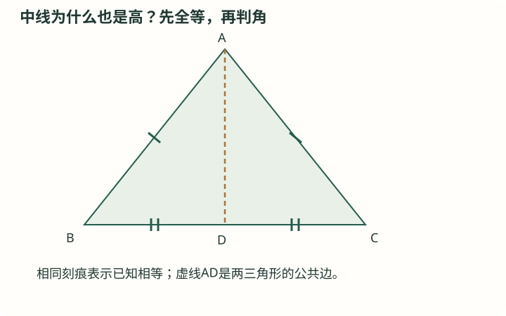

# J16 全等三角形：对应关系与判定

初中 · 八年级建议 · 图形与几何

## 前置知识

[J15 三角形的边角、重要线段与多边形](<../../知识卡/初中/J15_三角形的边角、重要线段与多边形.md>) · [J09 相交线、平行线与推理证明](<../../知识卡/初中/J09_相交线、平行线与推理证明.md>)

## 本节目标

- 理解并能应用：全等与对应
- 理解并能应用：判定定理与条件
- 理解并能应用：证明的组织

## 自学加深：先查起点，再问为什么

### 入门检查（先独立回答）

D是线段BC的中点，且B≠C。请说出这句话包含的两条几何信息。如果A不在BC所在直线上，∠ADB与∠ADC的和是多少度？

检查起点

D在线段BC内部，且BD=DC；∠ADB+∠ADC=180°。

中点不仅说明两段等长，还规定了点的顺序B、D、C。DB与DC是相反射线，所以由DA分出的两个邻角拼成一个平角。若漏掉位置关系，后续不能只凭“两个角相等”就断言它们各为90°。

### 直观入口（不是证明）

把等腰三角形想象成沿顶点A到BC中点D的线折叠，左右两半似乎会重合，折线也似乎会垂直BC。这个想象有助于选出要比较的△ABD与△ACD，却不是证明。真正要说明的是：哪些已知边保证两半全等；全等以后哪些角相等；这些角为何恰好拼成180°。

## 基础与概念

### 全等与对应

两个图形经过平移、旋转或轴对称能完全重合，称为全等。写△ABC≌△DEF时，顺序规定A↔D、B↔E、C↔F，对应边和对应角相等。全等三角形的周长与面积也相等，但等面积并不足以说明全等。

### 判定定理与条件

SSS（三边）、SAS（两边及夹角）、ASA（两角及夹边）、AAS（两角及一角对边）能判定全等；直角三角形还可用HL（斜边及一条直角边）。SAS要求角夹在已知的两边之间。AAA只能确定形状，一般SSA不能唯一确定三角形。

### 证明的组织

几何证明先明确要比较哪两个三角形，再把已知、公共边、对顶角、平行线得到的角列出，凑成一个正确判定。全等成立后才使用对应边角相等，避免先拿待证边角当判定条件形成循环。

## 图解与读图提示

图中AB=AC，BD=CD，AD为公共边。△ABD与△ACD由SSS全等，再由邻补角推出两个角都是90°。图形只是关系示意，不能用“看起来垂直”代替证明。

## 不跳步的推理

#### 为什么从“要证明垂直”倒着找角？

AD⊥BC表示AD与BC形成直角。由于D在BC上，若能证明∠ADB=90°，垂直就成立。单独求这个角不容易，但它旁边有∠ADC，两者天然相加为180°；如果再证明两角相等，就能各占一半。

#### 为什么选择△ABD与△ACD进行比较？

所需的两个角∠ADB、∠ADC分别属于这两个三角形。它们又恰好包含原题的AB=AC和BD=DC两组条件，并共用边AD。选择比较对象时，要让“已知条件”和“目标结论”同时落在所选图形中。

#### 为什么SSS的三个条件都已经具备？

AB=AC来自等腰条件；BD=DC来自D为BC中点；AD=AD来自公共边。三组边相等都是在全等证明之前就成立的事实。不能把尚待证明的直角或AD为高拿来凑条件，否则会循环论证。

#### 为什么全等书写顺序会影响下一步？

写△ABD≌△ACD时，对应关系是A↔A、B↔C、D↔D。于是第一三角形在D点、由DA与DB组成的角，对应第二三角形在D点、由DA与DC组成的角，正是∠ADB与∠ADC。顺序清楚后，才能准确引用“全等三角形对应角相等”。

#### 为什么相等的两个角最后成为直角？

两个角相等本身并不说明它们是90°，它们也可能都为40°。本题额外利用B、D、C依次共线，使两角和为180°。设共同角为θ，则2θ=180°，θ=90°；结合角的顶点和边，才得到AD⊥BC。

## 解题方法

- 由结论中的线段或角反找包含它们的三角形，再检查对应顺序。
- 每条等量注明来源，写出全等判定，最后提取目标结论。

## 易错与限制

- 两边一角并不自动是SAS，角必须为夹角。
- 共同顶点不等于共同角；两角的边必须分别同向或由定理保证相等。

## 完整例题

【原创】△ABC中AB=AC，D为BC中点，证明AD⊥BC。

1. 在△ABD与△ACD中，AB=AC、BD=CD、AD=AD，故由SSS全等。
2. 于是∠ADB=∠ADC；B、D、C共线，两角和180°，各90°。
3. 所以AD⊥BC。

答案：所以AD⊥BC。

### 老师怎样想到并检查每一步

#### 重述原例题，并明确不退化条件

原例题：在三角形ABC中，AB=AC，D为BC中点，证明AD⊥BC。三角形默认三个顶点不共线，所以A不在BC上；BC有正长度，D在线段BC内部。先连接AD，得到两个真正的三角形ABD与ACD。

#### 把条件按对应顺序排好

在△ABD与△ACD中，AB=AC（已知），BD=CD（中点定义），AD=AD（公共边）。逐项核对：大三角形的两条腰对应，底边的两半对应，公共边对应自身。

#### 使用SSS给出完整全等结论

三组对应边分别相等，所以△ABD≌△ACD，依据是SSS。到这一步为止，没有使用AD⊥BC，也没有使用∠ADB=∠ADC；这确保论证没有预先假定结论。

#### 从全等提取需要的角，而非随意列角

由全等三角形对应角相等，得∠ADB=∠ADC。两角都以D为顶点，一条边共用DA，另一条边分别指向B、C。这正是目标垂直所需的一对角。

#### 利用中点给出的位置关系求角

B、D、C依次共线，因此DB与DC反向，∠ADB+∠ADC=180°。结合相等关系，得到∠ADB=∠ADC=90°。这是“相等”与“互补”共同发挥作用。

#### 把角度结论翻译回垂直关系

∠ADB是直线AD与直线BC所成的一个角，它等于90°，所以AD⊥BC，原题得证。证明还可同时推出∠BAD=∠CAD，说明这里的底边中线也是顶角平分线；这个额外结论仍须从已证明的全等中取得。

### 错解对照

错误说法：D是BC中点，所以AD是中线；中线必定垂直底边，因此AD⊥BC。

错在哪里：一般三角形的中线并不一定是高。反例：A(1,2)、B(0,0)、C(4,0)，BC中点D(2,0)。AD不是竖直线，而BC是水平线，所以二者不垂直。这个反例不满足AB=AC，恰好说明原题的等腰条件不能被省略。

怎样修正：保留AB=AC，用它与BD=DC、公共边AD一起证明两三角形全等，再由D处对应角相等且和为180°推出垂直。三线合一可以在这一结论建立后使用，不能在尚未证明时用它替代依据。

## 自测与解析

### 1. 基础

【原创】两三角形各有边长3、4、5，能否判定全等？

展开答案与解析

答案：能。

解析：三组对应边相等，满足SSS；不必额外知道角。

### 2. 进阶

【原创】两三角形各有30°、60°、90°三个角，是否一定全等？

展开答案与解析

答案：不一定。

解析：边长1、√3、2与2、2√3、4的直角三角形角相同而大小不同。

### 3. 基础巩固

【原创·分层】两个非退化直角三角形ABC与DEF满足∠ACB=∠DFE=90°，AB=DE=13，AC=DF=5。能否判定两个三角形全等？写出顶点对应顺序，并说明BC与EF、∠ABC与∠DEF的关系。

展开答案与解析

答案：能，由HL判定△ABC≌△DEF，A↔D、B↔E、C↔F；BC=EF，∠ABC=∠DEF。

解析：由直角位置可知AB与DE分别是斜边；AC与DF是一组对应直角边。两直角三角形的斜边及一条直角边分别相等，满足HL判定，因此△ABC≌△DEF。全等成立后，才可推出对应边BC=EF、对应角∠ABC=∠DEF。写对应顺序时应先锁定直角顶点C↔F，再由给定直角边确定A↔D。

### 4. 条件变式

【原创·分层】A、B、C为不共线的三点，D严格位于线段AC内部，且BD=BC。有人认为：AB是公共边，BD=BC，∠BAD=∠BAC，所以△ABD与△ABC可以由SAS判定全等。这个推理是否正确？请指出角的位置问题，并用两三角形的周长说明它们实际上不全等。

展开答案与解析

答案：推理不正确，给出的是两边及其中一边的对角，非两边夹角；两三角形周长不同，因而不全等。

解析：在△ABD中，已知相等的两条边是AB、BD，它们的夹角在B点，是∠ABD；∠BAD在A点，并不是这两边的夹角。△ABC同理。因此不能用SAS。又因D严格在AC内部，AD<AC，而AB为公共边、BD=BC，所以AB+BD+AD<AB+BC+AC。两个三角形周长不等，不可能全等。条件D在内部同时保证了两个三角形非退化以及严格不等号。

### 5. 综合应用

【原创·分层】在非退化三角形ABC中，D是BC的中点。把线段AD越过D延长到E，使DE=AD，即A、D、E依次共线。证明AB=CE且AB∥CE。如果CE在可测区域内且测得CE=7.5 m，求AB的长度，并说明这种间接测量的依据。

展开答案与解析

答案：AB=CE且AB∥CE；AB=7.5 m。

解析：比较△ADB与△EDC：AD=ED由构造给出，DB=DC由中点给出，∠ADB=∠EDC为对顶角，所以由SAS有△ADB≌△EDC，顶点对应为A↔E、D↔D、B↔C。由对应边相等得AB=EC；由对应角相等得∠ABD=∠ECD。B、D、C共线，A和E在BC异侧，这两个角是一对内错角，因此AB∥CE。测量利用的是严格推出的等长关系AB=CE，而不是图上看起来相等；故AB=7.5 m。

## 离开本节前：独立迁移

在非退化三角形PQR中，PQ=PR，M为QR中点，∠QPM=28°。不用直接引用“三线合一”，证明PM⊥QR，并求∠QPR。

核对迁移题

由SSS得△PQM≌△PRM，进而PM⊥QR，∠QPR=56°。

PQ=PR、QM=RM、PM公共，故两三角形SSS全等。于是∠PMQ=∠PMR，两角因Q、M、R共线而互补，所以均90°，PM⊥QR。同一次全等还给出∠QPM=∠MPR=28°；M在QR内部，PM位于∠QPR内部，因此∠QPR=28°+28°=56°。能同时解释D类点的顺序与对应关系，才说明不是只模仿字母。

### 卡住时回哪里补

- 把中点、中线、高和角平分线混为一谈：[J15 三角形的边角、重要线段与多边形](<../../知识卡/初中/J15_三角形的边角、重要线段与多边形.md>)。分别只按定义画三条线段，不预设它们重合；逐条写出它保证的是边被平分、角被平分还是垂直。
- 不能解释两个角为什么和为180°：[J09 相交线、平行线与推理证明](<../../知识卡/初中/J09_相交线、平行线与推理证明.md>)。画两条反向射线DB、DC，再添一条DA；把邻补角的位置条件与单纯“两个角互补”的数量条件分开复述。
- 全等顺序与对应角书写不一致：[J16 全等三角形：对应关系与判定](<../../知识卡/初中/J16_全等三角形：对应关系与判定.md>)。先写A↔A、B↔C、D↔D的映射，再把边AB、角ADB逐个换成其对应对象，最后写全等符号。

## 掌握检查

- 闭卷解释本模块的定义及公式适用条件
- 独立完成例题的变式，并写出每一步理由

## 核查来源与对应范围

- [人教版八年级上册](https://www.pep.com.cn/xw/zt/hd/12/zbtjc/202410/t20241022_1996035.html)：参考书目名称保留，私人原文件链接不随公开版发布。此公开出版社页面只供教学背景阅读，不表示该页面逐条证明本卡公式。知识讲解和训练为自行组织。

本卡为自行组织的讲解与训练，不是教材的逐字摘录。来源定位不代表逐页核完该教材。
