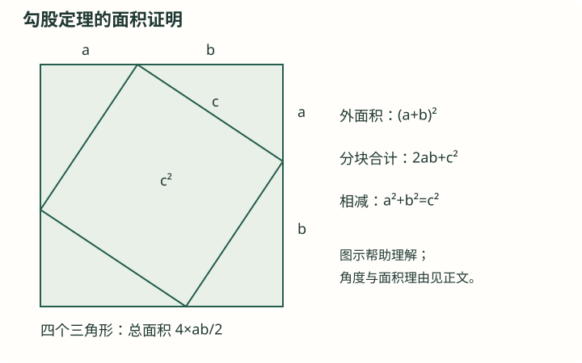

# J23 勾股定理、逆定理与距离

初中 · 八年级建议 · 图形与几何

## 前置知识

[J15 三角形的边角、重要线段与多边形](<../../知识卡/初中/J15_三角形的边角、重要线段与多边形.md>) · [J10 平方根、立方根与实数](<../../知识卡/初中/J10_平方根、立方根与实数.md>) · [J16 全等三角形：对应关系与判定](<../../知识卡/初中/J16_全等三角形：对应关系与判定.md>) · [J11 平面直角坐标系与平移](<../../知识卡/初中/J11_平面直角坐标系与平移.md>) · [J19 整数指数幂与整式乘除](<../../知识卡/初中/J19_整数指数幂与整式乘除.md>)

## 本节目标

- 理解并能应用：勾股定理
- 理解并能应用：逆定理与实际模型
- 理解并能应用：两点距离与展开图

## 自学加深：先查起点，再问为什么

### 入门检查（先独立回答）

直角三角形的两条直角边是3和4。先不要背5：两条直角边的平方和是多少？哪个边在直角对面？

检查起点

平方和为25；直角对面的边叫斜边。

3²+4²=9+16=25。斜边由直角的位置确定，不由纸上画得长不长确定；求长度还需要取平方根。

### 直观入口（不是证明）

勾股定理说的是三个正方形的面积关系，不是两条长度直接相加。沿两直角边作出的正方形，面积之和等于沿斜边作出的正方形面积。面积图能帮助理解等式里的平方；只有在已知直角的条件下才能使用这个等式。

## 基础与概念

### 勾股定理

在直角三角形中，两直角边a、b与斜边c满足a²+b²=c²。可用边长a+b的大正方形放四个同样的直角三角形，比较中间小正方形面积得到。必须识别直角对面的斜边，不能按图中看起来最长来猜。

### 逆定理与实际模型

若三边满足a²+b²=c²且c最大，则三角形是直角三角形，c所对角90°。现实中的梯子、矩形对角线、坡面都可构造直角三角形；高度和沿斜面的长度是不同的量。

### 两点距离与展开图

坐标平面两点P(x₁,y₁)、Q(x₂,y₂)的距离是√[(x₂−x₁)²+(y₂−y₁)²]，由水平和竖直的差构成直角边。在立体表面最短路问题中，可先把所经表面展开，再比较允许路径，不能直接穿过物体内部。

## 图解与读图提示

示意选a=2、b=3，外正方形边长a+b。四个角放全等直角三角形，中间四边形的边长都是c、角都是90°。外面积=(四个三角形面积)+c²，得到(a+b)²=2ab+c²。

## 不跳步的推理

#### 先说明对象与可用的基础

取一个非退化直角三角形，两直角边a>0、b>0，斜边c>0。以下拼图证明使用三角形内角和180°、全等三角形面积相等、正方形面积和三角形面积公式；不预先使用勾股定理。

#### 为什么拼图中间确实是正方形

在边长a+b的正方形四角放四个全等直角三角形，直角贴住大正方形四角，各斜边围成中央四边形。中央四条边都等于c；中央每个角为180°减去两个互余的锐角，等于90°，所以中央图形是边长c的正方形。

#### 同一块面积用两种方法计算

大正方形面积是(a+b)²；也等于四个直角三角形面积加中央正方形面积，即4×ab/2+c²=2ab+c²。因此a²+2ab+b²=2ab+c²，两边减2ab得到a²+b²=c²。

#### 逆定理不能只把原定理倒着读

设一个三角形三边a,b,c满足a²+b²=c²。另作两直角边为a,b的直角三角形，其斜边d由正定理满足d²=a²+b²=c²。d,c均为正，所以d=c。两三角形三边分别相等，由SSS全等，原三角形也有一个直角。这一步补用了J16的全等判定。

#### 坐标距离公式如何接上

两点横坐标差Δx、纵坐标差Δy的绝对值给出水平与竖直距离，且这两个方向垂直。于是距离的平方是(Δx)²+(Δy)²。若Δx或Δy为0，图形退化为线段，距离公式仍由绝对值直接成立；两差都为0时距离为0。

## 解题方法

- 先画直角标记并命名斜边；列平方关系求未知，再取符合长度非负的根。

## 易错与限制

- 勾股定理只适用于直角三角形。
- 由c²=25求长度应取c=5，不取−5。

## 完整例题

【原创】一架10米长梯子靠竖直墙，梯脚离墙6米。梯顶高度多少？

1. 墙与地面垂直，梯子为斜边10米，地面距离为直角边6米。
2. 设高度h>0，有h²+6²=10²。
3. h=√64=8米。

答案：h=√64=8米。

### 老师怎样想到并检查每一步

#### 把现实问题翻译成图形

原例题的墙竖直、地面水平，所以墙与地面垂直。把墙脚记O，梯脚记B，梯顶记A。直角在O，AB=10米是梯长，OB=6米是地面距离；不是把10米当高度。

#### 先说为什么选这个定理

已知直角三角形中的两条边，求第三条边，正是勾股定理适用的情形。设OA=h米，h>0。目标是h，而h²+6²=10²是把它与已知量联系起来的方程。

#### 不省略移项与开方

由h²+36=100，两边减36得h²=64。实数方程的根有8和−8，但h表示高度且h>0，故只保留h=8米。

#### 检查算式与实际约束

代回8²+6²=64+36=100=10²，计算正确；8米小于10米梯长，也符合直角边小于斜边。计算、单位、现实意义三项都要检查。

#### 改一个条件，观察方法何时失效

若墙与地面不垂直，就不能仍写h²+6²=10²；若只改梯脚距墙为10米，形式上算得高度0，但这不是题设所要求的梯子靠墙的非退化情形。公式使用前后的条件都要保留。

### 错解对照

错误说法：梯长10米，脚离墙6米，所以高度10−6=4米。

错在哪里：10、6和高度是三角形三条不同方向的边，不是同一直线上首尾相接的两段。长度的减法关系没有几何依据。

怎样修正：先标出直角和斜边，再写高度²+6²=10²，得到高度8米。若不确定该用加法还是平方，回到图形关系，不凭题目数字猜运算。

## 自测与解析

### 1. 基础

【原创】三边为5、12、13，是否构成直角三角形？

展开答案与解析

答案：是。

解析：5²+12²=25+144=169=13²，满足逆定理。

### 2. 进阶

【原创】P(−2,1)、Q(4,9)距离多少？

展开答案与解析

答案：10。

解析：横向差6，纵向差8，距离√(36+64)=10。

### 3. 基础巩固

【原创·分层】一个矩形的一条边长为8 cm，对角线长为17 cm，求另一条边长、周长和面积。

展开答案与解析

答案：另一边15 cm，周长46 cm，面积120 cm²。

解析：矩形两邻边和一条对角线构成直角三角形，对角线为斜边。设另一边为b>0，则8²+b²=17²，所以b²=289−64=225，b=15。周长2(8+15)=46 cm，面积8×15=120 cm²。长度必须取正平方根。

### 4. 条件变式

【原创·分层】一个非退化直角三角形的三边长为5、7、x，其中x>0，题目未指定哪条边是斜边。求x的所有可能值，并说明分类是否完整。

展开答案与解析

答案：x=2√6或x=√74。

解析：斜边是三角形最长边。5小于已知边7，不可能是斜边。若7为斜边，则5²+x²=7²，得x²=24，x=2√6；其数值小于7，且5+2√6>7，所以可以构成非退化三角形。若x为斜边，则x²=5²+7²=74，x=√74；它大于7且小于5+7，也可构成三角形。所有可能的斜边已逐一处理，因此这两个值即为全部答案。

### 5. 综合应用

【原创·分层】一个长方体的长、宽、高分别为6 cm、4 cm、3 cm。以前面左下角为A、后面右上角为B。蚂蚁从A到B，规定只可选两种路线之一：先沿前面再沿顶面，或先沿左面再沿顶面；每种路线只能在对应的两个面及其边界上行走，不能经过其他面或穿过内部。求两类路线各自的最短长度，再选出规定范围内的最短路线。

展开答案与解析

答案：前面加顶面路线最短√85 cm；左面加顶面路线最短√97 cm；应选择前面加顶面，最短√85 cm。

解析：将前面与顶面沿公共棱展开，得到长为6、另一边为3+4=7的矩形，A、B为其对角顶点。两点间线段最短，故该类路线长为√(6²+7²)=√85；展开线段穿过公共棱的位置距左端18/7 cm，在棱的0到6范围内，路线可行。将左面与顶面展开，得到两边为3+6=9和4的矩形，最短长度为√(9²+4²)=√97；在公共棱上的穿越点距前端4/3 cm，也在0到4范围内。因此两类均能实现各自的直线最短路，且√85<√97。这里比较的仅是题目允许的两类表面路线。

## 离开本节前：独立迁移

已知三角形三边为6、8、10。你使用勾股定理还是它的逆定理来判断是否为直角三角形？再求直角顶点到最长边的高。

核对迁移题

用逆定理判直角；所求高为24/5。

先验6+8>10且均为正，再算6²+8²=10²，用逆定理知6、8是两直角边。面积一方面为6×8/2=24，另一方面为10h/2，所以h=24/5。判断形状用逆定理，求高使用同一三角形面积的两种表达。

### 卡住时回哪里补

- 找错斜边或混淆三边关系：[J15 三角形的边角、重要线段与多边形](<../../知识卡/初中/J15_三角形的边角、重要线段与多边形.md>)。重新标记直角的顶点与它的对边；不看边长也应能指出斜边。
- 开方后把负根当长度：[J10 平方根、立方根与实数](<../../知识卡/初中/J10_平方根、立方根与实数.md>)。对比方程x²=64的两个实根与√64这个非负数的区别。
- 逆定理证明中的全等看不懂：[J16 全等三角形：对应关系与判定](<../../知识卡/初中/J16_全等三角形：对应关系与判定.md>)。将原三角形与辅助直角三角形三边逐一对应，再使用SSS。

## 掌握检查

- 闭卷解释本模块的定义及公式适用条件
- 独立完成例题的变式，并写出每一步理由

## 核查来源与对应范围

- [人教版八年级下册（旧版参考）](https://www.pep.com.cn/xw/zt/hd/12/zbtjc/202410/t20241022_1996035.html)：参考书目名称保留，私人原文件链接不随公开版发布。此公开出版社页面只供教学背景阅读，不表示该页面逐条证明本卡公式。知识讲解和训练为自行组织。

本卡为自行组织的讲解与训练，不是教材的逐字摘录。来源定位不代表逐页核完该教材。
