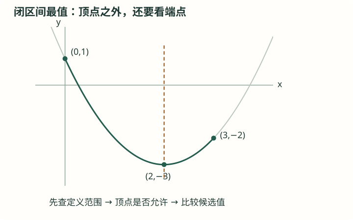

# J33 二次函数：图象、顶点与最值

初中 · 八至九年级建议 · 函数

## 前置知识

[J27 一次函数与正比例函数](<../../知识卡/初中/J27_一次函数与正比例函数.md>) · [J31 一元二次方程：配方、公式与因式分解](<../../知识卡/初中/J31_一元二次方程：配方、公式与因式分解.md>)

## 本节目标

- 能解释与应用形式与配方
- 能解释与应用增减与范围最值
- 能解释与应用三种表达与图象关系

## 自学加深：先查起点，再问为什么

### 入门检查（先独立回答）

展开(x−2)²。再回答：对任意实数u，u²能否为负？在−2≤u≤1内，u²的最小值是否一定来自两个端点？

检查起点

(x−2)²=x²−4x+4；u²不能为负；其在[−2,1]上的最小值为0，在内部点u=0取得，并非来自端点。

本例需要完整平方公式，以及“区间可能跨过0”的认识。若把两端平方后只比较4与1，会漏掉中间的0；这种错误与只比较二次函数两端而漏掉顶点是同一种问题。

### 直观入口（不是证明）

把二次函数配成y=(x−2)²−3后，可以把(x−2)²看成横坐标x到位置2的距离的平方。距离越近，平方越小；距离越远，平方越大。顶点是否在允许的横坐标范围内，决定距离0能不能取到。这个直观帮助选候选点，严格结论仍由平方非负、区间范围以及等号条件推出。

## 基础与概念

### 形式与配方

二次函数y=ax²+bx+c，a≠0。配方为y=a(x−h)²+k，其中h=−b/(2a)、k=(4ac−b²)/(4a)。顶点(h,k)，对称轴x=h，a决定开口方向，|a|影响相同横向偏移处的纵向变化。

### 增减与范围最值

a>0时在轴左侧递减、右侧递增，整体最小值k；a<0相反，整体最大值k。若限定x∈[m,n]，先检查顶点是否在区间，再比较端点与允许顶点的函数值；不能无条件套整体最值。

### 三种表达与图象关系

一般式便于读纵截距，顶点式便于最值，交点式a(x−r₁)(x−r₂)要求已知实零点。图象与x轴交点由对应二次方程给出，判别式决定交点个数；对称的两个横坐标到对称轴距离相同。

## 图解与读图提示

y=(x−2)²−3，深绿部分是题设0≤x≤3；浅灰部分只作趋势提示，不属于本题允许范围。顶点(2,−3)给最小值，比较端点(0,1)、(3,−2)得最大值1。

## 不跳步的推理

#### 为什么要配方，而不逐个尝试x？

原函数y=x²−4x+1有两个含x的项，一个增大、另一个可能减小，直接看整体变化不方便。用x²−4x=(x−2)²−4，将它写成y=(x−2)²−3，只剩一个平方项。恒等变形对每个实数x都成立，不是仅对几次试算成立。

#### 为什么顶点给出的−3不能无条件拿来当区间最小值？

平方非负给出y≥−3，但达到−3还要求x−2=0，即x=2。如果题目限制的范围不包含2，只能说−3是全实数范围的最小值，不能说它在该区间取得。本例0≤x≤3确实包含2，所以等号能够成立。

#### 为什么最大值要检查到对称轴的最远距离？

在0≤x≤3内，x−2介于−2与1之间，因此|x−2|≤2。平方后得到(x−2)²≤4，故y≤1。绝对值达到2的允许位置只有x=0；这证明所有区间内部点都不会超过1，而不只是算出某个端点恰好等于1。

#### 为什么比较端点必须有理由，不能变成万能口诀？

对开口向上的二次函数，离对称轴越远函数值越大，而闭区间内最远点总在端点，所以本题最大值可比较两个端点。对其他形状的函数，最大值可能在内部；即使同为二次函数，开口向下时内部顶点反而可能是最大值。先辨开口和顶点位置，再决定比较哪些点。

#### 为什么答案还应写取得最值时的x？

写出上下界只回答了数值范围，写出何时等号成立才说明界限能达到。最小值−3在x=2取得，最大值1在x=0取得，两个横坐标都属于题给闭区间。若区间端点不包含，端点对应的界限未必是可取得的最值。

## 解题方法

- 配方→标顶点与轴→确定定义范围→比较候选函数值→解释结果单位。

## 易错与限制

- 平移y=x²到右侧2单位是y=(x−2)²，不是(x+2)²。
- 抛物线开口向上，在有限区间仍可有最大值。

## 完整例题

【原创】求y=x²−4x+1在0≤x≤3上的最小值和最大值。

1. 配方y=(x−2)²−3，顶点横坐标2在区间内，最小值−3。
2. 端点y(0)=1、y(3)=−2，开口向上最大值从端点取。
3. 最小值−3（x=2），最大值1（x=0）。

答案：最小值−3（x=2），最大值1（x=0）。

### 老师怎样想到并检查每一步

#### 锁定原例题与允许范围

原题求y=x²−4x+1在0≤x≤3上的最小值和最大值。横坐标只能在闭区间[0,3]内取值，端点0、3都允许；不能把区间外图象也纳入比较。

#### 补出完全平方，同时补偿常数

x²−4x+1=(x²−4x+4)−4+1=(x−2)²−3。括号内为了构成平方多加了4，括号外必须减4，保证没有改变函数值。

#### 先求下界并检查可达性

对每个实数x都有(x−2)²≥0，所以y≥−3。等号要求x=2，而0≤2≤3，所以最小值确为−3，取值点为(2,−3)。

#### 用区间限制给出上界

从0≤x≤3得到−2≤x−2≤1，因此x到2的距离不超过2，即|x−2|≤2。于是(x−2)²≤4，y≤4−3=1。等号要求|x−2|=2，可能的x为0或4，只有0属于[0,3]，故最大值为1，在x=0取得。

#### 核对两个端点，检查数值计算

直接代回原式：y(0)=1，y(3)=9−12+1=−2；顶点y(2)=4−8+1=−3。端点中的较大值确为1，且内部顶点值−3小于两个端点。这些代入可检验配方和计算，但不能替代上一两步对整个区间的论证。

#### 完成结论并表达选择原则

在0≤x≤3上，最小值−3在x=2处取得，最大值1在x=0处取得。选择候选点的理由是：开口向上，最小值看允许范围内距对称轴最近的点，最大值看最远的点；本例最近点是内部顶点，最远点是左端点。

### 错解对照

错误说法：只算y(0)=1、y(3)=−2，就认定区间最小值为−2、最大值为1。

错在哪里：仅比较端点不能排除内部出现更小的值。原函数的对称轴x=2位于区间内部，实际y(2)=−3<−2，因此“最小值−2”被一个允许的点直接否定。端点法在这里算对最大值，是因为开口向上和距离结构支持它，不是因为任何函数的最值都在端点。

怎样修正：先配方确定顶点，检查顶点横坐标是否属于区间；把允许顶点和两个端点一并列为候选，并用开口或平方距离说明没有其他点给出更大或更小的值。

## 自测与解析

### 1. 基础

【原创】y=−2(x+1)²+5的顶点与最大值？

展开答案与解析

答案：顶点(−1,5)，最大值5。

解析：平方项非负而系数负，x=−1时达到5。

### 2. 进阶

【原创】抛物线零点1、5且过(0,10)，求式子。

展开答案与解析

答案：y=2(x−1)(x−5)。

解析：设y=a(x−1)(x−5)，10=5a得a=2。

### 3. 基础巩固

【原创·分层】把y=2x²+8x+3写成顶点式，求顶点与对称轴，再求它在−1≤x≤2上的最大值和最小值。

展开答案与解析

答案：y=2(x+2)²−5；顶点(−2,−5)，对称轴x=−2；区间最小值−3在x=−1处取得，最大值27在x=2处取得。

解析：配方得y=2(x²+4x+4)−8+3=2(x+2)²−5。抛物线开口向上，顶点横坐标为−2。给定区间[−1,2]完全在对称轴右侧，函数在该区间递增，不能使用全体实数上的最小值−5。计算y(−1)=2−8+3=−3，y(2)=8+16+3=27，分别得到区间最小与最大值。

### 4. 条件变式

【原创·分层】实数a为参数，求函数y=(x−a)²+1在0≤x≤2上的最小值，用a的取值范围分段表示，并写出各段取得最小值时的x。

展开答案与解析

答案：a<0时最小值a²+1，在x=0处取得；0≤a≤2时最小值1，在x=a处取得；a>2时最小值(a−2)²+1，在x=2处取得。

解析：平方项(x−a)²等于数轴上x与a的距离的平方，要在区间[0,2]内找离a最近的点。a<0时a在区间左侧，最近点为0；0≤a≤2时顶点就在区间内，最近点为a，平方项为0；a>2时最近点为2。分别代入得到三个表达式。a=0与a=2时，顶点与区间端点重合，归入中间一段可避免重复。

### 5. 综合应用

【原创·分层】某商品每件进货成本6元，无其他成本。按模型，单价由10元提高x元后，每日销量为100−3x件，且预测销量全部售出；x只能取0到20之间的整数。求每日利润最大的定价、销量和利润，并说明为何不能直接把抛物线顶点横坐标当成可行的提价数。

展开答案与解析

答案：提价15元，定价25元，每日销量55件，最大利润1045元。

解析：每件利润为(10+x)−6=4+x，每日利润P=(4+x)(100−3x)=−3x²+88x+400。配方得P=−3(x−44/3)²+3136/3，连续模型顶点在x=44/3，约14.667，落在0到20之间却不是整数。开口向下，利润随着到44/3的距离增大而减小，故只需比较相邻整数14与15：P(14)=18×58=1044，P(15)=19×55=1045。其他可行整数离顶点更远，利润更小。因此选x=15，售价25元、销量55件，利润1045元。结论仅在题设销量模型及成本假设下成立。

## 离开本节前：独立迁移

仍是y=x²−4x+1，但改成3≤x≤5。求最大、最小值及取值位置，并解释为什么本次最小值不再是−3。

核对迁移题

最小值−2在x=3处取得，最大值6在x=5处取得；顶点横坐标2不在新区间内。

配方仍为(x−2)²−3，但现在1≤x−2≤3，距离始终非负且随x增大而增大。平方项从1增至9，函数值从−2增至6。x=2不允许，所以平方项不能取0，−3在这个区间并不能取得。若能明确指出取值范围改变了等号能否成立，就掌握了区间最值与整体最值的区别。

### 卡住时回哪里补

- 配方时把常数改错，或漏掉完全平方中的一次项：[J19 整数指数幂与整式乘除](<../../知识卡/初中/J19_整数指数幂与整式乘除.md>)。展开(x−2)²确认中间项为−4x；把补加的4与外面补减的4同时写出，再代x=0检验恒等式。
- 平方一个跨过0的区间时把最小值也取在端点：[J02 有理数、数轴与绝对值](<../../知识卡/初中/J02_有理数、数轴与绝对值.md>)。在数轴上标出−2、0、1，用到原点的距离解释绝对值；分别比较端点与0的平方，再回到|x−2|的距离含义。
- 算出了顶点，却不检查横坐标是否在允许范围内：[J33 二次函数：图象、顶点与最值](<../../知识卡/初中/J33_二次函数：图象、顶点与最值.md>)。把同一函数分别限制到[0,3]与[3,5]，先写“2在不在区间内”，再求最值；最后注明每个最值取得时的x。

## 掌握检查

- 说明本模块公式的条件及与前置知识的联系
- 独立完成两道自测并解释关键步骤

## 核查来源与对应范围

- [人教社：初中数学教材主编详解](https://www.pep.com.cn/xw/zt/hd/12/zbtjc/202410/t20241022_1996035.html)：新版章节与统计增补范围核对；知识讲解、计算例题为原创，教学次序按依赖编排。

本卡为自行组织的讲解与训练，不是教材的逐字摘录。来源定位不代表逐页核完该教材。
