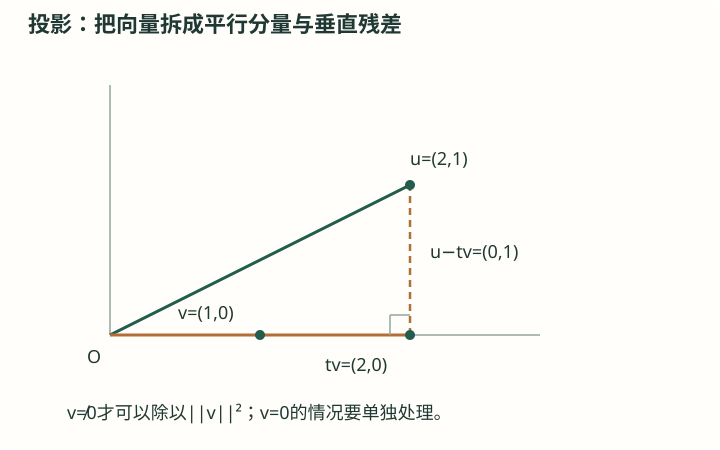

# A11 柯西—施瓦茨不等式与投影

高阶拓展 · 学有余力选学（非统一高考必修） · 拓展 · 线性代数与不等式

## 前置知识

[H13 平面向量与数量积](<../../知识卡/高中/H13_平面向量与数量积.md>) · [H04 基本不等式与等号条件](<../../知识卡/高中/H04_基本不等式与等号条件.md>)

## 本节目标

- 明确基础对象及定理假设
- 复述公式推导与误差或等号条件
- 完成例题与自测

## 自学加深：先查起点，再问为什么

### 入门检查（先独立回答）

u=(2,1)、v=(1,0)。求u·v和||v||²；再求实数t，使u−tv与v垂直。

检查起点

内积为2，||v||²=1，t=2。

u−tv=(2−t,1)，与v点积为2−t，令它等于0得t=2。这就是把向量分成沿v的分量与垂直分量。

### 直观入口（不是证明）

一个向量在某个方向上的投影长度不可能超过它本身的长度，这可以帮助理解柯西不等式。但图形只展示二维情形，正式证明会用非负平方范数，因此可以适用于任意维实内积空间。

## 基础与概念

### 实内积空间

内积⟨u,v⟩把一对向量对应到实数，满足对称、线性、正定：⟨u,u⟩≥0且仅u=0时取0。普通Rⁿ中内积为Σuᵢvᵢ；长度||u||=√⟨u,u⟩。复空间还需共轭，本卡只证明实数版。

### 正交与投影

⟨u,v⟩=0称正交。把u分为沿非零v的分量tv与垂直残差，投影系数t=⟨u,v⟩/||v||²，来自⟨u−tv,v⟩=0。

### 等号比背公式重要

柯西不等式等号当且仅当u、v线性相关（含零向量）。要把一个代数上界称为最大值，需同时能满足原题约束与等号条件。

## 不跳步的推理

#### 先解释线性相关与零向量

两个向量线性相关，指存在不全为0的实数α、β，使αu+βv=0。当v≠0时，这等价于u是v的某个实数倍；若其中一个是零向量，也线性相关。负倍数和正倍数都包括在内。

#### 单独处理会导致除零的情况

若v=0，内积和右侧的||v||²都是0，不等式为0≤0，等号成立。下面只讨论v≠0，此时正定性保证||v||²>0，可合法作分母。

#### 为什么挑这个t而不是任意猜

希望残差u−tv与v正交：⟨u−tv,v⟩=⟨u,v⟩−t||v||²=0，所以唯一选择t=⟨u,v⟩/||v||²。这个t使残差成为去掉沿v分量后的部分。

#### 把被压缩的一行完全展开

由对称性与双线性，||u−tv||²=⟨u−tv,u−tv⟩=||u||²−2t⟨u,v⟩+t²||v||²。代入t，后两项合并为−⟨u,v⟩²/||v||²。范数平方非负，所以0≤||u||²−⟨u,v⟩²/||v||²。

#### 乘回正数，检查等号的每个方向

两边乘正数||v||²，得到⟨u,v⟩²≤||u||²||v||²。等号成立当且仅当残差范数为0，按正定性等价于u−tv=0，正好是线性相关。反过来若u=tv，代入也确实为等号。

#### 平方不等式与最大值之间还差什么

开方先得到|⟨u,v⟩|≤||u||||v||，因而−||u||||v||≤⟨u,v⟩≤||u||||v||。要取正的最大值，需要同向的正倍数；负倍数通常给最小值。只有原约束允许那个向量，界才是最大值。

## 定理：柯西—施瓦茨不等式（实内积版）

### 成立条件

- u、v属于同一实内积空间。

### 结论

|⟨u,v⟩|²≤||u||²||v||²；等号当且仅当两向量线性相关。

### 证明

证明范围：完整证明

1. v=0时两边为0，等号成立。以下设v≠0。
2. 令t=⟨u,v⟩/||v||²，非负平方范数给0≤||u−tv||²=||u||²−⟨u,v⟩²/||v||²。
3. 乘以正数||v||²得到不等式；等号等价于u−tv=0，恰是u为v的倍数。

## 公式如何衍生

1. 代入u=(a₁,…,aₙ)、v=(b₁,…,bₙ)，得到(Σaᵢbᵢ)²≤(Σaᵢ²)(Σbᵢ²)。
2. 取v=(1,…,1)，得到(Σaᵢ)²≤nΣaᵢ²。
3. 这又说明Σ(aᵢ−平均数)²≥0；方差非负与向量长度非负是同一个结构。

## 图解与读图提示

示例u=(2,1)，v=(1,0)。投影系数t=(u·v)/||v||²=2，投影tv=(2,0)，残差u−tv=(0,1)与v正交。非负残差范数是正文柯西证明的关键；一般定理不依赖二维图形。

## 解题方法

- 对照定理逐项检查假设，区分精确等式、近似及单向不等式。

## 易错与限制

- 不能省略平方／绝对值，就声称内积总是非负。

## 完整例题

【原创】x²+y²=4时，求3x+4y的最大值。

1. 内积上界为√(3²+4²)√(x²+y²)=5×2=10。
2. 等号需(x,y)为(3,4)的正倍数，结合长度2得(6/5,8/5)。
3. 该点满足原条件且目标值10，因此上界可达。

答案：10，在(6/5,8/5)取得。

### 老师怎样想到并检查每一步

#### 把目标式识别成内积

原题x²+y²=4，求3x+4y最大值。设u=(x,y)、v=(3,4)，则目标是u·v，约束给||u||=2，已知||v||=√(9+16)=5。

#### 先找全局上界

柯西给|3x+4y|≤2×5=10，因此3x+4y≤10。到这里只证明不会超过10，尚未证明能够达到10。

#### 把等号条件与约束联立

取正最大值要求u=λv且λ>0，即x=3λ、y=4λ。代入原约束9λ²+16λ²=4得25λ²=4，λ=±2/5。为正最大值取λ=2/5。

#### 直接代回，不把候选当答案

得到(x,y)=(6/5,8/5)。其平方和(36+64)/25=4，符合约束；目标值18/5+32/5=10，确实达到上界，因此最大值为10。

#### 说明另一个根的数学意义

λ=−2/5给(x,y)=(−6/5,−8/5)，它也满足柯西等号，但目标值是−10，对应最小值。不能仅写“两向量成比例”就结束最大值取等分析。

### 错解对照

错误说法：柯西等号要求(x,y)与(3,4)成比例，所以正负两个比例点都给最大值10。

错在哪里：平方或绝对值会掩盖目标式的符号。负比例点使内积为负，达到的是−10而非10。

怎样修正：先从绝对值不等式分出上下界，再按最大值取同向、最小值取反向，并代回目标函数验证符号。

## 自测与解析

### 1. 基础

【原创】证明(a+b+c)²≤3(a²+b²+c²)。

展开答案与解析

答案：对所有实数成立。

解析：用向量(a,b,c)与(1,1,1)；等号a=b=c。

### 2. 进阶

【原创】向量(2,1)在(1,0)上的投影是什么？

展开答案与解析

答案：(2,0)。

解析：系数内积2除以长度平方1，再乘(1,0)。

## 离开本节前：独立迁移

实数x,y满足x²+y²=9，求x−2y的最大值及取等点。

核对迁移题

最大值3√5，取等点(3/√5,−6/√5)。

取v=(1,−2)，其模为√5，u模为3，故目标≤3√5。正比例u=λv且5λ²=9，取λ=3/√5。该点平方和为9，目标为15/√5=3√5。

### 卡住时回哪里补

- 内积展开时不会处理系数：[H13 平面向量与数量积](<../../知识卡/高中/H13_平面向量与数量积.md>)。先在二维坐标中逐项展开，再对应到内积的线性和对称性质。
- 把上界当作最大值：[H04 基本不等式与等号条件](<../../知识卡/高中/H04_基本不等式与等号条件.md>)。重做限定范围x≥4时x+9/x的题，练习检验取等点是否允许。

## 掌握检查

- 能说明公式为何成立及何时不能用
- 能独立完成练习并检查结果

## 核查来源与对应范围

- [核查与延伸阅读](https://ocw.mit.edu/courses/18-06-linear-algebra-spring-2010/)：课程中的正交、投影主线；本卡给出可独立核对的完整证明。

本卡为自行组织的讲解与训练，不是教材的逐字摘录。来源定位不代表逐页核完该教材。
